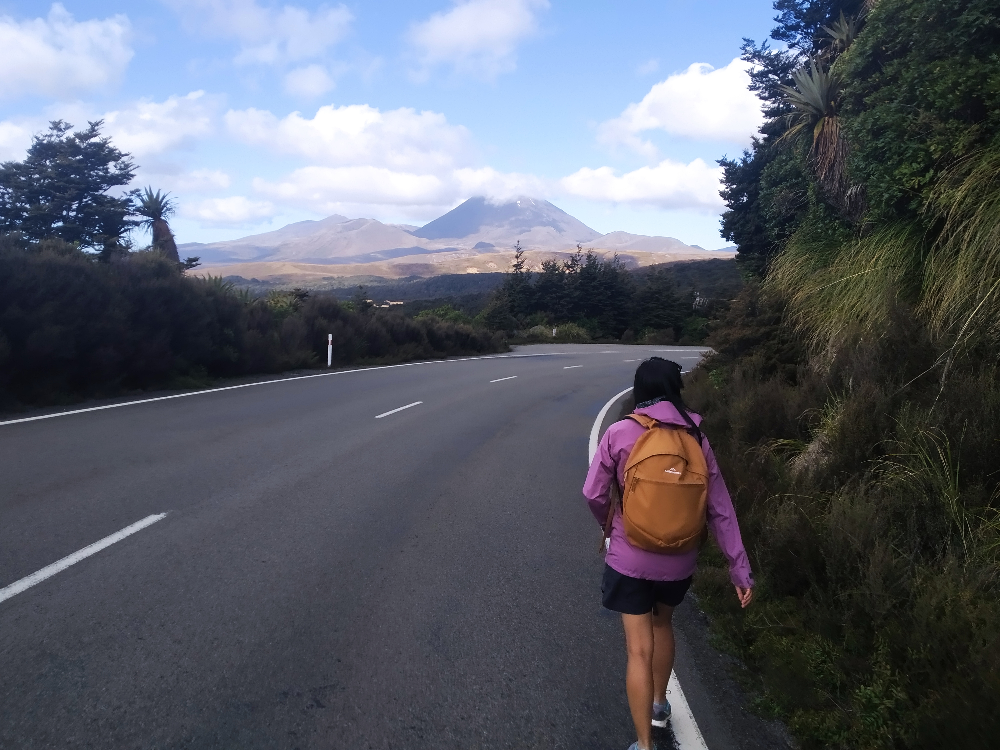

This wasn’t necessarily going to be our last day on holiday. After all, tomorrow is only Saturday so there’s another two days before we’re back at work. But we’d already decided that we’d just head home tomorrow. What else would be as enticing as the comforts of home? Plus, everything we’d pass by tomorrow could be reached on a day trip from Hamilton.

Okay, so it’s the last day – how are we going to spend it? Well, there’s not much to do south of Taupo. Guess it’s going to be more walking\!

We drove to National Park (the confusingly named town) and on to the ski village of Whakapapa, near the slopes of Mount Ruapehu. Here, well inside the Tongariro National Park, was a number of walks. We’d certainly enjoyed alpine walking in the past – we just hoped there’d be some good ones here.

And there were. The first we picked out was to a waterfall. It was a nice stroll alternating between sunny fields with views of both Ruapehu and Ngauruhoe, and pockets of alpine forest.

Also, this was part of another New Zealand Great Walk. So I think I’m up to 1.3 Great Walks done now.

Wouldn’t be a waterfall walk without some waterfall pictures:

Pictures probably aren’t doing it justice – it was quite large. I’d have gone down there and walked behind it, except the air was thick with waterfall spray. I’m already damp enough due to walking in the sun – why did I choose a black t-shirt today?

> “Tastes like air”

Okay, that is one walk done (once we walked back to the car). What next?

Well, we’re on a road that leads up to a skifield. Why not check that out?

> Ruapehu is surprisingly hard to photograph. It’s very wide and flat.

So Whakapapa was certainly not another Whistler, or even another Remarkables. Interestingly there was one sign listing “summer activities” but no other useful directions. We were just going to do a short walk to something called “Mead’s Wall”. The trail apparently led off from the main chairlift area, but it wasn’t clear where it was.

Instead of asking directions from one of the few staff members around we just set off up the main ski area. After about five minutes of climbing we got high enough to realise, “Oh, it’s over that way.”

> That’s probably the wall we’re looking for.

It was actually quite an interesting piece of geology. The “wall” name was spot on, perhaps four metres wide and with vertical faces on both sides.

We debated whether this thing was man made. It might be quite useful to shield the ski field from northerly winds.

However sense prevailed once we came to grips with the exact scale and amount of rock that was in it. Here’s a better angle that shows the width of the wall, and how small I look on top of it.

It was certainly worth the trip – a 10 to 15 minute flat walk from the parking lot (assuming you don’t walk in the wrong direction like we did). Plus it gave some more pretty good views of Ngauruhoe.

> The scary mountain\!

Okay, early afternoon – what now? Well, we need to eat. But what options do we have? Well, literally none at the ski field so we headed back down to the village.

The chateau was probably open, but that probably wasn’t the type of dining options we were looking for.

The only other lunch option was a food truck selling burgers for Burgerfuel level prices (not ridiculous but not cheap either). Aside from the plain bun, they actually turned out to be pretty good. I didn’t even finish mine, but that’s only because this little fella got some bun crumbs:

> Couldn’t say “no” to that face

The next thing we did was actually check in, but then an hour or two later we realised we still had plenty of day left.

So back towards Whakapapa we went. The first stop was a short walk to another waterfall.

This one was of particular interest because it was featured in Lord of the Rings. However, that sounds cooler than the actual facts, which was that this waterfall was CGI-ed into the background of one of the scenes. So this wasn’t actually a filming location – just a source of stock footage.

But it turned out to be a rather decent fall.

“Gollum’s pool” they call this

> Someone’s a happy hobbit.

So that walk didn’t really count. It was less than fifteen minutes one way. Next one was a bit longer. Too long perhaps? Maybe – this is our fourth walk for the day. One way or another, this was going to be the last one. The destination – the “Silica Rapids” – didn’t actually sound that stunning but this was our fourth choice for walks to do in the area.

The walk itself was actually quite nice.

Some board walks, some forest walking, frequent views of Ruapehu and Ngauruhoe…

Exactly more of what we wanted.

As expected, the “Silica Rapids” did not impress. There was actually some “Golden Rapids” earlier in the trail that were more striking. That being said, rocks can be quite pretty when they want to be.

This was definitely an interesting area to come to. And a good place to finish this trip. I feel I can honestly say I’ve explored the whole North Island now. Sure, much of it was not in depth and much more was a decade or more ago. And sure every other member of my family has probably seen more than me. But that’s okay – because it’s not like I’m done with this island just yet.

> Nice salute\!

Although for now we’re heading home. Back to Hamilton, 22 months since I left it to find work in Auckland. Back to the old boardgaming club. Back to a new job and new challenges.

It’ll be good to be home again.