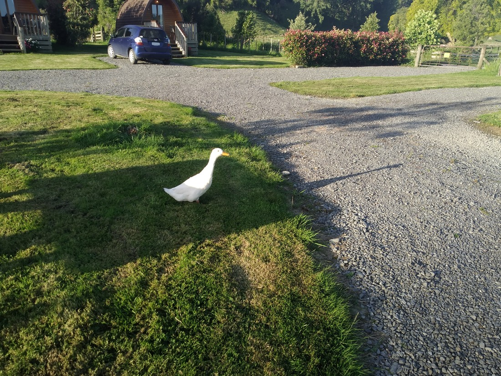

So here’s the thing about how I prefer to organise a trip. I like to set out with all the accommodation already booked. There are definitely reasons why this isn’t good. It doesn’t leave much flexibility so if some place is more interesting than expected, we have to move on regardless. However there are real benefits – we won’t ever miss out on staying somewhere because we didn’t book. The main reason though is that it takes away the stress of having to organise things during the holiday. Plus, planning is kinda fun.

However I may have got it a bit wrong with today’s schedule. I picked a particular place that isn’t actually near anything useful. It’s not in a town, just on the main highway about an hour out of Palmerston North. It also had no food options. So there was literally no use in turning up early.

However, we did decide to do the walk I had in mind when I mapped out our route. However, the walk wasn’t that long. What to do beforehand?

So we went to the gardens. They were nice enough.

> Man, what is it with gardeners and wanting to show off how many different types of roses they can grow?

Unfortunately the day was actually quite cold, which killed the mood. Who wants to hang out with plants in the cold? We did find a few small aviaries, and this duck pond:

Then we went to the mall. Spent exactly an hour there (partly because that’s how long the free parking was for). We decided to head on after this, but it wasn’t yet lunchtime. But there were also no lunch places where we were going. So we bought some sushi so that we could eat it once we became hungry.

The walk for today was the Rangiwahia Hut walk, part of the Ruahine Forest Park. Google Maps was pretty good at getting us there but I still managed to disbelieve it, only to find that we were now out of cellphone coverage and so could not check if the directions we had were correct. Fortunately they were, although we did have to go through a couple of closed farm gates. The first had a “missing person” flyer on it. This made me a little worried…

The track had a handy map showing the trails. Unfortunately the trail we had picked was confusingly listed as being “1 to 3 hours long (in one direction)”. Um, that’s quite a big difference. Why? Is it short but really steep? I thought I read that it was a gentle gradient. Was there optional bits to do? Didn’t look like it. It mentioned a detour due to a slip – was it a long detour?

The main reason we were worried was that if it was going to take us three hours to hike up and then three to come back down, we’d be checking in rather late. Perhaps too late. Fortunately a local arrived as we we’re wondering. He told us he’d been up within the last week and it had only taken an hour. While he was probably quicker than us (spoiler, he was), he was just an ordinary guy doing ordinary walking. So that reassured us that we would be on the lower end of that range.

Probably.

Perhaps halfway up there was something unusual – a wooden arch bridge between two cliffs.

Usually on walks like this they’re swing bridges or something similar so this felt out of place. It was basically a scene out of Lord of the Rings, but with less orcs, and more muesli bars.

The bridge turned out to be nothing like the one from Khazad-dum. It was kind of nice. Still a bit scary since unlike swing bridges a wooden bridge cannot bend. How much weight is too much weight? Fortunately it turned out to be more than one Luke plus one Betty.

So approximately 75 minutes after setting out we arrived at the top of the climb. How did we know it was the top? Well, basically everything about the landscape changed.

> Where’d the mountain go?

We had arrived in the land of golden grasses. Gone was the green native bush – no shade in sight. Had we not clearly been on top of a hill, I would have described the landscape as “plains-like” or “deserty”.

When doing a walk, it’s certainly nice to have something at the destination or turnaround point. Something unique to see – not just “Oh, these trees are a different brown than the other brown trees we’ve been looking at for the last two hours.” This walk certainly had that reward. It didn’t even really matter that the view over the countryside wasn’t that clear.

We did find the hut (wasn’t hard to spot amongst the bushes). Usually I’m not that interested in these things but this one seemed quite spectacular, perched near the edge of the hill giving a nice view out over… whatever region this is (not a joke, I honestly don’t know what to call it). This would make a great night getaway if it wasn’t so far from basically everywhere.

Speaking of being far from anywhere – our accommodation was a little motor camp on State Highway One. The reason I had picked this was because Betty and I stayed here on our first holiday together, on the way to the South Island. Back then we had commented on the cute little cabins they had, which at the time were unavailable due to resource consent issues. I figured we’d check them out and fill ourselves with nostalgia.

So they were still cute, but boy were they little. They had a bed jammed in at the end, a small fridge, a chair, and not much else – because there wasn’t the room for much else. The only window was basically useless – tiny and high up, which was a shame because it would have looked out over some picturesque farmland. It was also surprisingly cold, discouraging us from getting up only to find that the 9am air outside was actually warmer than that inside the cabin.

Certainly learned a lesson about “cute” being a bad thing when it comes to square metres.

Also, as I mentioned, dinner options were a bit scarce as this was 15km from the nearest town.

But we did get to meet some animals.

This donkey was also called Luke, and was louder than the picture suggests

> Not used to seeing a white duck. Afterwards I doubted myself, wondering if it had been a goose. He did not care for the wafer biscuits we gave him.

So, lessons were learned here. Planning in advance = still good, but just because something was good for one trip does not mean it will be good for another. I suppose we’re supposed to try new things on holiday anyway – not just go places we’ve been and do things we’ve already done.

One more night of holiday to go. Next stop – Ruapehu.