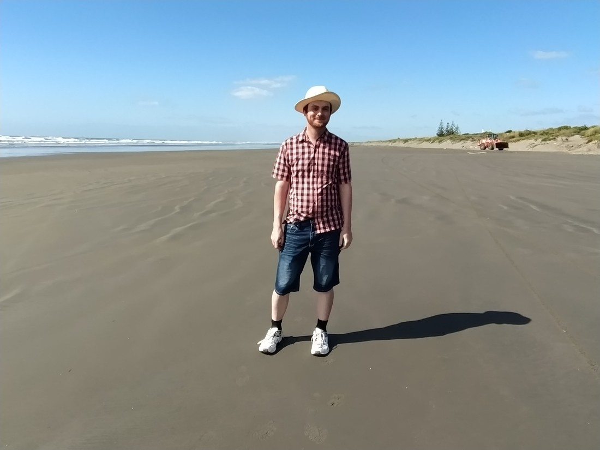
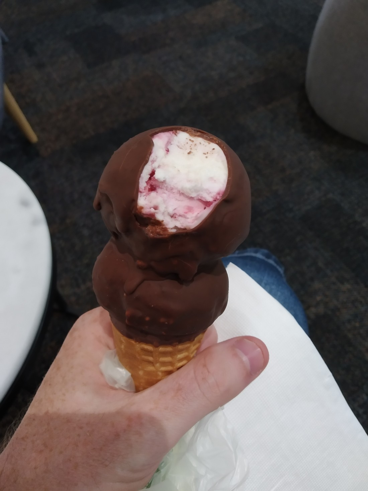

It’s December 1st – time to get out the bathing suits and the barbeques.

Yes…. about that…

Unfortunately today started just like yesterday weather-wise. We’re an hour out of Wellington on the Kapiti Coast and we’re staying here for a couple of reasons. The first is that Kapiti Island sounded quite interesting. It’s an offshore island (as opposed to those onshore islands) that is predator free. Apparently that makes the birds happier to pose for photos.

Kapiti Island turned out to be a lot larger than I was expecting. It was basically always visible, due to it’s height. We didn’t end up going there as we decided it just probably wasn’t going to be the best experience – having to spend 5 hours on a windy island. Still took a picture of it though

> Looks windy

We had breakfast at a cafe in Paraparaumu Beach (because we ate our B&B breakfast for dinner last night). It’s really weird to be in a beach town when it doesn’t feel like beach weather. It’s like we’ve taken a wrong turn, like we’re not really supposed to be here. Also, lots of old people.

Unfortunately there really wasn’t much to do in the area (Paraparaumu and Waikanae) that wasn’t outdoors.

We went to the mall.

Then we went back to our accommodation.

More board game times were had.

Fortunately it did fine up in the evening. We had our eyes on a particular walk – the Paekakariki Escarpment track – which was very highly rated. But it appears all our holiday luck has been used up.

The track’s website (yes track’s have websites) told us that it would be closed for maintenance for three days – starting today. What’s more, another walk I had considered was closed because of damage to the road to get there. Really wish we were still back in Wellington and at least we could eat ourselves happy.

Anyway, what we did do is go to the beach.

> Was a nice beach

Here’s a photo of Betty to show you that it was still colder than it looked:

> Where’s that cute face?

And here’s a photo of me in shorts and a sunhat to confuse you:

> Bet you’re noticing my swanky shirt – got it earlier from the Warehouse

We did do one more outing today – a trip to the cinemas to see a Christmas comedy movie called Happiest Season (it is December after all). Movie wasn’t anything to write home about. One good thing did come out of this trip, as at the cinema I bumped into an old friend:

> Oh boysenberry choctop, how I have missed you

Okay, another blog post written. This one is so late. I can’t keep up to date with them like Kate can. I’ve probably already told some of you who are reading this what happened in these last few days of our trip. This blog posts are mostly just for us to look back on in the future. Kind of like a photo album, but with more rambling.

…but don’t stop reading. Next one is another cute one, I promise.