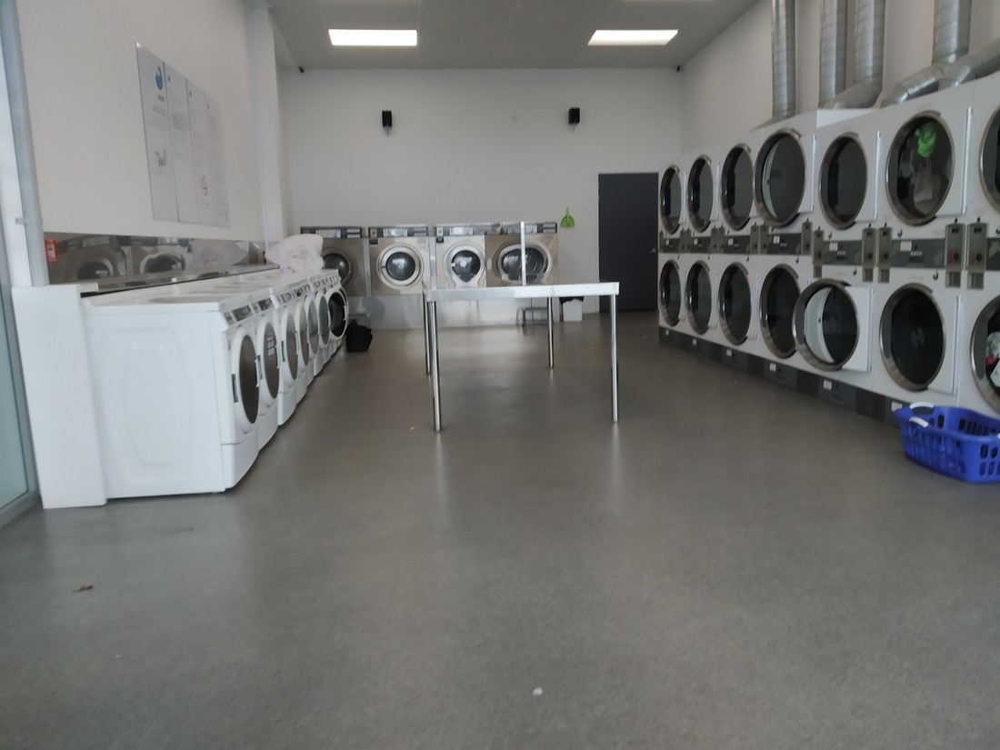

What’s with this weather? Yesterday was so fine – blue skies everywhere. Why does the weather person predict today will be rain all day? That’s so not fair – just pick one.

When we checked in we were reminded by reception that our voucher came with a late checkout of 4pm. I laughed, assuring her that we’d be long gone by then. But that was two days ago, when I wasn’t aware that the weather was going to be bad. With such a late checkout we can just hang round the city where there is at least cover from the rain and then go straight to check in at our next accomodation.

Anyway, we headed back to the Wellington Museum. It’s a building basically on the waterfront but a lot smaller than it’s more famous brother. It was mostly just about the history of Wellington, which doesn’t sound all that interesting, but it frequently was.

The first floor had a chronology of events dating back over 100 years. They’d done a good job at picking a wide variety of interesting topics. The one that most stood out to me was that New Zealand almost became alcohol free soon after World War One. However laws were enacted that bars must close at 6pm. Not quite sure of the reasoning – something about wanting to discourage intoxication I guess. However, these fifty years has perhaps defined our drinking culture ever since, as workers rushed to the pub after finishing work to drink as much as they could as quick as they could.

There’s probably a lesson or two to be learned there. But I still don’t know exactly what and I’ve already wasted enough time reading Wikipedia articles when I’m supposed to be writing.

> I’m guessing from the felt lined tables this is some sort of card game room

The next floor of the building was almost exclusively devoted to marine stuff. Wasn’t too interesting. More interesting for kids perhaps because because it was somewhat interactive. Which reminds me, I think there were at least three classrooms of kids going through the museum at the same time as us. Wasn’t prepared for how many field trips we’ve been running into on this holiday.

There was a third floor with some more things.

Then there was the fourth floor which was called “The Attic”. Very little detail was provided other than its name. It’s theme was basically, “If fiction wasn’t fiction.” So it had time travel devices, steampunk gadgets etc. To be honest – it wasn’t as interesting as it sounded. It was just a collection of things which someone dreamed up at some point. Usually I want to go to museums to see facts. It did have this though:

> Haven’t actually watched this movie though

Okay, 2pm rolls by and we figure it’s time to head on our way. We find our way out of central Wellington and start heading up State Highway 1. We have one stop to make today, and it’s one we’ve been planning for the last two weeks.

Here it is in all it’s glory:

> The part where the clothes spun round in circles was my favourite

The weather turned out to actually be kind of okay today, although the cloud layer was so thick that it always threatened some wet weather. We possibly could have gotten away with a walk but we couldn’t be sure. Wellington seems like the kind of place where you might want to be sure of the weather before heading up into the hills.

Our accommodation today was another B&B on the Kapiti Coast, kind of near Waikanae. Overall it wasn’t bad. No one was there to greet us but there was a lot of helpful notes – clearly relics of the lockdowns – to allow us to check in and eat our breakfast (for dinner) without any person to person contact. It was actually kind of nice, to the point that I was a bit disappointed when the owner came home and wanted to check in on us. Maybe I was just grouchy because she interrupted a good board game.

> We had to make do with that little table for our game.

There was a clear “beach” theme to the room. Unfortunately this didn’t go well with the cold weather we were having. Still gave it a 5 star review on Google though – weather wasn’t their fault.

Okay, so that was another day where we didn’t do too much. There’s increasingly more of these as the trip goes on. But that’s fine – gotta have some rest days. Betty says she’s looking forward to coming home soon. She has a point – nothing does beat sleeping in your own bed.