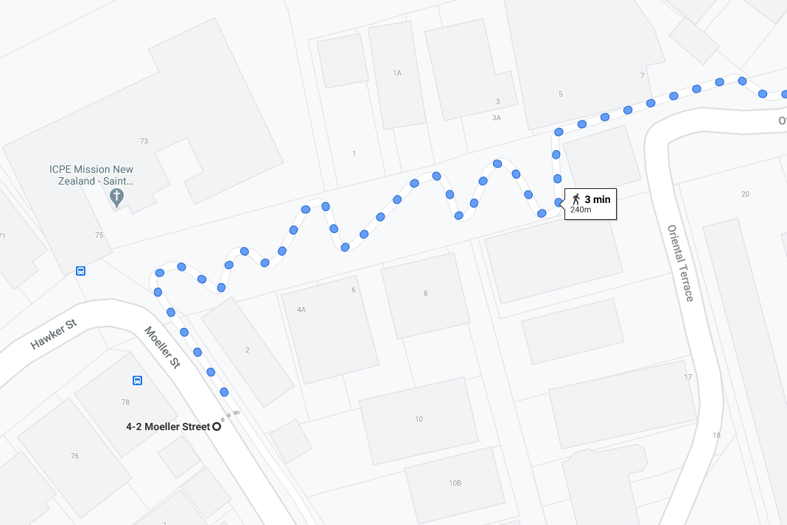
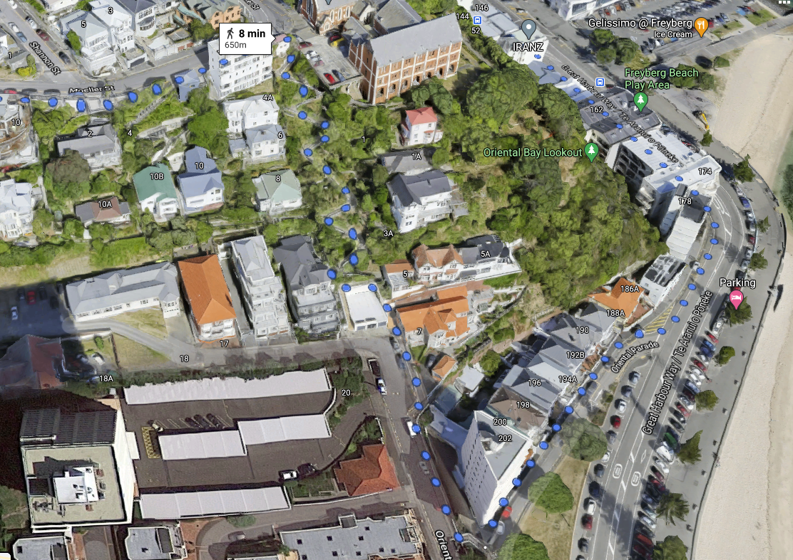

Unfortunately after the rock beach walk we had already used up a good chunk of the day. So back to our hotel we came.

Next few hours weren’t memorable. Definitely shouldn’t waste a whole paragraph talking about them, but I’ve already started one. I probably played games on my phone. Betty might have dozed off at one stage. Did we even play a game together? No – nothing that exciting. Gotta add more words to show time has passed etc.

Okay, it’s the early evening now. Time for dinner. No one wants to decide.

“Do we go that Malaysian Street food place?”

“I don’t know – looks very busy. How about we just have waffles for dinner.”

“Um, I guess I’m not that hungry. Do you actually feel like waffles?”

“No, not really.”

“How about we just go for a walk first?”

And that’s the story of how I tricked Betty into climbing another mountain.

If you look at a map, Mt Victoria just looks like another park within central Wellington. But as I learned last time I was here, just because it looks close on a map doesn’t mean it isn’t going to be a tiring walk up a hill to get there. How were we supposed to know that “Mount” Victoria was so “up”?

Here’s where the mountain started:

> Why does steepness never translate well to my photos?

Here’s some photos of us exhausted while climbing the mountain:

(Kidding – no one wants to see that)

Here are the money shots of us at the top:

Betty, noticing that all the dinner places are back at the bottom

> Luke, displaying confidence so as not to indicate how sweaty his legs currently are

Ordinarily I would like a walk like this but it was very steep. Who builds a city here?

Interestingly we came down a different path which brought us down a zig zagging lane between some houses. Then we noticed the houses had mailboxes, along this lane literally the size of a footpath, probably on a 20 degree slope with a 160 degree corner every 15 metres (numbers are just estimates). These houses did not look like they had driveways. I think the only entrance was that lane.

“Hey bro – can you help me move house this weekend?”

If they live in Wellington, it’s probably not worth it.

Oh – I found where it was on the maps. Doesn’t look like it has a name, but here’s a pic.

That’s right – maps don’t show up and down. Fun fact – Google Maps has this interesting 3D view:

> Interesting\!

So anyway, the walk took longer than expected. We ended up making our way back to that Malaysian place but it was very busy. Should have gone at 10am when it was quiet. This was right near our hotel so we headed back. Not 20 metres from the hotel was a pizza stand selling pizzas by the slice. Looked interesting. Probably should have eaten somewhere like this in New York but better late than never.

Their menu was kind of ordinary except for the “special” that they had which contained “asparagus, truffle mascarpone, bacon, and spinach.

Betty said this was the best pizza she had ever had. After finishing she spent a while considering whether to get a second piece because she forgot to take a photo of it and wanted to remember it. And also to eat it again of course.

I thought it was good too. Betty, I’m glad I can immortalise the memory of that pizza in blog form. Please don’t be too sad when you read this and are reminded that you might never eat it again.

Perhaps one day we’ll come back to Wellington, just to stay in the CBD and eat things. We’ll have to keep climbing Mount Victoria in order to burn it all off.