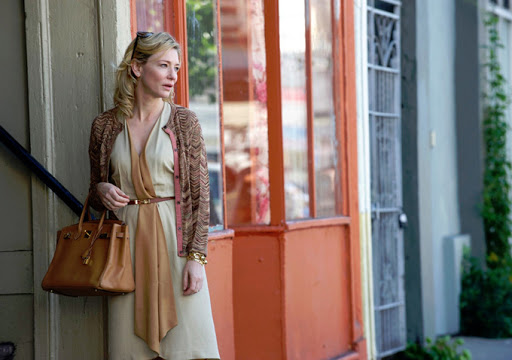
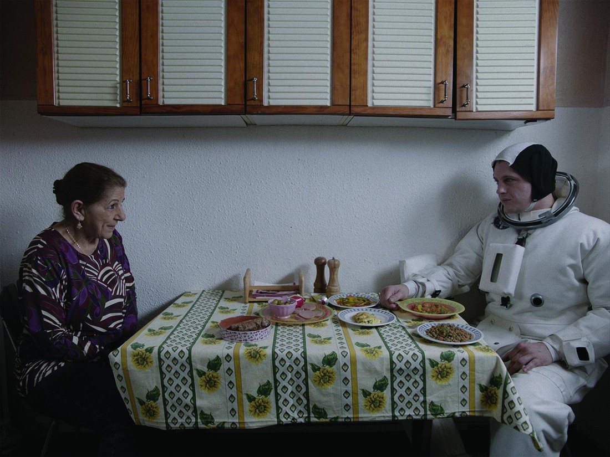

This blog post is going to be a bit different. Rather than go out at night (what are two young people like us going to do in Wellington CBD on a Saturday night?), we tended to just stay in. While I was blogging (not usually all that productively), Betty found some interesting stuff on the Maori Channel. As she really enjoyed what she watched, and as I wasn’t always paying attention she has taken it upon herself to record her memories here.

Anyway, take it away Betty:

_This isn’t so much of a holiday blog post, but we did watch various movies (sometimes the weather is bad, sometimes we just need a rest) that i thought would be nice to write about._

_First we watched a movie called Pirates: Band of Misfits, about a bunch of silly pirates trying to win the coveted “pirate of the year award”. Aimed at families, I guess. I’m not normally a fan of stop-motion animation but I didn’t mind it here. The story was good and the jokes were pretty funny. Unfortunately it was half way through already (probably) when we started tuning in. We had some fun guessing who the voice actors were – Luke was always right._

> “I”m Hugh Grant\!”

_Pirate movie was followed by Blue Jasmine, starring Cate Blanchett. This is the first Woody Allen film I have seen. This film isn’t for everyone but I enjoyed it, despite not being a fan of dramas. It never veers into melodrama territory, and I am very fond of non-linear narrative plots. Blanchett is stellar in this film, delivering a captivating performance as an upper class socialite struggling to cope with the sudden loss of money and status. We watch as she steadily spirals out of control. It turned out Blanchett received a lot of accolade and won a lot of well-deserved acting awards for this role._

> “Look at me, with my fancy clothes and schmancy handbag”

_The following night we watched a French film called Macadam Stories which followed the lives of 3 individuals living inside an apartment building. It wasn’t amazing by any standard but I thought it was a bit of a gem. It was an offbeat, low-key kinda film that definitely had its charms. Superb acting from the cast certainly helped. I was also really surprised by the French setting – the apartment block and its surroundings were really drab-looking. I wouldn’t have picked France, let alone Paris, as the location._

> “I like your outfit”

_I think I was just pleasantly surprised to enjoy the 3 movies that happened to be on TV (kudos to Maori TV – they often show good movies, we just don’t normally watch much TV). I really don’t think I would have seen them otherwise as one, I hadn’t even heard of these, and two, they’re not the kind of movies I normally go for. _

_Luke’s favourite was the pirate film (he’d already seen it before)._

_OK thanks byeee\!_