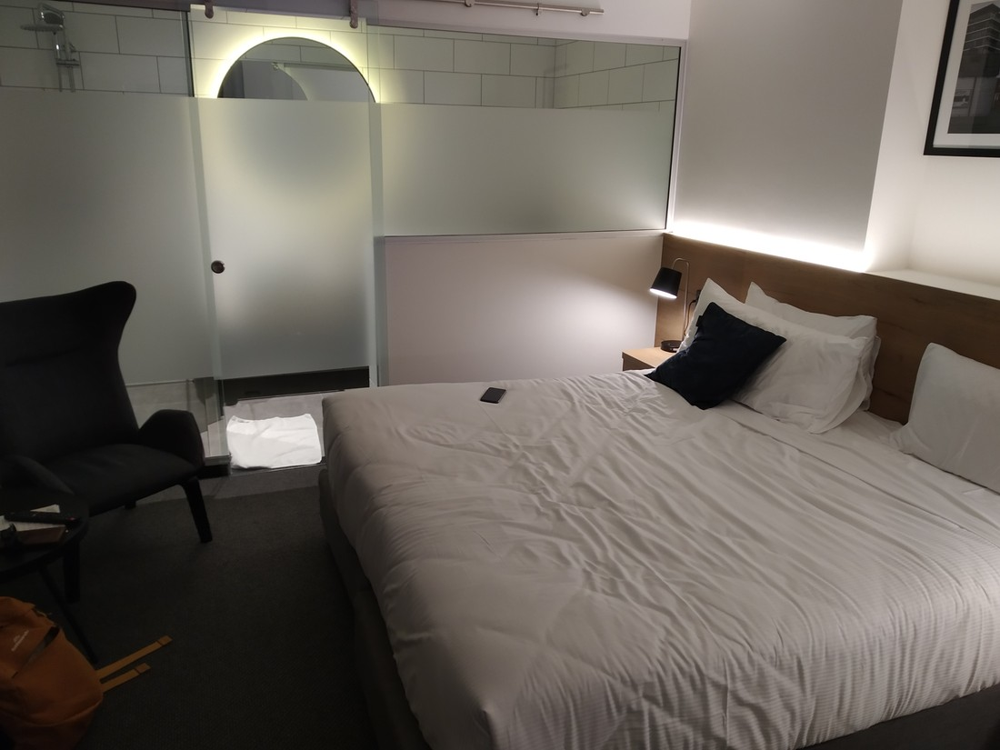

We were staying at a hotel on Courtenay place called “Oaks”. Betty had spotted a discount coupon on GrabOne which, in addition to a discount rate, offered free parking, discounted breakfast, and late check out. The location was also really central, right in the heart of Wellington’s CBD. There was only one catch – it was a “central” room.

What this meant is that there were no windows. But did we really need windows? No windows means no outside noise would be leaking in. In the past we’ve had some rooms with excellent views but because they’re facing a road, they have been rather loud. Overall the room was fine, except for that night.

> Also makes it tough to tell what the weather is like

I thought I had terrible sleep the first night we spent here. I kept waking up and having trouble falling back asleep. Eventually I reached over to check my phone and the time that stared back at me was “9:00”. This was quite confusing. It was much later than 9 pm when we went to bed. It made no sense. Until I realised that it meant 9 am. Despite the hour, the room was still fully dark (because no windows) so I’d wrongfully assumed it was still the middle of the night.

So yeah, we slept in that morning.

Anyway, back to today. Not much more to say other than we went out for a late lunch. We found a tiny Chinese restaurant called “Taste of Home”. Despite their rather authentic menu, surprisingly none of the staff were of Asian descent. Didn’t know what to make of that but the food was nice.

> Suspiciously nice

Now what? Well, we just happened to be a block from a board game cafe. Coincidence? Actually yes. But why walk back when we can just go there. So we spent a couple of hours there. Learned a new game and revisited one I used to own. We ended up back at the hotel really early (because our dinner had been in the middle of the afternoon) but it felt like we’d done enough activities for the evening.

I guess this is what happens when we stuff an extra hill climb in before lunch – we are just “done” for the day afterwards.