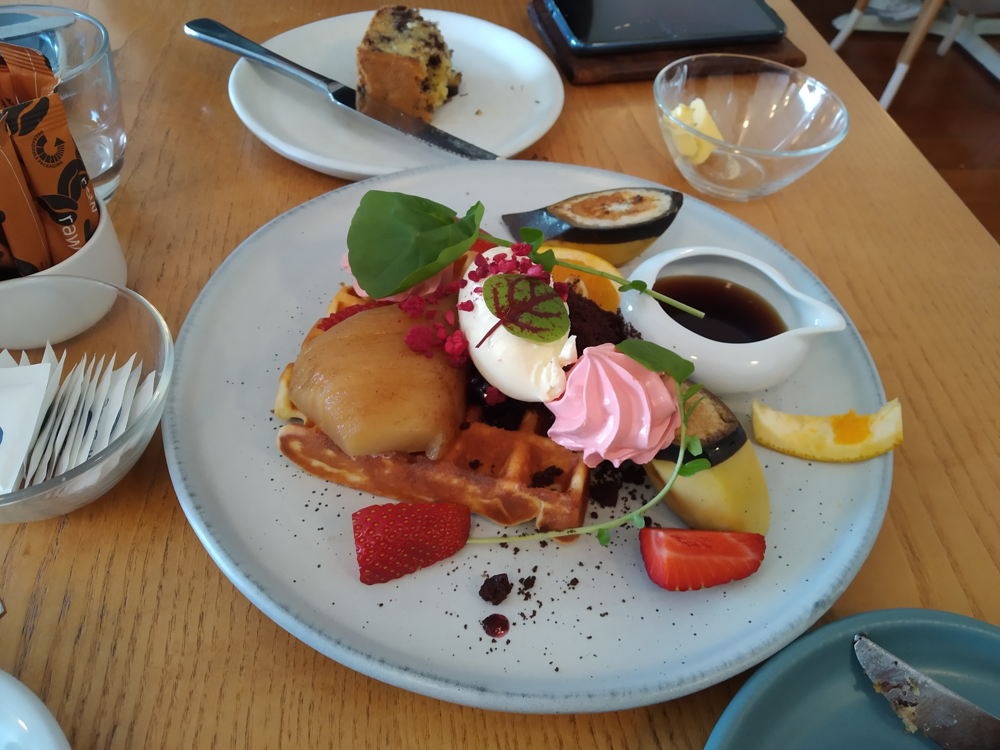

When we were planning this trip, I was looking at where there was stuff to do. Wellington kept coming up – due to all the different hills, forests, and coastlines – so we settled on a total of six nights in the area. But Wellington is not a small place, so rather than have one home base for six nights, I split it up into three different accommodation places for two nights each.

We’d spent two in Upper Hutt – now it was time to head southward into the Wellington city area.

Firstly we stopped in Petone / Lower Hutt for breakfast / brunch. Together we ordered the waffles and a slice of banana bread. While the waffles looked good, that banana bread was something amazing. We regretted that we had to finish the waffles and its variety of toppings when really we just wanted more banana bread.

> The star of the show (the banana bread) is the half eaten thing at the top. So unassuming but so delicious.

Anyway, we’re heading South. But there’s plenty to see on the way. We did try a bit of shopping – poking our noses in what I would describe as a geek clothing store – but before long we were heading west to the Belmont Regional Park.

In terms of parks, this really wasn’t much. It had some bush but resembled a farm more than anything else. I’d selected a walk up to Boulder Hill which would give us some good views of the city without being too long. However the track was strangely quiet. We only saw three people, and they were all doing another (longer) track.

It did make me question – is there a better track in the area?

Overall this was a very nice walk. Not too long and the hill at the top had excellent views of Lower Hutt as well as Porirua to the west.

> “Oh, banana bread. I know you’re still out there somewhere”

We were also glad that the hill was so easily identifiable. We definitely knew we’d arrived at Boulder Hill.

> Maybe it meant a different hill covered in boulders

So that didn’t take too long. We got back down and it may have even still been morning. What to do now?

Originally I had hoped to do the Skyline walkway – which was a 13 km path from Johnsonville that would have excellent views of the city. Unfortunately today was supposed to be windy and possibly questionable so that idea was dismissed. It ended up being a lovely day. Regardless, it still may not have been smart to do just one long walk.

I suggested to Betty we just climb to the highest point on the Skyline walk – a peak called Mt Kaukau. It wasn’t supposed to take very long. Betty didn’t have any better ideas for an activity before we check in (though she might have wished she had).

So we drove to Johnsonville and parked on a super narrow street at the base of one of the paths. Man, Wellington streets are horrible. The suburbs are so hilly and the streets are so tight. Was a nice place to visit but I don’t know I could live here.

The Mount Kaukau trail went through a forest…

…and up to another viewpoint – this time over Wellington central and Johnsonville.

You know the drill – stood there and took a bunch of pictures.

> “I’m a little teapot”

Two climbs done, and we hadn’t even had lunch yet.

> Who’s excited about lunch?

Okay, that’s probably enough for the morning. Time to continue on to the CBD.

To be continued…