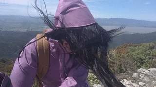

Okay, we’ve woken up in Upper Hutt. We’re in a place that is literally surrounded by hills (mostly) – right up our alley. What are we going to do?

Well first we’re going to have breakfast.

> Leah with her collection of friends she’s probably going to slowly tear apart if she keeps playing with them as rough as she does

Our hosts weren’t about (we didn’t exactly rise early) and breakfast was all laid out, but do we just help ourselves? Betty was keen for some farm fresh french toast. The eggs were lying out, as well as some other mixture which looked like it would eventually become bread. Were we supposed to make it ourselves? Too shy to try and find Eli we just had a continental breakfast.

On the way into Upper Hutt we passed three attractions which I took a mental note of thinking, “Oh that might be nice to do.” So today we basically backtracked and visited those places.

First up was Kaikoke Regional Park. I hadn’t included it on my list of places to see when planning this holiday because it was a small place. But it was because it was small that I figured it would be a good place to start for today.

Plus, you know, Lord of the Rings\!

> What do we have here?

Rivendell is a beautiful elf town (settlement / place / thing) in Lord of the Rings. In the movie it is a fantastical place. So some of the scenes were filmed here, though (without criticising the work that was done) it was clearly done on sets. Sets plus special effects. And after visiting Kaikoke Regional Park, I can confirm that was the case.

> A height guide. I’m pretty sure these are book measurements because Legolas didn’t tower over Gandalf in the film

Except, sets have to be built somewhere. So the team behind Lord of the Rings built those sets among the trees here. This adds more believably to the foreground of the shots, even when the background is a composite of models, paintings, and other landscapes. This also means that the park caretakers can point to certain places in the park and say, “you can tell the X scene was shot here because you can recognise the trees from those shots.”

So here I am, taking my picture with a famous tree:

> This fellow worked alongside Elijah Wood

The park caretakers had also constructed an archway in the design from the movie (the entrance / exit to Rivendell). It’s certainly nice to look at, and is very large, even if it is only half scale. I guess the movie version was done with special effects.

> Someone doesn’t know if Mordor is left or right

After visiting the “Rivendell” part of the park (which was 30 metre by 30 metre square), we decided to do a 40 minute loop walk.

Poor Betty, for most of this walk she had to endure me spouting off Lord of the Rings and Hobbit facts. Bet she regretted asking that one initial question.

> This was called the “swing bridge” walk

After I had taught Betty everything I knew about Lord of the Rings, we backtracked further along the road toward Masterton – to the top of the Remutakas. We spotted a carpark with a walk that was neither too long nor too strenuous so figured we could slot this in before lunch.

The sign warned “Do not attempt this track in windy conditions”

Well it was windy, but was this “windy” windy? Wellington is known for being a windy city – perhaps this is just normal for them?

So we decided to give it a go.

The first part of the walk wasn’t bad, as it was still under some tree cover. But this changed quite quickly. It was a good thing I had left my hat in the car because this was no hat weather.

At one point it started becoming difficult to walk into the wind. Then we’d round the corner and be walking with the wind and all of a sudden it was if we were weightless. And the wind just kept getting stronger the closer we got to the trig at the top.

> You’d have thought gravity was going sideways

It was a strange sensation. Not necessarily an experience I’d recommend because of how much my nose and ears took a beating but at the same time it was kinda funny.

The views weren’t bad, but it was very difficult to look at the mountains in the North East, as that involved looking directly into the wind. Rest of the directions were nice to look toward but it was hard to enjoy them as our attention was so preoccupied with not falling over.

After less than five minutes at the top we started heading down again. And it wasn’t until another five minutes later, crouched down behind some bushes, that we were able to have a conversation again.

After this we returned to Upper Hutt to have lunch and let our extremities recover. Then the question became, what next?

When we returned to our B&B late in the afternoon, we didn’t feel like telling them about what we did this afternoon. But I will tell you. Just not here. Will let that be a story for the next post.