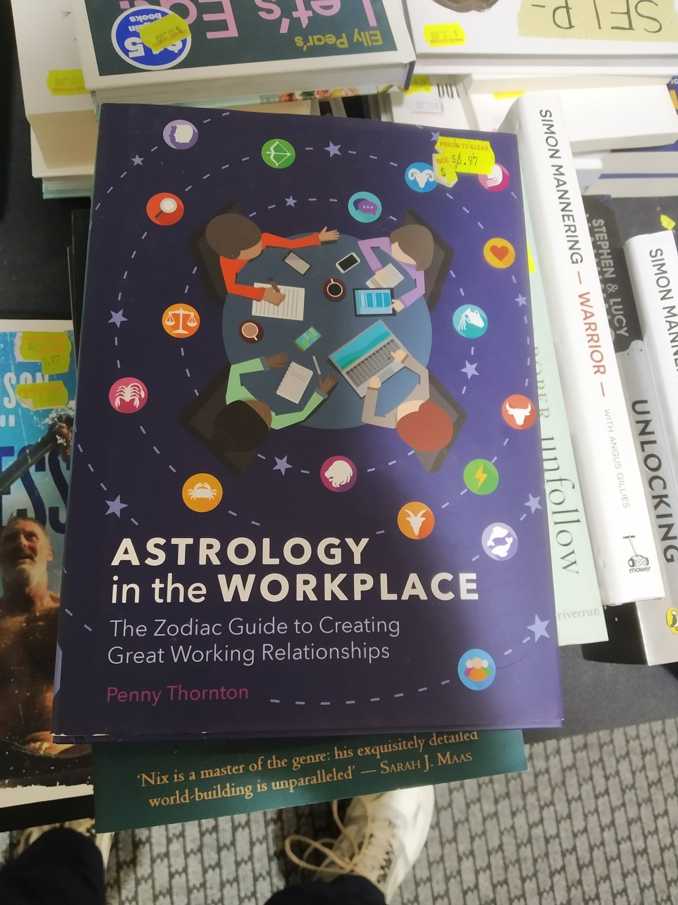

So it has been five or so days in a row of writing one article for a whole day. But today was different – I needed to split today over two posts. Why, when all we did was go on one short-ish walk and then check-in? Well, the accommodation was a bit different this time.

We were staying at a B&B in a valley, ten minutes from Upper Hutt. Wasn’t too hard to find. But when we pulled up to the gate, we weren’t sure what we were in for. Betty got out to open the gate and three dogs came running, all barking very loudly.

We were like, “ummm….”

Eventually a lady came out and started walking to the gate, smiling. She greeted us and started trying to calm the dogs down. They were certainly reluctant to cease their barking. But the lady assured us that they were just like this with new people, and the fact that their tails were wagging showed they were no danger.

It wasn’t the tails I was focused on – it was the teeth, and the noise.

So eventually the dogs were quietened, and the gate was opened. The dogs turned out to be fine, except for one, which the lady warned was a “licker”. And boy was he a licker. It was like he had never seen a person before. When we parked, he raced up to me and licked my leg several times, then back to Betty to lick her, then back to me to lick me more. I don’t know why, but this dog’s enthusiasm just made me happy. I certainly see why people like dogs.

Here he is with Betty:

> His name was “Dustin” or “Dusty” but I more prefer to just call him “The Licker”

It was a bit of an odd introduction. I didn’t actually get her name and she never asked for ours. I wondered whether we were the people she was expecting as when searching my inbox for the check in time I found an email asking for a deposit – which I hadn’t seen. Did we even still have a reservation?

I found out from their website that her name was Eli and her partner’s name was Sacha. I correctly guessed that she was from Germany.

Eli was very nice, and very chatty. We were shown our room. It wasn’t much of a B&B – I don’t think they would ever have more than one group of guests at once. Their house just had a couple of extra bedrooms and a bathroom off one side of the house. But they were certainly serious about the B&B. Their website was better than most motels we’ve booked. They were a bit of a puzzle.

> The room was nice

From our room we could see the chickens and some fields but not much more. The lady told us that she would go feed the animals at 5 pm and we could join if we wanted.

Weren’t going to pass that opportunity down. In fact, we were waiting impatiently when 5 pm came. 5:10 came and we decided we’d go walk around outside – you know, prompt them. I guess they weren’t as excited as we were – they probably do this every day.

The grass was quite wet as it had just rained, although it had fined up. They came out and offered us gumboots. Betty gladly accepted, though I could not due to a problem with my foot size (they are too big).

> Look at her – all smug with her boots that fit her

The chickens got fed first. We found out some chicken facts – such as why they had a rooster but still ate the eggs. The kunekune pigs got fed next. Then we were taken to the alpacas.

They had mentioned alpacas, but they were nowhere to be seen on their farm so I was wondering whether I had just imagined them saying “alpacas”. The reason they were nowhere to be seen was because the farm stretched behind a row of trees.

And beyond a stream.

> Look at her – smug that she can walk through a stream without getting her feet wet

Eventually I decided that I couldn’t be left behind and opted to go barefoot rather than soak my shoes.

It turned out they had quite a few alpacas.

As I said before the lady was very talkative. She said so much but I comprehended so little as I was too focused on the animals.

Despite waiting by the gate, the alpacas were a bit shy. They preferred to just group together with only one or two being brave enough to eat from the bucket. Perhaps the dogs made them a bit nervous.

But the alpacas weren’t the only animals in the field – there were also a few sheep. A couple had been bottle fed and were very friendly, enjoying a light scratch on the head.

But there was one in particular that was causing trouble. “Marlene” the sheep was ceaseless at trying to get as much food as she possibly could. Here she is being held back while the more polite sheep get some food.

We must have spent about an hour on this farm tour, learning a lot about alpacas and their owners. They had purchased the empty property five years ago and had built it into what it was today, learning as they went. This made me speculate what their circumstances were. I speculated that the guy was a senior IT person which he could do from home, which would explain how they could purchase a large property. A sneaky search found his LinkedIn profile, which confirmed I was probably right.

Perhaps one day the guy in the photo below will have that freedom.

> Though I’m not sure he’ll go to quite this extreme. Maybe he’ll just get a cat.

After spending a fair amount of time with the lady alpacas and the lady sheep, we moved on to visit the males. Unfortunately for them we’d given all the food to the girls so they didn’t get much more than some attention.

> They said this male was purchased because his amazing black coat would result in interesting coloured babies

So that was a really nice end to the day. Well, sort of – we did have to drive back to Upper Hutt to have dinner. That was also another opportunity to visit a Warehouse.

> I struggled not to buy this book – I just thought it was hilarious.

I probably don’t need to keep mentioning all these Warehouse visits. I mentioned it once and then laughed when we kept going back. Betty wants you all to know we’re not crazy people that have to visit one if we’re in town. They’re just so useful since they stock everything. Like a Walmart.

As I said, the animal tour was a nice experience. This place wasn’t all that expensive. If you mentally deduct what a guided farm tour would cost then this was extra affordable. They had a framed photo of their online average review score and I can certainly understand why it is so high.

I was glad we’d booked to stay a second night.