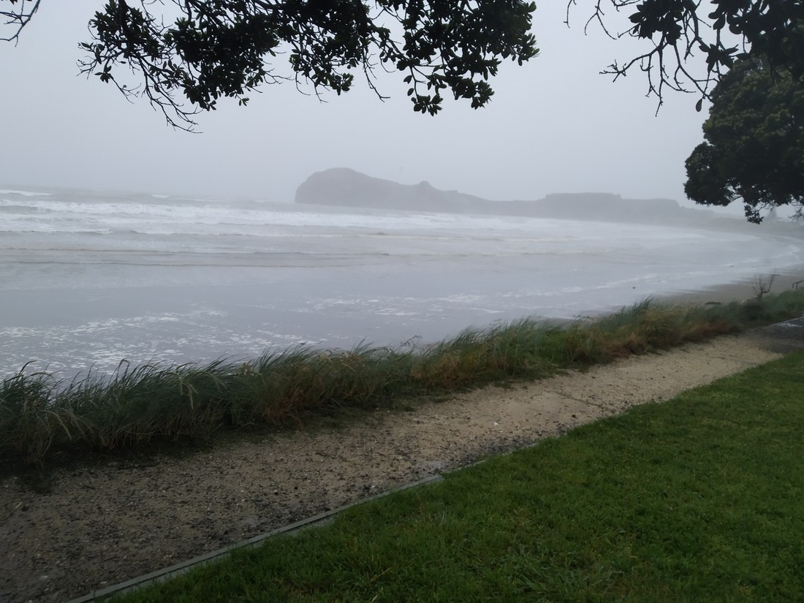

Today was not a good day. We could hear the rain as soon as we woke. And it was not going to stop at all today. The original plan for today was to hike up the Tararua Ranges and then head out to Castlepoint. Definitely can’t do the hiking today, but what to do instead? Castlepoint is little more than a camping ground – no point heading out there early. We checked out as late as we could, but what to do for the four hours before we could check in?

Well, first we went to this cafe / bakery that sounded pretty good.

It was.

> Yum yum yum yum yum yum yum yum yum yum yum yum

Now what? We were considering driving out to Stonehenge. That was an interesting find – a Stonehenge replica just out of Masterton. But would it be fun in the rain? Would we have the patience to care about astronomy when the rain is going sideways? We’ll never know.

Instead we went to The Warehouse again (bought an umbrella – you know, for the rain).

We did go to a chocolate shop in Greytown. We may or may not have bought some.

And by now we had wasted enough time to start heading out to Castlepoint. Still the rain poured. We arrived and found out that our “cottage” accommodation had been upgraded – which sounded nice.

It didn’t feel like an upgrade.

Sure there was more room, but the promised ocean views were difficult to see. The windows in the main bedroom let gusts in. I’d describe the shower as “nursing home-like”. And part of the reason we chose the cottage in the first place was because it was further from the noise of the sea whereas now we were sharing a not-all-that-sound-proof wall with a family.

This was quite a low point. A day of wasting time and rain, with a disappointing room. We struggled to find stuff to do in Masterton (it’s not exactly a tourist hub) but there was literally nothing to do in Castlepoint. We’d spent an hour driving out here, and we’d have to spend an hour driving back. All for nothing. This was quite a low point.

Then we played a game that we’d brought along.

Then we played another.

And another.

And like magic, this day become a good day. It seems I have a lot to learn about how to holiday well. I guess all that you need is good company to have a good time.

(Because it’s difficult to play games alone).

Anyway, lesson over. I ran out into the weather to take some photos to prove we were actually here. Then we watched Taskmaster.

> The rain had actually lessened, through the wind was still very strong

> Would be a very nice beach on a nice day. There is also supposed to be a lighthouse in this photo.

> Looking in the opposite direction when I was running out to the lighthouse

> It said not to come up here when it was windy. Well, it was very windy. I probably should have just stayed indoors.

> Here’s that lighthouse.

> And here’s the idiot that ran out in the rain to take pictures of the lighthouse