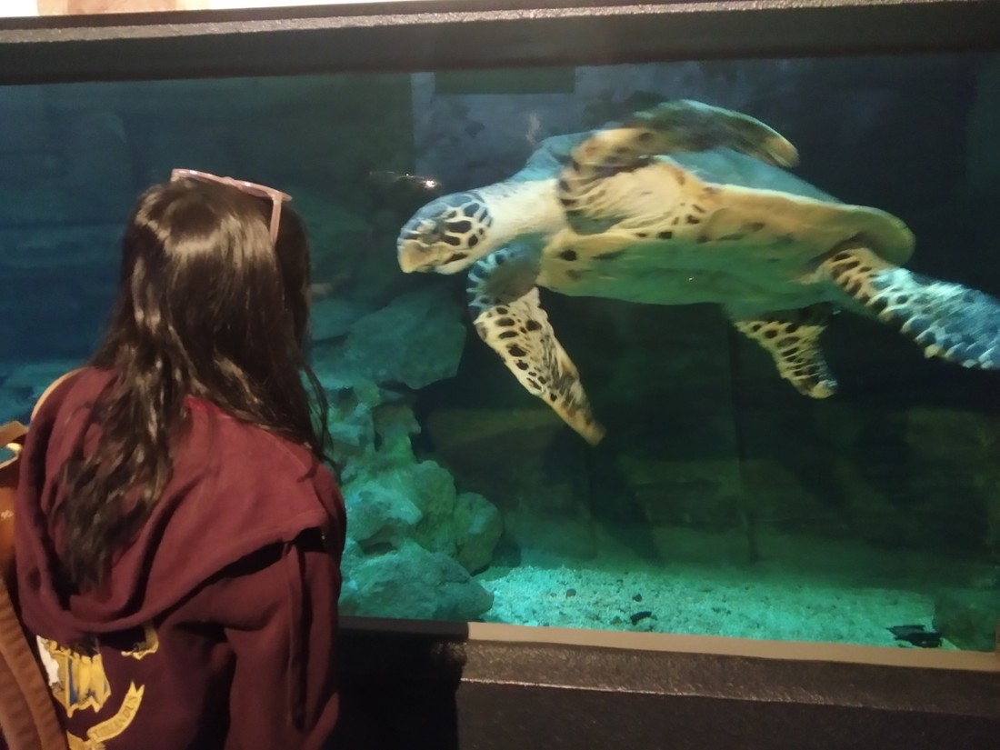
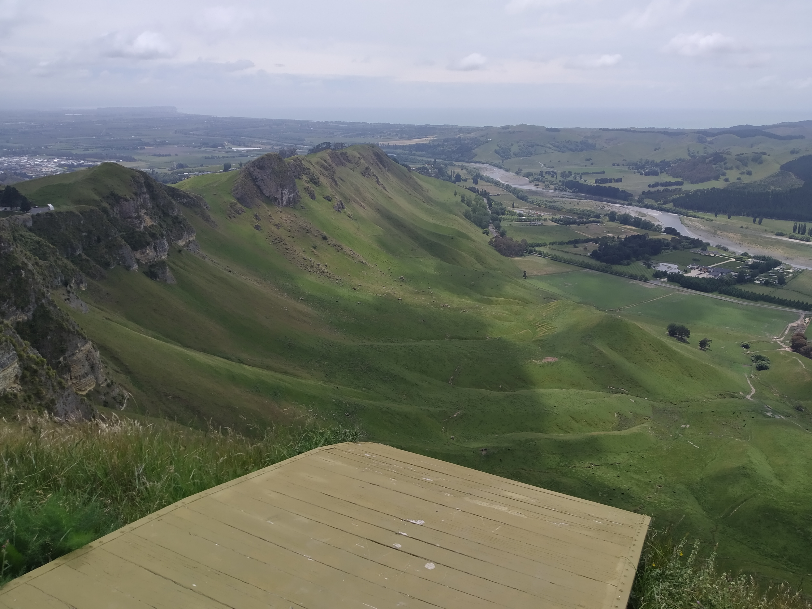

Okay, we’re not doing a big walk today. What are we going to do instead? Well, we’re going to do a bit of touristing that we’d done before.

First stop, the National Aquarium of New Zealand.

We missed the penguin feeding (couldn’t get up early enough) but we made it in time for the fish feeding – hand feeding in fact. By a scuba diver. It was quite a show last time. Fortunately there was a school group to be the audience. Unfortunately the jokes weren’t as good this time.

Afterwards we went round the aquarium. Saw some fish, trout, turtles, piranhas etc.

> Some dragon things. They liked to play the statue game.

> Betty and the giant turtle

> Some more interesting fish

However the real treasure of the aquarium is the kiwis. They’re kept in a darkened room and they’re really quite active. One is always digging in the ground, and then dashing round the enclosure. They run round like some sort of armless animal. Kind of cute, though not everyone could appreciate it. Possibly because it was really dark. Their loss – they missed out on hearing the kiwi call. Well, it sounded like a call. It could just have been screaming at its enclosure buddy for messing up the leaves. Anyway, no pictures of this because of the darkness.

Then we sought out Napier’s board game store. I bet you are amazed this is the first time I’m mentioning board games on our trip. Not for lack of trying – often I search the internet to find out if there is a local gaming scene. Didn’t spend much time here – just another store.

Then we headed out to Te Mata Peak.

This was another place we came when we were last in Napier, and figured it was good enough to come back to.

The great part about this peak is that you get all of the views with none of the hiking – you can just drive up.

> See – look how happy this person is that she didn’t have to walk up here.

> Fun fact – when I’m reaching for my old movie t-shirts, I probably am overdue to do washing

Then we started driving – to Masterton. Well, not quite all the way to Masterton. We stopped outside Woodville. We’d heard the gorge to Palmerston North was closed – figured the walks in the area were worth checking out.

Well, they might have been. But we kind of gave up. I’m sure it was a nice walk but we couldn’t do the whole thing. And it just kept going up hill. If it wanted us to walk more perhaps it should have been flatter.

We arrived in Masterton and checked in – just a little motel, nothing fancy. Played a game and caught up on the Taskmaster episode we hadn’t had time to watch. And that was it. Not much done, but that’s okay. We’re on holiday. We don’t have to pack our days with fun stuff, right?

Fun stuff would be fun though.