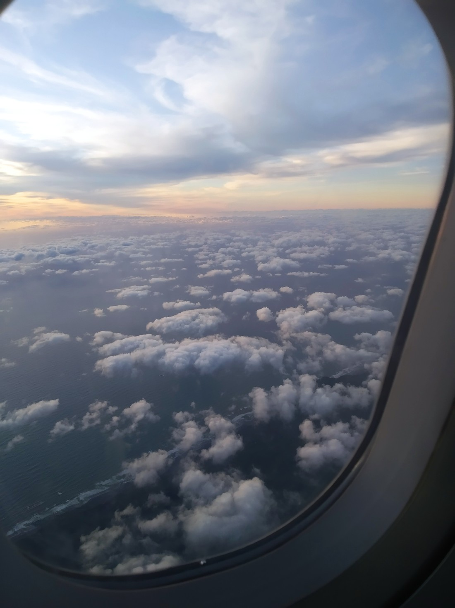

Our last stop before heading to the airport was at Arrowtown. It’s an old mining town that has still retained that look and charm. Many of the shops in the town centre area look like they are still from that time.

So yeah, we took no photos of any of that.

We had lunch and then Betty and I headed off to find a “Chinese village” that we had seen a sign for earlier. We found it:

> Wasn’t hard – because of the signs

The village was an area where there were old (partially restored) buildings used by Chinese settlers who came here 100+ years ago to search for gold.

Their lodgings weren’t very roomy.

That being said, they had a look about them as if they were built by someone who didn’t know how to build a house (eg, a gold miner) but had to in order to survive the cold winters.

To be honest, If I was one of those miners I’d be pretty happy with these houses. There’s nothing like being a web developer and feeling like none of your skills are useful for anything practical. Well, there was one house I could probably do better:

> Dude, you forgot to build your hut

And that was all we had time for. After that it was back to the airport, and back to Auckland.

It was 9:30 pm when we had dropped everyone off, and we now had a choice about what we wanted to do – stay in Auckland or drive back to Hamilton. We decided to drive back that night. That made the day extra long but meant we had more time the following day.

Which was important because even though we were home, our holiday wasn’t over.