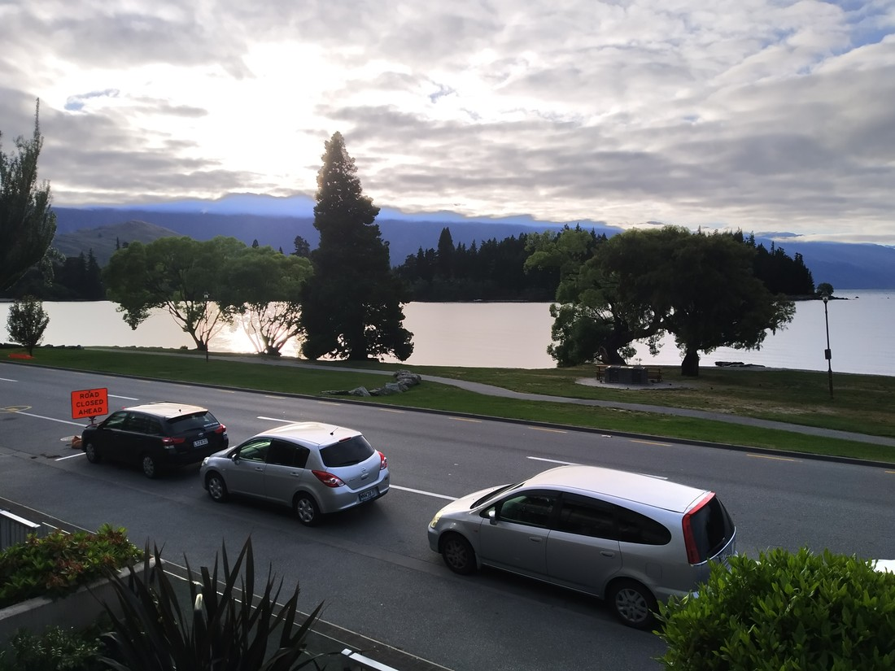

Today started a bit different. We had to set our alarms so Betty’s Mum and Aunt could catch the bus at 7:20am. They were heading off to Milford Sound for the day. “But Luke,” I hear you ask, “isn’t Milford Sound like really far away?” Yes, yes it is. Roughly four hours to get there in fact. It would be after 8pm by the time they returned.

> Cloudy start to the morning

So what were we going to do? We needed two activities – one for the morning, one for the afternoon. So Betty was given my list of ideas and told to pick two. Unfortunately once we excluded the activities reserved for tomorrow, that only left two ideas.

And they were both hill climbs.

> The view from the bottom of the first hike was already quite nice

So we started off with Queenstown Hill as it was quite a cloudy morning and this one was at a lower elevation. We drove to a small parking lot in the back streets off Queenstown (which was part way up the hill), so that was some of the work done. Still was an elevation climb of 400+ metres but it turned out to be quite an easy 400 metres.

> Few trails have gates this nice

That being said, the conditions were perfect for fast climbing. The incline was a nice gradient, it was through a very shady pine forest, and we were walking in the cool morning air. I don’t know if we were walking fast though because there was a guy who started the walk at basically the same time as us. Only difference was that he was older and carrying an infant. And we never did catch up to him.

> So maybe we’re not quite as quick at hill climbing as we thought

By the time we had reached the top, the clouds had all but disappeared

> Betty thinks she looks terrible when photographed after these climbs. The camera disagrees.

Like the other hills we’d been up around Queenstown, this one gave a nice view from above of the lake and the various suburbs.

> Also mountains

And what is becoming a pattern for our walks, there were basically no people around. The whole hilltop was ours.

Well not quite just ours

> Betty spotted something

A family of eight or nine goats were basking in the sun. Some were testing our their horns on their brothers (or sisters – they all had horns, do lady goats have horns?)

And that was it. Back down, and back to our accommodation. All before noon.

After walking round the shops (purchasing some cheap New Zealand swag) and lunching at the Big Fig (Betty adored the Kumara gratin), it was time for our second activity. So we drove back to the Crown Range road and up to the carpark at its highest point.

> Queenstown is back down there somewhere

From here we set out along a track to Rock Peak. The sign said 1 hour (one way). A blog I had read about it said 1.25 hours (return probably*). The landscape couldn’t be described as anything other than desert-like. Fortunately it was high enough that the cold air counteracted the hot sun.

> *it was not

As we climbed the first hill, we were overtaken by another lady doing the same trail. I must say, we weren’t used to be overtaken this easily. A while later we spotted her at the top of a hill. Then she came past back down the hill and commented to us, “It’s further than I thought.”

“Kind of a weird comment,” we thought. Unfortunately when we got to the top of that hill, we found a distinct lack of rocks. “I guess this isn’t the peak,” we both thought. “Must be the next one.” But it wasn’t the next one. Once we had crested that hilltop we finally saw in the distance another huge hill.

> “Why is it so far away?”

This is something I feel like I’ve noticed about distances in the South Island. They often (but not always) take longer than the quoted time. I was sure we were not slowpokes. Are South Island people just fitter? Are South Island people just better?

> No, that’s crazy talk\!

Anyway, we got to to the top. Probably took us 1.5 hours, maybe more. It was certainly worth it.

> Views

So high up. The sign at the top read 1,485 metres above sea level. And yet we could still see everything so clearly. We could see cars on the road (and unfortunately hear them slightly too).

I don’t know if our walks in the North Island our going to compare to these.

We (mostly) don’t have the giant valleys, the desert landscapes, the snowy mountains.

> We do have rocks though

However we do have much milder winters. But what might it be worth to be back here when the bushes are all dusted with snow?

> Let me Google “Queenstown temperatures in June” first…

But we couldn’t stay up there forever. We had to get back down, drive back, shower, and then wait for the others to get back from Milford Sound.

We suspected they might have missed out on lunch so we needed to make sure we were ready so we could go straight out for dinner once they returned.

As I said, they didn’t end up getting back to late. So I guess we could have spent a bit more time up there.