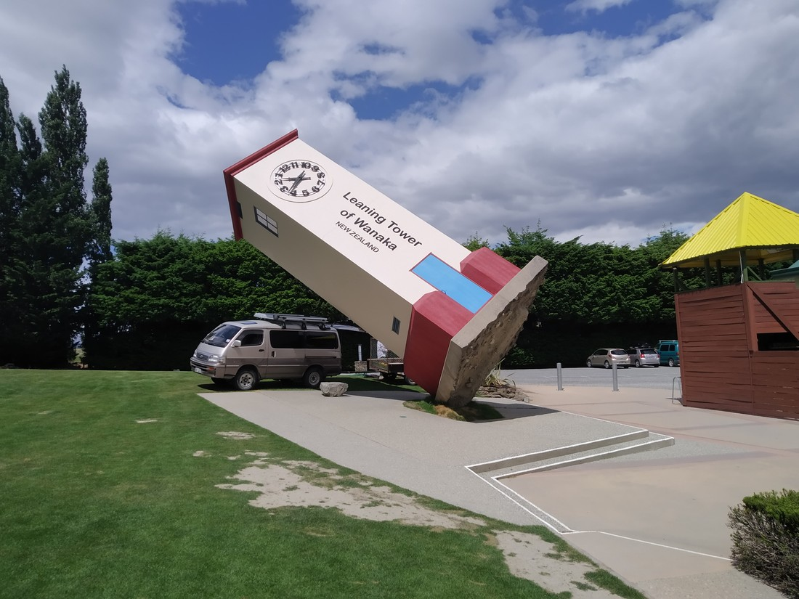
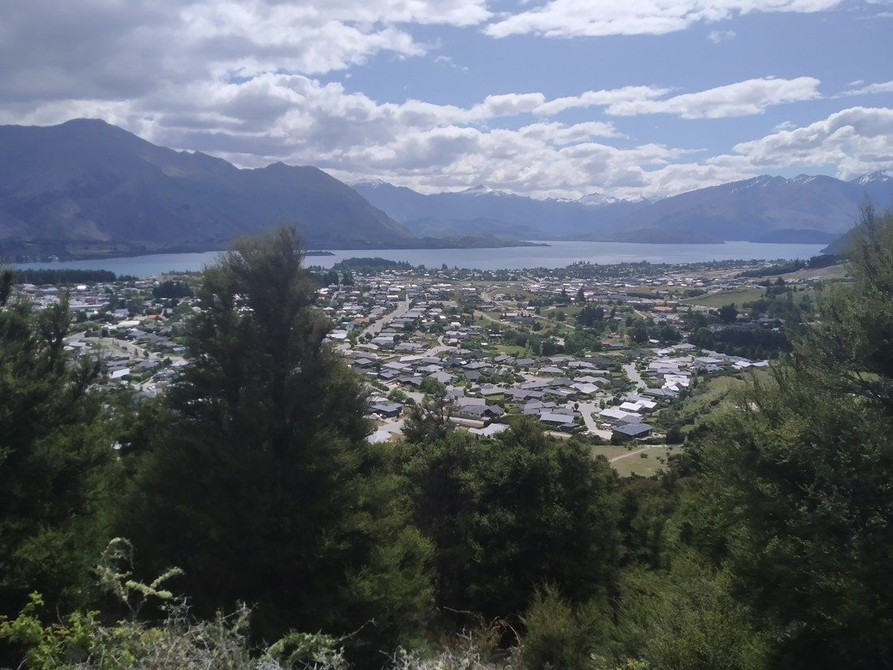

There’s only one road back from Mount Cook. While it’s certainly still scenic, we did just drive it like 24 hours ago. (Fun fact: there wasn’t a single passing lane in either direction – good thing our rental car can overtake quickly). So instead of driving the exact same route back, I figured we could go via Wanaka.

> Not the best picture, I know. Didn’t take any others of the lake.

Lake Wanaka and the city of the same name (coincidence?) do seem very nice. Lots of new houses in new subdivisions. Snowy mountains border the opposite side of the lake. Might actually be a nice place to live, as long as it was this climate all year round.

We dropped the old folks off at the lakefront and city centre and headed to…

What would Wanaka be without Puzzling World? A lame town probably. I’m pretty sure this must be the reason why Tom Cruise enjoys Wanaka so much.

> Not a great place to park a van

Anyway, we were actually only here to ask for directions. Across the road was a giant hill called Mount Iron. Sounded pretty neat.

It was nice. A decent challenge. Happened to be a very hot afternoon. Gave good views in each direction.

> See, right across the road

Not sure why we weren’t more excited about it. I guess we packed so much in to these first few days that a moderately sized hill didn’t stand out. It was a very hot day. The right activity probably would have been sitting under a tree with ice cream.

While it was certainly scenic, some good did come out of the detour home via Wanaka. Taking the Cardrona road back to Queenstown, I spotted something we could do tomorrow…

