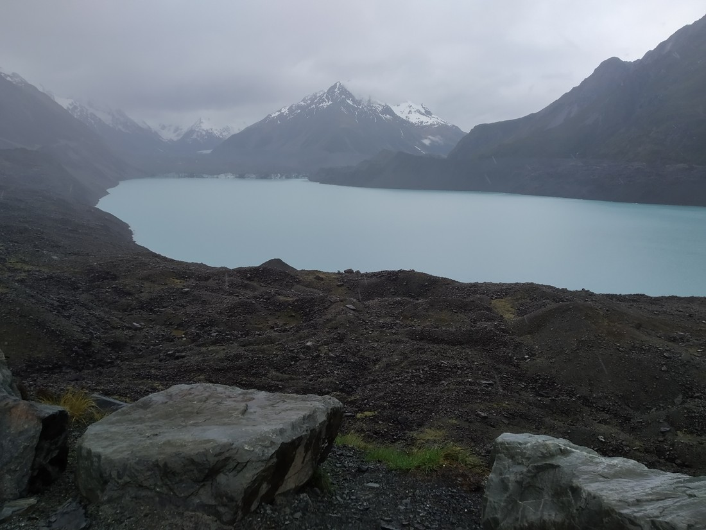

Aoraki / Mount Cook National Park is usually a rather nice place. It is a great big valley in the shadow of snowy mountains. And like a lot of other places we’ve visited so far, it was quite deserted.

And we can’t really blame people for staying away. It was not nice\!

We arrived at around 4pm but it was already very dark. The rain was steady. Can’t just wait for a break, the clouds were taking none. I got wet dashing to the lodge reception. I then got wet a second time dashing to the other reception after the first one said it was closed, and told us to go to the other. The man behind the desk, clearly oblivious to the outside, gave us a map and explained several nice walks in the area. Fortunately there was a mostly sheltered area for us to unload.

The weather forecast was on the TV at the reception. Rain tonight, rain tomorrow night, and rain the following day. However, tomorrow day was fine / cloudy. Perhaps the three hours of travel (plus seeing sights) each way might have some reward. But this was no guarantee. “Fine” is not much use if there is also low clouds obscuring the mountains.

> The view from our accommodation. Yes, I could have gone out and stood on top of the hill to take this photo. But rain…

I decided that however bad it might be right now (which actually wasn’t too horrible), that didn’t mean we couldn’t go out and see some things.

Betty, wisened after bring dragged up the Remarkables for a chilly walk yesterday, was even more reluctant. But how could she pass up the opportunity to be both cold AND wet?

> Here she is, enjoying her decision to come out

Anyway, here’s some blurry photos. Could see some things but couldn’t see Mount Cook.

> That should be Mount Cook – where those clouds are

At the first viewpoint we hiked to we couldn’t see much more than a big grey lake. None of the promised views out down the Hooker Valley toward Mount Cook.

> Someone doesn’t mind the rain

The second viewpoint was actually much nicer. This lake was a lot nicer and even in the dimmer than usual light, it still managed a blue glow. I made a mental note that we should come back tomorrow if the weather turned nicer.

> Again, I’m told Mount Cook should be in this picture somewhere

We didn’t stay long here as the rain had now become rainier. Plus we needed to get back for dinner.

Unfortunately food options were slim. The Hermitage hotel had some sort of restaurant for romantic couples dinners (not quite what we were after what with the dampened enthusiasm). They had another restaurant but I didn’t even bother enquiring after hearing the breakfast price of $30 per person. I just wanted something simple so we could get it over with and then to bed.

We all went to bed when the sun did that night. Perhaps the rain did appear to be lessening? Not sure. We just had to wait and see.