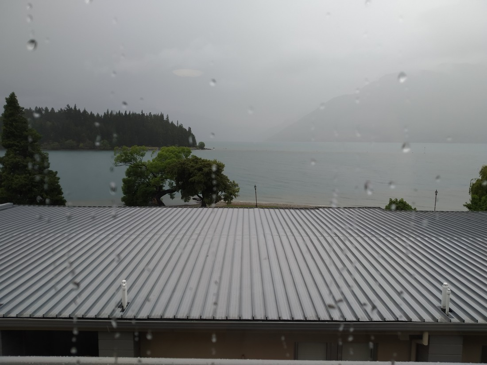

We knew from the internet that day two was going to be bad (weather-wise). We went to bed on Monday with this view

And woke with this view:

Today we had scheduled that we’d spend one night at Aoraki / Mount Cook National Park, though the weather forecast for there wasn’t good either. Not much to do but continue on as planned. As it was too late to change anything we just had to continue on and adapt to the weather.

> Interestingly, it rained for a lot of today but there was also a lot of sunshine (often at the same time). So just because a lot of these pictures look sunny, that doesn’t mean it wasn’t also raining.

We stopped and picked up a whole bunch of snacks from what I can only describe as the most fantastic Pak n Save ever (so many snack choices). And then started driving, making the occasional stop.

The first stop out of Queenstown was some blue water

Then a deserty place

> Can confirm, was raining at the time of this picture

Next place was actually a planned stop that we decided to keep because it wasn’t raining (at the time we started the detour). It was a place called the Clay Cliffs near Omarama and again it brought back memories of places we visited in America – this time of Bryce Canyon.

This trip has reminded us that in New Zealand we do have everything North America has – but just not on the same scale. These structures were limited to one section of a cliff, rather than a 145 square kilometre canyon.

> A bit of a slot canyon going on here as the rain water clearly ran down the cliffs and then out a single exit.

It was only a twenty minute walk but naturally it started raining when we were at the point furthermost away from our car. Fortunately it was only light rain and stopped before we got back.

> Betty putting on a brave face, pretending she doesn’t care about the rain

But not before I had gotten wet, put my coat on, then regretted it as this made the coat as wet on the inside as it was on the outside.

> Not pictured: anyone wearing a coat. I guess I took these pictures beforehand.

The whole drive from Queenstown to here was very scenic. So mountainous – nothing like what we have in the Waikato.

> Ignore the person in the foreground, I’m talking about the stuff behind her.

The road ran through these giant valleys filled with farmland, surrounded by hills. The farmland was frequently filled with sheep (and lambs – so many lambs) and irrigation machinery. Frequently the roadside was lined with flowers.

> These flowers

One other thing I did keep an eye on was the clouds. At the beginning of our drive there was a big black cloud to the East. Fortunately we missed it or left it behind. Then we were nearing Twizel I couldn’t help but notice the clouds to the West, where the highest mountains should be. Then we reached Lake Pukaki.

Lake Pukaki is the giant lake where you turn off to go to Mount Cook. It is also quite spectacular in that it is a very long lake that points almost directly at Mount Cook. This is what we saw:

> See that white smudge in the top right – there should be mountains there

Mount Cook National Park feels like a kind of pocket in the Southern Alps. And presently that whole area was hidden behind a literal wall of cloud.

And that was where we were going.

We decided to drive on to Lake Tekapo first (more on that later) and then return, hoping the weather would have improved and it had, but not really. For reference, the photo above is from when we returned. The first time we drove past the mountains in the left of the picture were also obscured.

But we didn’t really have a choice. Our accommodation was booked so in we went. Into the rain. Willingly, if reluctantly.

And just a bit on Lake Tekapo before I finish this post. Lake Tekapo is more famous than Lake Pukaki despite being smaller and not having views of the highest point in the country. But we didn’t stay more than mere minutes because the wind was so strong. Here are the few photos I snapped before running back to the car.

> Famous church or something. Photo is not cropped nicely because I wanted to quickly get out of the wind and the rain.

Unusually the lake had waves – and they weren’t small waves. Well, they weren’t big waves either. Perhaps big enough for a small child to boogie-board on them. Point is, they shouldn’t have been there. Stupid wind.

And again, you can see the clear divide between the nice weather (if really windy) and the weather we were heading into

> They may not all look it but the flowers were all blown sideways

We were intending to visit the hot pools, but as they were outdoors we decided to give them a miss. By this point we just wanted to check in as soon as we could.

To be continued in day two, part two.