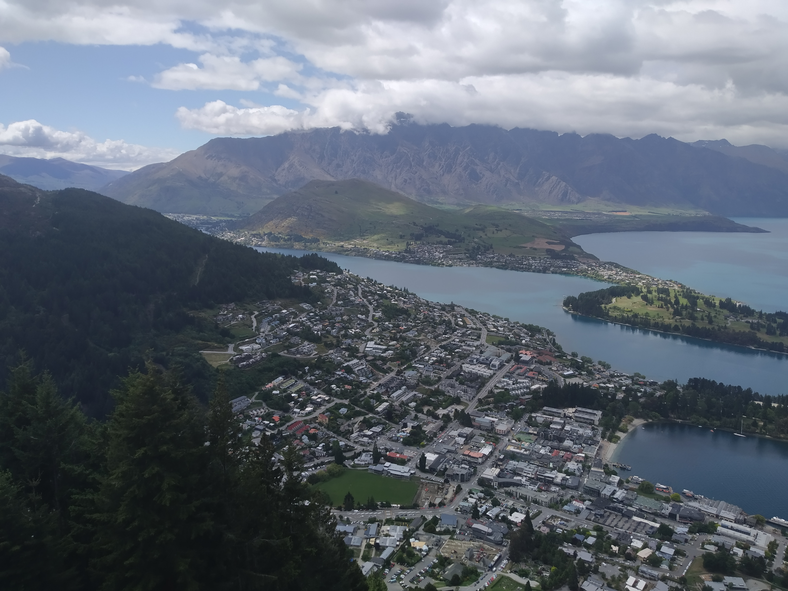
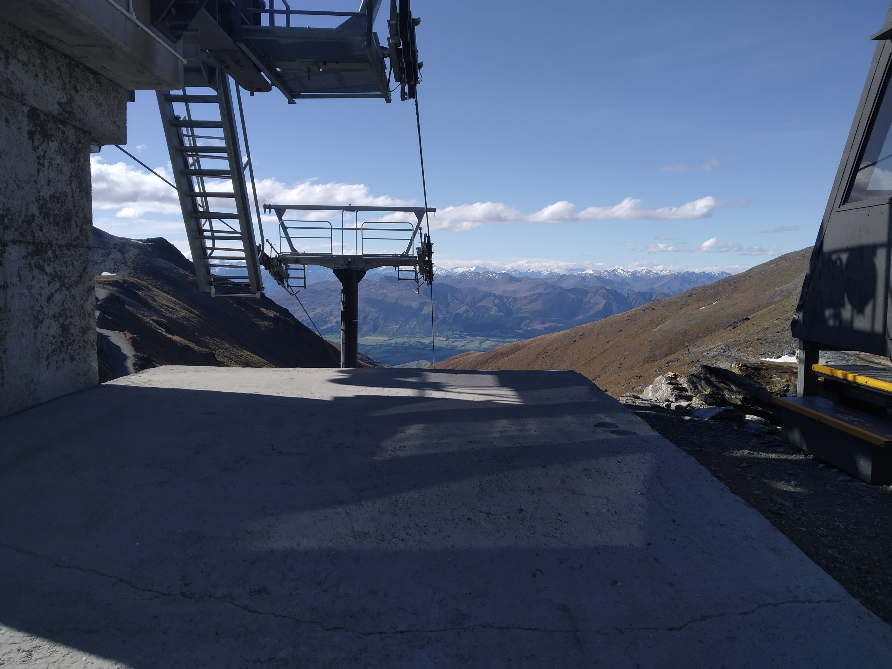

Just going to nip this in the bud straight away – it wasn’t actually abandoned. I’m just cleverly using a mysterious title to make our adventure sound cooler.

So what do you do? It’s 3pm and your poor girlfriend has been up since 6am to do a day of flying and then sightseeing. Bear in mind that she had worked the seven days prior and is probably feeling quite exhausted. Well, if you’re like me you point at the big mountain out of the motel window and say, “let’s go up there.”

> That one with all the clouds. Also, this is not the view from our motel room. Our motel is slightly more down there.

So after we had a long rest (not so crazy to allow her none), Betty and I took off for the road to the Remarkables. It has this weird thing where it’s a tourist attraction but it thinks it can charge people money to enter. Fortunately it was only $10 so we paid it and on we went.

The road up the hill gave a stunning view of Queenstown, the airport, Arrowtown (probably, I don’t know the names of the places yet), and the surrounding areas.

> Surrounding areas

Honestly, this view was actually worth the entry fee. Much better value than the gondola and you could bring your own car. And being so quiet,

However what we were really after was the Lake Alta walk at the top. We didn’t know much about it other than there’s a lake, the walk takes 1.5 hours return, and we shouldn’t try swimming because of hypothermia reasons.

We get to the end of the road, which is a giant carpark for the Remarkables skifields. However it is basically deserted. We park by the only other car to keep it company and start heading up. Now unfortunately there weren’t a lot of signs. Fortunately we ran into the only other people straight away who pointed us along the right path. And then they were gone. We literally had the whole skifield to ourselves.

Now, did I mention it was cold? I must have had some sense banged into me after our walk along the High Note trail at Whistler because I actually brought some warmer, weather proof clothing this time.

> Well, plants might still have been nicer

Without anyone to operate the chairlifts, we were resigned to walking. But that was fine. It was when we got to the top of the chairlifts that we found we had a problem.

Which way to go?

> Not down

There was a handy sign showing the ski routes. It also showed a trail to lake Alta. But where was this trail?

> Proof we didn’t just imagine a sign

We had a rough guess that the lake was over the rise to the right but the only path went way up the mountain to the left of us. Lacking time (we had to get back for dinner), we started out making a direct line up the hill for where we through the lake was.

This wasn’t easy. It involved scrambling over rocks, making our way through the undergrowth, and walking over snow drifts which frequently lay in our path.

It took a bit of nerves to get on and off those snow drifts. The middle was relatively solid but the edges were weaker, and there we could see exactly how deep the snow was and how far we would probably sink if we were heavy enough. Once I managed to find out.

> Not that cold at the time of the photo but it did feel a bit weird afterwards

After cresting several crests we finally made it to the lake. Woo\!, we had guessed the right direction.

Not a bad lake. It felt similar to Lake Moraine, in both colour and surroundings, but at least this time we could be there during daylight and without crowds.

After spending a short while we started looking for the trail back, figuring it should be easier to spot from above.

> Nope

But it wasn’t. We chose a different route down and basically stumbled over the track. It was quite small but was marked with infrequent markers. We also found out why we hadn’t seen the start of the track from the chairlift end. At the time we took this photo I was standing on the trail to Lake Alta – we just didn’t know it.

> Who put this snow here?
And that was it. We headed back down and told our amazing story of how we conquered the elements.

While we do have several days in Queenstown, there is still so much we can do. Like Whistler, there may have been circumstances where we shouldn’t have tried to sandwich into our day a walk at such altitude but like Whistler, this little risk paid off.

Anyway, that’s the end of day one. Man, I’m so far behind already. But I can only write when we’re not busy, and when I’m not tired. Tired Luke no jokes good.