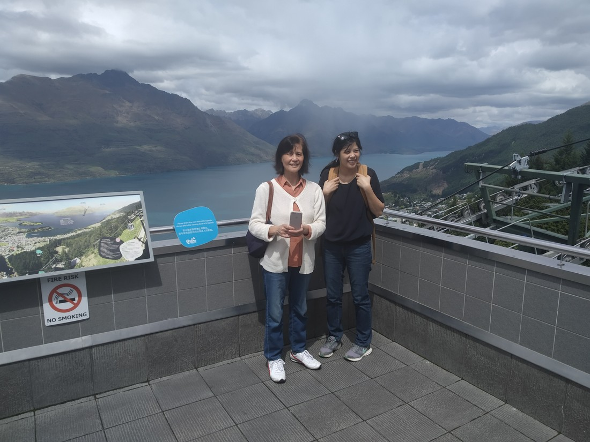
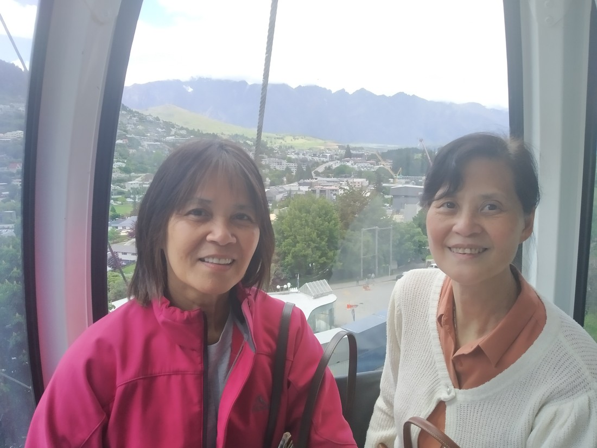

I suppose I had better explain who these people are that will increasingly appear in some of our photos.

You see, we have some tag-alongs on this trip. Betty’s Mum and Aunt are joining us.

> Mum left, Aunt right

They like taking selfies, falling asleep in the backseat, and talking about me in Chinese (I mean, that’s what I assume they’re talking about).

> Also dressing alike

What they don’t like is crazy long walks up mountains. Which is their loss mostly, as you will see…

Also, technically I’m the tag-along for this part of the trip. They started organising it for Betty and them, but I wasn’t going to let them go adventuring without me.