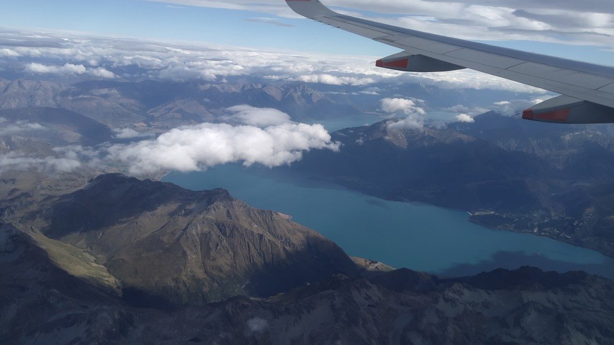

So yesterday was a good day. We walked a very large section of the Routeburn trail. We made it to the highest point on the track and back again, in just one day. But can we say that we have “done” the track?

This led to a discussion about whether it was feasible to do some more of the Routeburn track. After all, we’ve basically done half already. Could we get up early and drive round to the other end and do the other half? That would be a great end to our holiday – essentially doing the whole Routeburn track, twice.

Ultimately we came to the conclusion that the answer was “no”. We hadn’t really walked halfway. The Harris Saddle was closer to the Glenorchy side and so we’d probably have to do as much walking as we did yesterday – plus an extra 10 kilometres. With the state of our legs being uncertain, we decided not to try. But maybe next time we can attempt the whole track in one go.

Our legs were mostly fine today, for our last day on holiday. I mean, they weren’t as good as before we walked 27 kilometres, but we could consider doing a walk or two. But what walk?

Nothing we can do will compare to what we did yesterday. Do we even do a walk, or should we just have a true rest day.

“How about a walk that would get us higher than we’ve been so far,” I said. “Higher than even Ben Lomond.”

Betty probably didn’t like the sound of that but she came along anyway.

Yes we’d have to do some walking up a hill but we’d actually be driving most of the way. We paid the $10 entry fee and drove up to the Remarkables Skifield.

Last time we were here it was quite cold (the carpark is already at 1,576 metres above sea level) so we packed warm clothing. Last time we also had the whole skifield to ourselves but this time there were a number of other cars with people doing the walk to Lake Alta. However, we didn’t follow them and the established route. Instead we turned right and started walking up the hill.

We were following a service track up, following the Shadow Basin chairlift. We didn’t know much about the track. All I was working from was a topographic map and that the website I got that map from called it the “Shadow Basin loop” – hence why we were following the chairlift.

Part way up we encountered some lakes. I guess this is the Shadow Basin?

It wasn’t an easy walk. There wasn’t much to step on other than loose rock. Sometimes the trail got steep, which made it hard going.

And also, didn’t turn out to be that cold. I guess last time we were here on a November evening rather than a March afternoon. So no snow at all today.

At the top we found a helpful sign.

> Three ski runs were open despite the complete lack of snow?

Based on the topographic map I had I expected the trail to keep going up the hill and helpfully this map showed a small dotted line going in that direction up to the top of the ridge. The question was, where was the path?

I guess the terrain looks very different in the winter when everything is covered in snow. I started up the hill where I expected to find the trail and found nothing. Well, we weren’t very far from the ridge so I suggested we just make a direct path over the rocks.

Not one minute later we looked down and saw the path 20 metres below. How did we miss that?

Up until now we were only really had views of rocks and more rocks. The skifield is kind of enclosed in a pocket in the mountains. I guess that’s useful to keep the wind out – but means there aren’t many views (except on the drive up). However this point was at the very top of the ridge and it looked out over Queenstown.

The viewpoint we arrived at was at least 1,943 metres above sea level (according to the not so helpful sign). The highest we’d been before on this trip was the peak of Ben Lomond at 1,748 metres. Standing up here really made that peak seem small.

It certainly seemed like a fitting way to end our travels. On the highest peak, looking down at Jack’s Point, the trail we did on the first day we arrived:

But I wouldn’t say it was the most enjoyable trail. The track wasn’t the easiest to walk on and there wasn’t much to see until we reached the very top. But like most of the trails we have walked over the last three weeks it was something new.

On the way back down we discovered something near that sign.

> How did we miss this?

Turns out the last bit of the trail wasn’t so hard to find after all. All we needed to think to do was look for the giant arrow on the ground. Admittedly, rocks do blend in with other rocks quite well.

So what now? Do we just head back down? But didn’t I say this was a loop track?

I did say it was described as a loop. Supposedly it would head over to Lake Alta and then back to the parking lot. We knew roughly which direction Lake Alta was in. But where was the path?

This part certainly wasn’t a well known path so they’d be no giant arrows. Eventually we found something which *might* be a trail. Here it is below:

> It’s there somewhere

Now obviously that picture was useless so I’ll describe what we were seeing. There appeared to be a line of rocks that appeared to be squashed, or condensed – like they had been walked on before. It was heading in the direction that the topographic map predicted.

So we figured we’d give it a go.

As we walked, the trail slowly became less distinct from the other rocks around it. Sometimes we’d find three stones piled on each other in a way they couldn’t have done naturally – indicating that we were still on the track. But other times we had to stop and then make judgements about what direction looked the most “track-like”.

I will say that there was never any risk of getting “lost”. We were always able to see the Shadow Basin below us. It’s not like we were in a forest or walking long distances in hills. Even if we lost the path we’d still be able to find a way back.

Which was a good thing.

Because we did lose the path.

Eventually we came to the top of a ridge and we were able to look down at Lake Alta.

> Either the lake is small, or Betty is huge, or the rocks make the perspective very confusing

We were still very high up. The hill went very steeply down towards the lake. And then we couldn’t see it any more – which mean it got even steeper. With no track to follow, there was no way we were going to attempt to get down this way.

Instead we headed back over to the Shadow Basin side as while there was no path that way either, at least the angle of the hill was more manageable. But the next 20 or so minutes were just both of us trying to find whatever way down we could.

> Was there a path somewhere here? We’ll never know

There was a sign way back at the carpark warning not to go off track and trample the alpine plants. Well, we couldn’t help the “not to go off track” part now, though we did try and avoid standing on the plants.

Eventually we did make it down the hill enough that we were able to rejoin the path we took coming up.

And after another 20 minutes to walk down we had ended our final adventure for our holiday. It wasn’t always fun climbing over rocks and maybe we would have enjoyed a gentle walk around a lake more. But at least we gave it a go.

We had an early flight back the next morning. Then we had one more mini adventure when we realised I’d forgotten a bag at our accommodation – resulting in a hurried taxi ride to Queenstown and then back. And then we had to queue. It seemed like a large number of people were leaving at the same time.

It has been a long time since we have had to queue.

Perhaps another sign that this has been a great trip.

