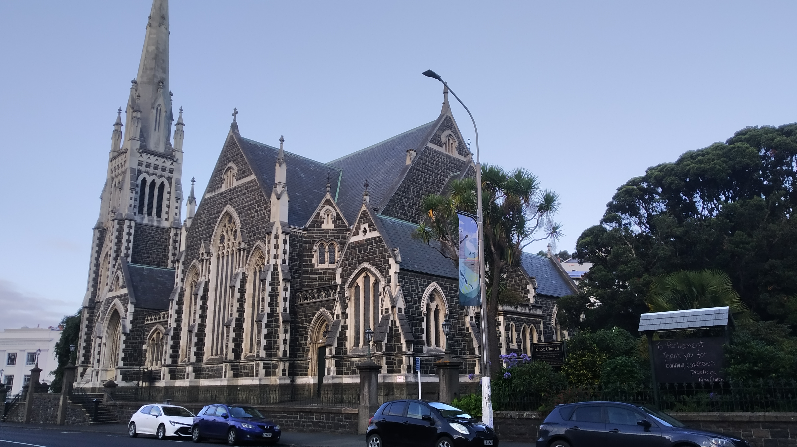

We were up early this morning for a coffee date (not our choice to be up early). Afterwards it was time to say goodbye to Dunedin.

> Goodbye Dunedin – you sure has a lot of character for your size

We hit the road to Wanaka.

*insert road trip music*

Okay we’re here.

Time to do that math thing again. Four walks we want to do divided by four days equals… no time to rest, we have to fit a walk in today.

We picked the shortest walk since it was now mid afternoon. What we failed to account for is that the shortest walk also required the longest travel time. More on why that was an issue later.

The place we were heading was in the Mount Aspiring National Park. Like Fiordland this was mostly just a single road and the place we were heading was at the very end. A notable thing about this road is that it went through paddocks rather than around. It turns out the locals were not too happy about this, as we found out when we got to one fenceline:

Once through the sheep and at the end of the road, we leapt out to begin walking. Then within seconds I was swarmed by bees. Okay “swarm” is a bit of an exaggeration, but I counted no fewer than six on me at one point. The photo below shows me midway through sunscreening, paralysed, unsure what to do:

> Fortunately Betty was relatively bee free and so could enjoy my misfortune

My current hypothesis is that it is something to do with the sunscreen. After a while we realised that they either weren’t getting the message that I wasn’t a flower or they were but then new bees kept showing up. At least they didn’t see me as a threat and I got to feel their little fuzzy bodies.

But they wouldn’t leave. So we decided we’d just have to walk them off. Unfortunately this was definitely bee territory.

> Lots of flowers in those grasses

It wasn’t until we entered the forest after 15 minutes that we left the bees behind.

> “Haha – goodbye bees”

Perhaps now I should take a moment to fully explain where we are. Wanaka and Mount Aspiring National Park is a land of mountains and valleys. It feels special, driving down the road towards a mountain surrounded by grasses, both farm and alpine. And in the summer sun, it truly made me feel happy.

> One happy chappy

I’m so sorry Dunedin. You could not compete with this. I know you might have been hamstrung by your own weather, but it’s pretty clear why you’re not the tourist destination that Queenstown and Wanaka are. Entering Wanaka kinda felt like a holiday had just started.

Anyway, the trail we are following is called the Rob Roy Glacier track. It leads along a valley, then into another valley, and ends under a glacier.

The track was about 1.5 hours to the view point, and mostly a nice path through the forest. It followed a rather raging stream which was nice, until we realised we were probably looking at melted glacier.

The end point was a clearing, allowing a full view of the valley and the glaciers on top of the hills.

It was nice. Except…

This is the part I mentioned earlier about why it mattered that we were here so late. At this time of the day the sun was positioned directly over one part of the glacier. So staring at that part of the glacier was literally like staring into the sun.

The pictures above and below are of the parts that weren’t in the sun, because every picture we tried to take of the glacier with the sun behind it turned out terrible.

Can do silly poses when no one else is around

While walking here people had regularly passed in the opposite direction. When we arrived at the view point we were surprised to have the area all to ourselves. I guess everyone else knew that it was too late in the day.

Or was it? Maybe it wasn’t too late at all – maybe it was too early. We decided to wait for the sun to go down behind the mountain. Only then we were able to get a full view of the glacier.

It still didn’t make great photos with the mountain in shadow and the bright white ice now muted in colour. But it was a nice reason to justify sticking around and enjoy the scenery – especially since we had the place to ourselves. The morning would definitely be the best time to walk this trail but there was a still a lot of nice things to see at this hour.

Overall, this was a very nice way to be welcomed back to the region.

The original plan for this trip was to just spend three weeks in this area without heading out to the east coast. We now know that would probably have been nicer for us if we skipped Dunedin. But isn’t that the point of travelling – to learn and discover new things?

It’s only been half a day and we’ve certainly discovered there’s going to be a lot we’re going to like in Wanaka.

(Fun fact – the bees swarmed me again when returned to the parking lot. I couldn’t get into the car without taking half a dozen with me. Betty had to drive down the road to find a spot with less bees before I could get in).