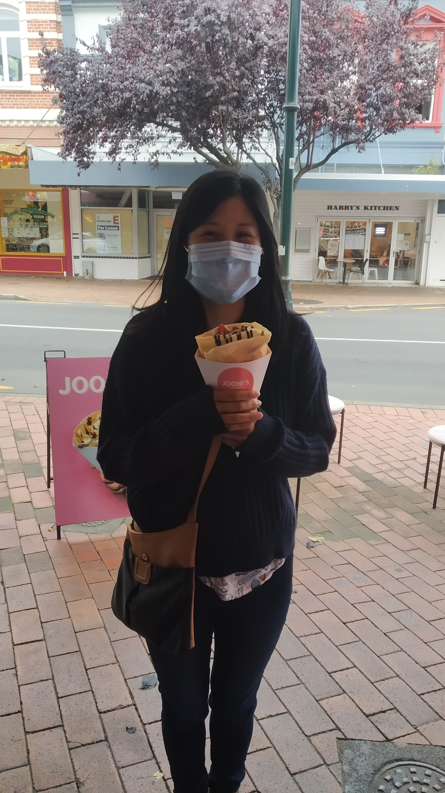

Today wasn’t expected to be a good day for activities that might involve being outside. So, we did some indoor activities – we went to the museum.

Otago Museum certainly has a lot of things. There isn’t always a lot of information or commentary to go with those things (eg, rooms of stuffed animals and birds) but when your local museum is Waikato Museum, it doesn’t take much to impress.

One exhibit of note was a three story butterfly aviary (is “aviary” the right word for butterflies). Walking in we were hit by the hot and humid air used to keep the butterflies hot and humid. We were also immediately aware of the butterflies flying around.

> The brown ones (pictured) were amazing as the inside of their wings were a perfect sky blue

I don’t really have any good pictures of the butterflies in flight. They’re obviously quite small and don’t like to stay still in mid air. Hopefully the next photo of all the butterflies hanging out on the ceiling (presumably where it is the hottest) gives you an idea about how many were flying around this room.

Weirdly this exhibit was part of a larger (paid) exhibit focused on interactive fun. It meant lots of kids running round touching things, which was not really what we wanted during times like this. There was a neat looking room that was something to do with the big bang:

> Shiny

Was kind of neat but it was just lights and mirrors – I left knowing nothing more about the big bang than when we entered.

It was the middle of the afternoon when we left the museum. It wasn’t presently raining so we drove to another stereotypical Dunedin tourist spot:

> The steepest street in the world (maybe)

So let’s add another entry to the list of hills we’ve walked up on this holiday. Of course we did the usual touristy photo things:

> How is this possible?

We also found this cat with it’s own mini armchair, set up in the bay window so it could watch all the people go past:

And the last place we visited was another hill – although this one we just drove up.

> It’s nice being both on top of a hill and unsweaty

Well, not the last thing. We still ate.

> Best thing all day?

And this will basically be our trip to Dunedin. Tomorrow we will be moving on to Wanaka. I must say – not super impressed with this side of the country. Even when the weather has been nice, it hasn’t been that nice. We’re kind of looking forward to heading back inland. Mountains equal warmer, right?