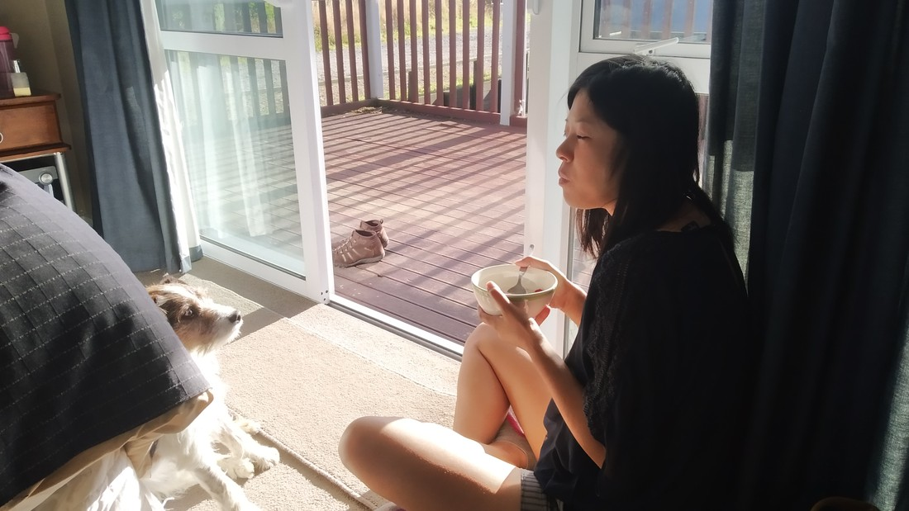

We stayed in the Caitlin region in a backpacker type accommodation in the middle of nowhere. Internet was terrible, but that type of thing does happen. While we had booked a private room, we actually had the whole place to ourselves. This possibly wasn’t a sign of Covid – could just be a sign that the occupiers were moving out of the backpacker business.

After getting our room key they asked us, “Any questions?” I said “no” because they had already explained how to go about feeding the sheep – something their website promised.

As we walk back to our car to start unloading I told Betty, “I think unloading might have to wait.” It wasn’t my decision. You see, we were being watched.

> The watchers

These sheep had never seen us before but they clearly knew what we were. Or maybe, because they had never seen us before they knew what we were. And what we were was four hands that might feed them. And they were being as loud as they possibly could to ensure we wouldn’t forget.

I forgot to warn the owners before we left that they might need a new fence shortly – based on how the sheep pushed on it, climbed on it, and stuck their head through. Whatever they could do to get their heads closer to the feeding hands.

> That’s a sheepish grin (this caption was written by Kate)

Eventually we did manage to get unpacked and fall asleep. In the morning we were packing to get going when this guy turned up:

> “My name is Harley”

He’s a farm dog but not a farm dog. He lives here but doesn’t have a job. While the other dogs rode the 4×4 out to round up the sheep, he waddled behind and then got sidetracked and went to visit the two strange people who arrived yesterday.

> Betty wuvs Harley. Harley wuvs whatever Betty is eating and wants it.

This did not help us get on the road promptly in the morning.

So glad no other guests were around to see us acting so silly in front of animals.