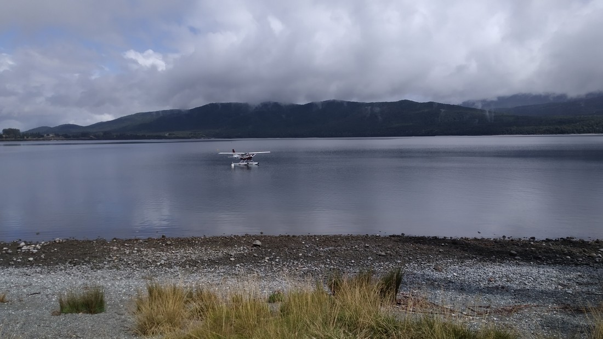

Woke up this morning to rain. We knew it was coming today but it was surprising how much of it there was.

So nothing ended up happening today. We just lay round reading books. It was nice to do nothing for a change – although this was the third day our hired car went nowhere all day despite the dollars we were spending per day on it.

Well, I did some laundry. Couldn’t figure out where to put the detergent in the front loading washer so I just sprinkled it over the clothes. Turned the machine on and started to walk out when it occurred to me that I couldn’t hear any water sounds.

After I had taken my clothes out of the dryer and scraped up all the detergent I could, I put them in the actual washing machine.

And later, after 24 minutes in the dryer again, the clothes weren’t quite dry. Instead of wasting another dollar or two instead I just covered all the surfaces in our room with slightly damp clothing. I told Betty it was art. I titled it, “Didn’t want to spend an extra dollar.”

Anyway, here’s a photo of the lake that I took when the morning rain had stopped and the afternoon rain hadn’t started yet.

And here’s a photo of me enjoying the view from our room

