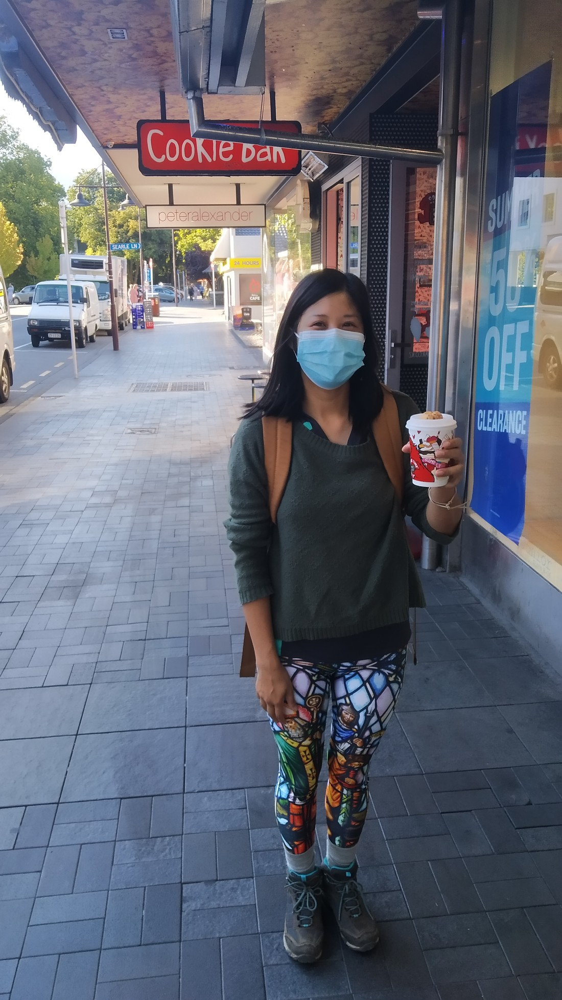

We woke up this morning, having to say goodbye to our first accommodation. After five nights in Queenstown it was time to move on.

But not without one last morning trip to the Cookie Bar for their $1 coffee and $2 hot chocolates.

> Picture is from a different day – but the masked smile was the same each day

We were heading to Te Anau, but there didn’t seem to be too much to do or see along the way. So I reviewed the list of Queenstown area walks we hadn’t done and picked one near Arrowtown.

The walk started with the Tobins Track – part of which we’d done before on our second day in Queenstown.

The Tobins Track isn’t much more than a wide path (literally a road as we found out once we got to the end) at a constant gradual incline. Then at the end of the track was a round hill that could be walked up.

> Remember – 100 kilometres per hour max on this trail

I say “walked up”…

As we crossed the fence and looked up at the path of stamped grass leading up a hill in the late morning sun – it started to feel a lot like we’d done this before…

> We miss trees

Yeah, I hadn’t done much research on this one. Yes, it’s more of a track and less steep than that Moke Hill walk but it did kinda bring back those memories.

But at least this hill would have a moment where we’d be able to get to the top and look around in all directions…

Except it turned out not to be much of a view in the opposite directions. Just some featureless hills.

Also poo again. While we knew we were walking through a paddock, it had happily been poo-free. Turns out that’s because all the animals apparently like to hang about at the top to do their business.

So yeah, not the greatest way to end our Queenstown area escapades. Fortunately we will be back again before we fly out. Hopefully there’s still some good walks on the list that we haven’t done. 