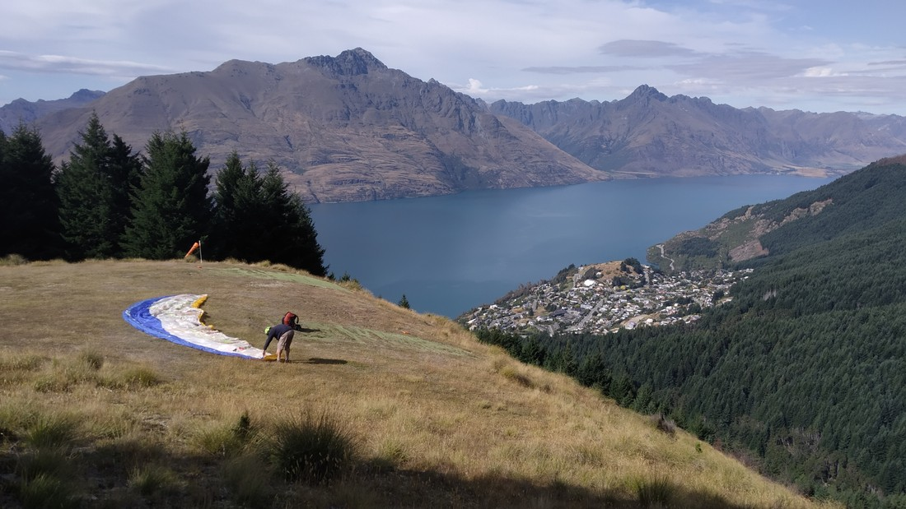

So yesterday we bought a three day gondola pass. Made perfect sense. Either spend $44 for one return trip on the gondola, or spend $66 on unlimited trips over three days. If we did nothing but ride the gondola for all three days, that would be like 100 trips – which would be $0.66 per trip rather than $44 per trip. Makes perfect economical sense.

> Here’s that view again

What we actually had in mind was coming back up today so that Luke could take the scenic way down. Six years ago I saw the paragliders circling above the city and I thought to myself, “That looks worth doing”. This trip I finally listened to myself.

My tandem buddy was George who was a Frenchman. As we walked up to the take off area we exchanged the usual pleasantries. I asked what he did for a living and he said he was a tandem paragliding pilot.

The take-off area was really scenic. Literally just looked like a field that just ended with Queenstown really far below. But it wasn’t to be as the wind wasn’t blowing in the right direction so we hopped in a buggy and drove up to the backup take-off area which pointed in the other direction. I guess that’s good – higher take-off might mean more flight time?

> This isn’t the pilot – just some other paraglider who hitched a ride on the buggy

Meanwhile, Betty was waiting on the viewing deck – which she had been told was a great place for a photo.

I don’t know that there’s much to say about the take-off. George said that he’d tell me to walk forward, and then tell me to run. In case he hadn’t noticed I pointed out that there was literally only six metres of grass in front of us before a steep drop. Turns out that was all we needed.

After taking off and adjusting into the seat, George took us out over the gondola. “Where’s your girlfriend?” he asked. “Uhh, I don’t know,” I answered. So George swung us around, giving all the other spectators a good show. We spotted Betty at the end of the viewing platform, looking off to the north. George yelled a greeting. The other spectators yelled greetings back. And Betty still gazed off towards the north…

Fortunately she did notice in time, just as we swung away to head out over Queenstown. Betty claims her picture is perfectly fine because two of my family members could tell it was me.

When we had taken off, we had zoomed over the top of the forest. Seeing the trees go by beneath our feet was certainly an experience I enjoyed. It felt like flying. However when we headed out over Queenstown, it kind of felt like the flight had lost it’s point of reference. We were now just hanging in mid-air, and I couldn’t have told you what direction we were moving. Maybe that confusion sent my stomach into a panic. Apparently the pilots could do an adventurous trip or a gentle trip – but I had forgotten to make a request for the latter. Fortunately after a couple of spins George picked up on my hints.

While flying, George made some comments that he clearly said on every flight. Comments like how we’re just being held up by fabric and strings were not helpful, or required. However he mentioned that it is rare that towns allow paragliders to fly directly above the town. As we came into land and I noticed the power lines, I think I understood why most cities say “no”.

We landed on the primary school rugby field. Apparently kids at the school see this all the time and literally don’t care any more as no one even looked our way. George showed me the photos and video he’d taken. The video wasn’t bad but the photos were kind of rubbish. Nice try business – you almost had more of my money.

Afterwards we returned to our accommodation, where I still felt queasy. At least I didn’t throw up like after I went skydiving (although maybe that might have helped end the queasiness feeling). And also unlike skydiving, I felt like I had ample opportunity to enjoy the flight and the view. I know there are other paragliding companies in this area but being able to fly over Queenstown was certainly a novelty I wanted.

I probably won’t opt to do it again (stomach will probably veto it next time) but it was something I enjoyed.