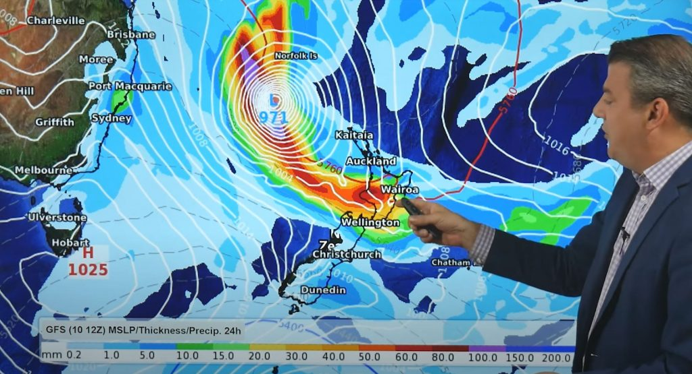

Day two of our holiday. Cyclone Dovi has hit New Zealand. The Auckland Harbour Bridge has been closed due to wind. Interisland ferries have been cancelled. Plenty of flooding, slips, and road closures. Thousands are without power. People have been advised to stay home and avoid unecessary travel.

We wake up, look out the window. A bit cloudy but seems fine – let’s go walking.

> Turns out we picked the exact right time to leave the North Island

Actually it’s not all good news. It’s a little chilly. “8.8 degrees Celsius – feels like 5” was what we were greeted with when we left this morning. Nothing a service station coffee and a pie couldn’t beat. At this hour in the morning Auckland temperatures were already in the low twenties – we’ll certainly take what we’ve been given over that.

Today we were heading to Arrowtown. We didn’t want anything too ambitious this morning because the highest peaks are cloud covered. And plus, it’s still early days and we’re still warming up (that’s not supposed to be a weather pun but I’m not changing it).

The walk we picked was called Sawpit Gully. It was one of the highest rated trails in the Arrowtown region according to AllTrails.com. There’s likely more to tell about it but I haven’t created an account on that website and so they stopped me viewing any more info until I do. However we knew it should only take a couple of hours.

There’s actually a bunch of trails in this area. We parked by the river in downtown Arrowtown – in the same place we’ve parked before when exploring the city. It’s nice that the trails are so central. The only problem was trying to figure out how to cross the stream at the start. Do we just walk through the water? Eventually we did find a little bridge.

Also handy was that every junction there was a map showing where you were and the length of time to walk any section. This became relevant when we got to the top of the climb and were deciding whether we wanted to do a bigger loop. Due to the uncertainty about the weather we opted not to climb a hill called “Big Hill” which would have taken us quite high.

However once we got to the bottom of the next section, we found ourselves on the old Macetown road. At this junction we had the option of walking back into town and then having lunch and then finding something else to do in the afternoon. But we weren’t hungry yet so instead we opted to basically start another loop.

This loop combined part of the New Chum Ridge track as well as part of the New Chum Gully track. The extra time it should take us would be just over two hours. That was a neat thing about this area – you could build your own loop track to suit.

Although having no time to research the tracks we didn’t necessarily know what we would be getting into. The word “ridge” certainly implied a view of some kind. What it did not imply was really tall grasses.

So this was certainly not a well traveled track. Often the path was clear, but sometimes the path was just a narrow line of flattened grasses. It certainly wasn’t like the well maintained tracks we’d been on until this point.

As we crossed the ridge, we did get some clearer views of Arrowtown and the surrounding area.

> Arrowtown (somewhere)

> Arrowtown (closer)

Overall a more than four hour hike. Nice job us.

We did see on our rental car’s GPS that apparently there was a Lord of the Rings filming location (where Arwen stared down the Ringwraiths) near the carpark. But after walking around looking at the water, all we achieved was making our feet hurt ever so slightly more.

By now we had missed lunch by so long that we decided to go straight into dinner. I don’t usually comment too much on what we eat (because usually it makes us look lame and uncultured) but in this one instance I will offer some advice. Don’t get the Fergburger pork belly burger unless you’re really really hungry. Like really hungry. Even after all the walking we did today, it got the better of us.