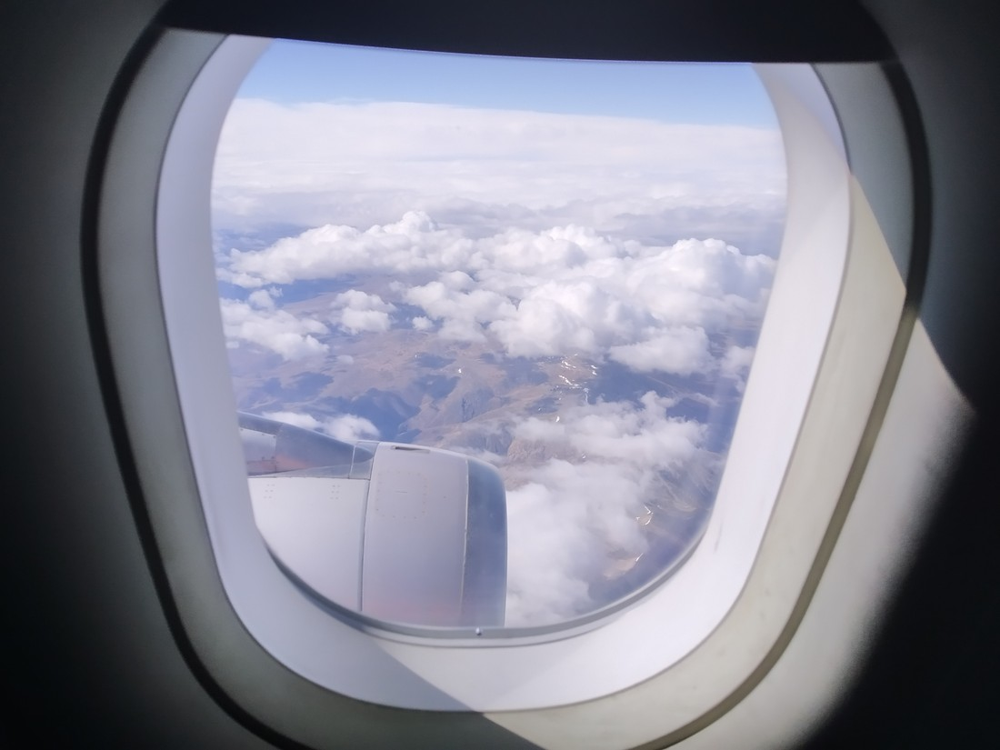
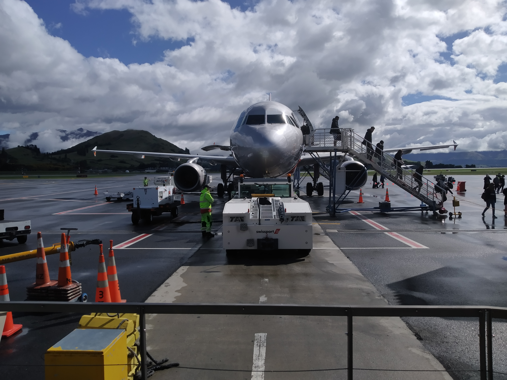
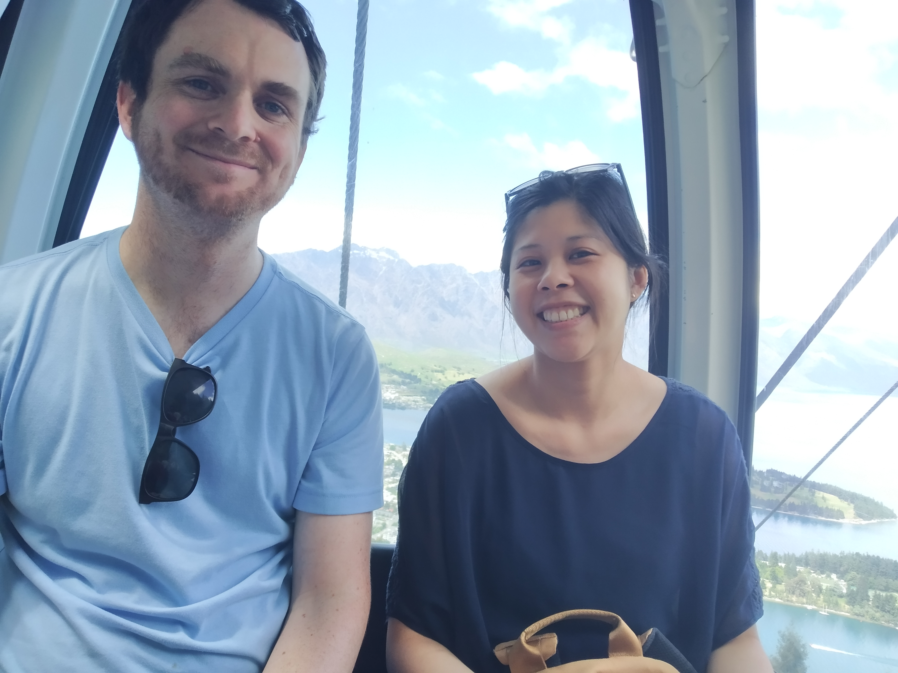

Auckland Airport was a lot busier than I was expecting. The media had reported that something like 4,000 Air New Zealand crew lost their jobs this year. “Everyone with under 25 years of service, gone” this article quotes. And yet the terminal still buzzed. A constant stream of cars and shuttles, dropping people off. People walking in every direction. Announcements over the PA – the works. But the large, basically empty park-and-ride carpark reminded us that this busyness is probably limited only to the domestic terminal.

Entire industries had been shaken up this year, if not destroyed completely. But we’ve been fine. Companies didn’t just stop needing websites. People are still getting admitted to hospital and need their illnesses diagnosed. Overall we came out of the lockdown in arguably a better financial position thanks to some extra overtime and being forced to not waste money dining out. But this was just luck. We were lucky to chose the careers we did. We were super lucky to live in New Zealand when the global pandemic hit. And when we arrived in Queenstown I couldn’t help but feel like our lucky streak was continuing.

It must have stopped raining no more than 15 minutes before we landed.

> Our ride

The tarmac was completely wet but the skies were blue. Perhaps we’d brought them with us.

Queenstown both was and was not how I remembered it. The streets were all there as I remembered (makes sense, streets rarely move). There was still a lake, and some big hills. It was still common to hear South American and European accents. But the vibe of the city was different.

It was quieter.

> Where are all the queues at this popular burgertorium?

There were still plenty of people about but there was noticeably less people than last time. This could be due to the different time of the year we are visiting in. Neither summer nor winter, perhaps at this time of the year Queenstown is just between crowds.

It was certainly welcome (lucky again).

> Don’t underestimate how uncomfortable this actually was. Who builds a hammock out of metal balls?

And I don’t know but everything just seemed a bit more colourful than last time. The lake appeared bluer, the trees greener. Even the houses on the hills seemed to shine a shinier shine than last time.

So yeah, as you can probably tell by the tone of these last few paragraph, we have had a good day today. What better thing to do first (after lunch of course) is to head up the gondola?

> Two people on a gondola

No luging for us – just some sightseeing and light hiking.

I took Betty into this deep, dark forest. She didn’t want to go in – but that was probably just because the path went steeply uphill.

On the other side we came out at a viewpoint giving a good look at Ben Lomond (mountain).

Getting a bit lost we ended up out at the paragliding take-off area as well as more nice views of Mr Lomond.

I’ve told Betty we should come back later in the week and climb it. This is mostly just a bluff so she’ll agree to my less demanding ideas but if she calls me on it, I’ll happily climb that 1,438 elevation gain to witness the panorama it will provide. (My legs might not be too happy though).

> Betty, deciding

Anyway, moral of the story – it was a good day. Our luck with the weather might not hold tomorrow but at the very least we got a good day today.