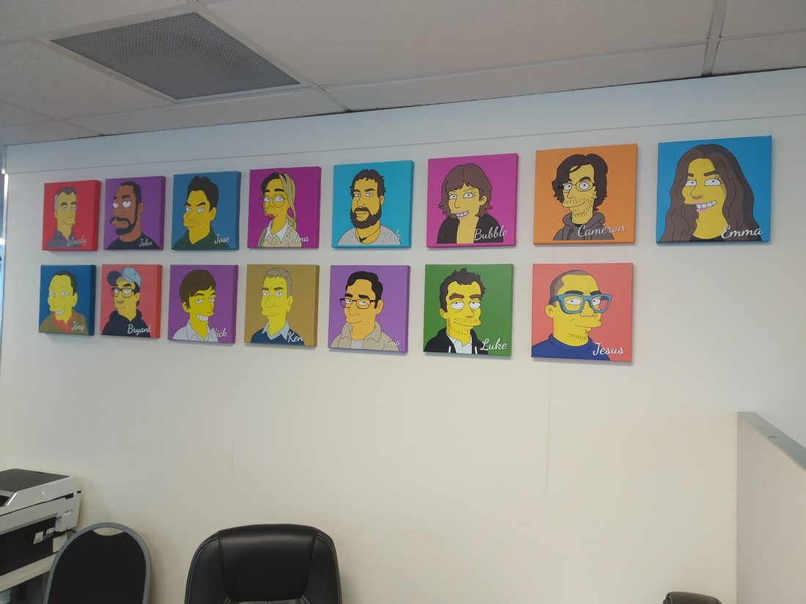
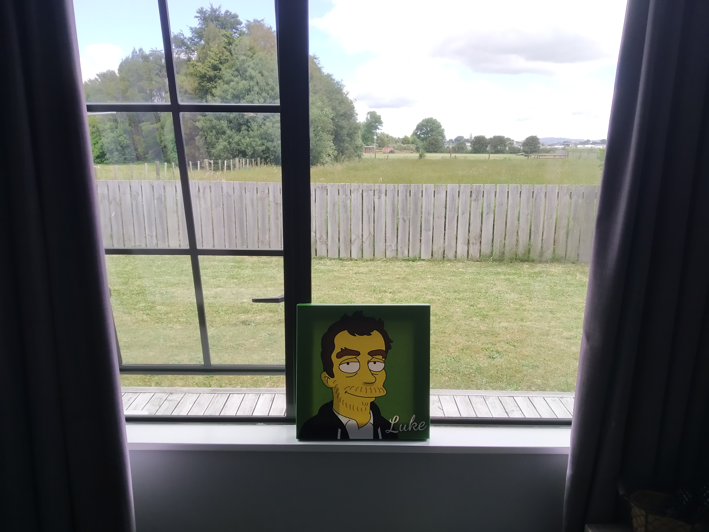

This holiday has been a long time coming. Circumstances of it are certainly not what we were expecting. There are many perks of being in my industry but having long holidays is not one of them. Having to take annual leave over Christmas means that it would take two full years to accrue the leave I would need to take another long holiday like we did last year. And after last year’s holiday, we certainly wanted another.

> Me and the team

But two years is a long time in my industry. And as it turned out, two years is a long time for the world as well.

In June this year it became clear that any end to the coronavirus pandemic would be at least a couple of years away. So, no overseas holiday as planned. But we still needed something. Betty had been working hard, battling the coronavirus all through lockdown while the rest of the country stood still and she needed a break. So we started looking closer to home for our travel plans. But as I said, it was June. Winter does not make a good time to go holidaying

So we penciled in this holiday for November, hoping to pick a couple of weeks of good weather this side of Christmas. We were starting to think of ideas over the next few months. Then something else happened.

A nondescript vacancy appeared on the job website for a front end developer in Hamilton. Nothing about the listing suggested it was anything interesting and I was really enjoying the work we were doing at my current job so it was somewhat dismissed. However, there were still reasons to apply. There might be more to this role than it appears. Plus, it’d be good practice for when the right role came up in the future. But that all changed right after the first interview. After hanging up my headset I knew what was going to happen. I knew I was going to nail the follow up interview, just as I had the first one. I knew I was going to be offered the role. And I knew that I wanted it.

It was time to come back to Hamilton.

So here we are, November 15 2020 and I’m back. Finished up with my employer two days ago but don’t start my next job for another three weeks. I have already moved all my stuff down from Auckland. It’s still in piles all over the floor because there’s no time to get anything tidy – I gotta pack for this holiday that we’re taking. Betty is no help – she has had to work all weekend – didn’t even help me move (kidding face). I’m almost done checking off all the items in the long list of things I had to do and “create blog” is the one I am up to. I’ve prioritised it over “pack clothes” and since I have to pick up Betty in less than two hours I suppose I will leave this entry here. Seven paragraphs – that’s a good length.

Next one will be an actual holiday blog post.