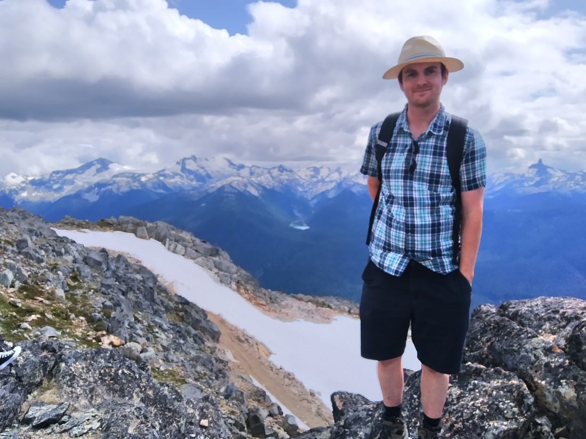
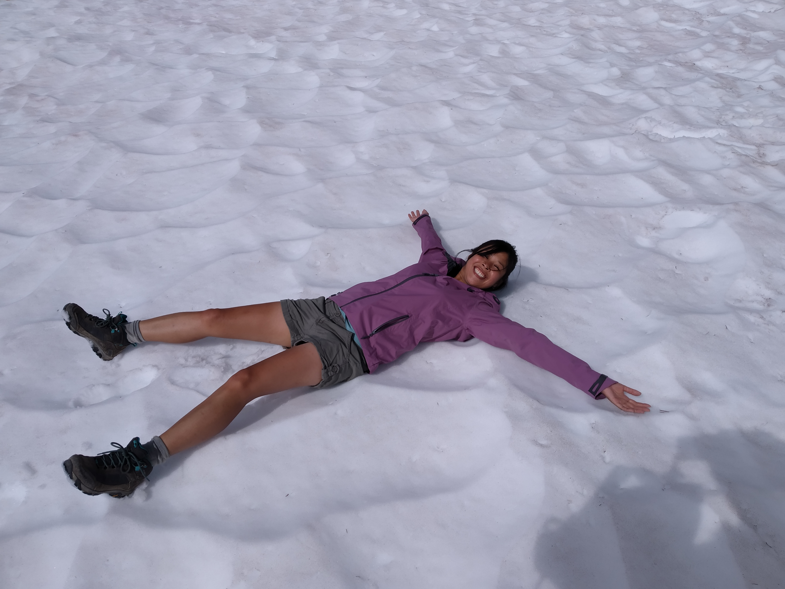
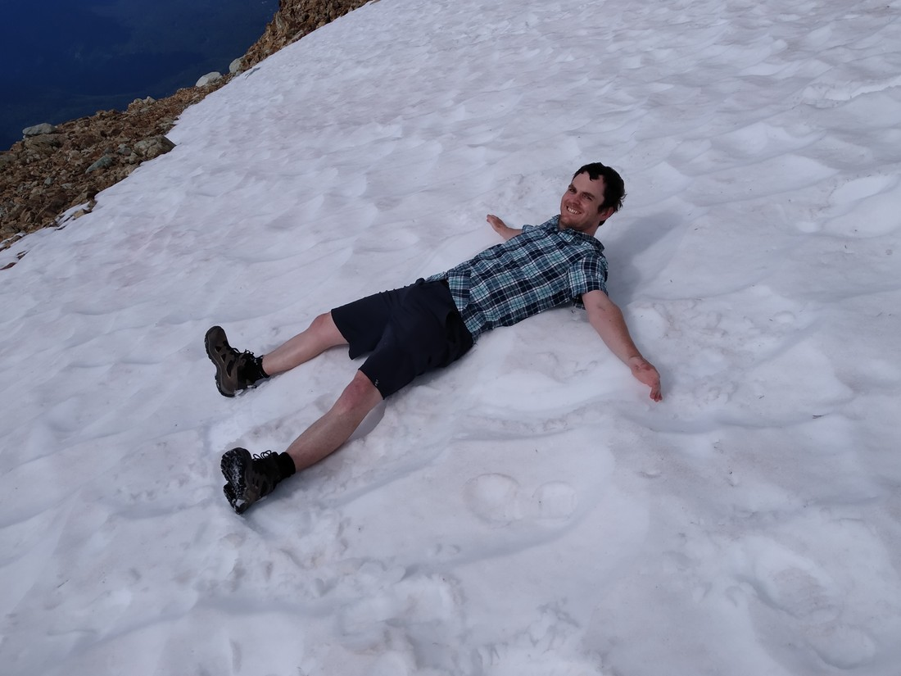
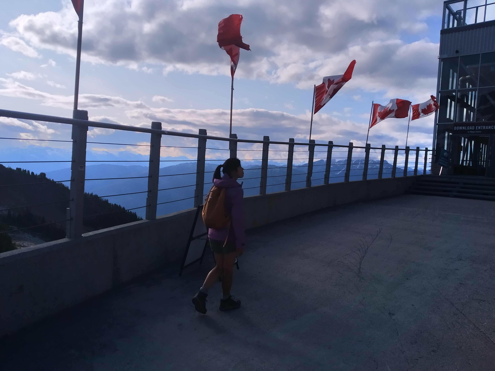

Well, it looks like this is going to be my last blog post.  It’s going to cover a whole day so it might get a bit long.  I’m actually having mixed feelings writing this.  Even though at the time of writing this we’ve been back in New Zealand almost two weeks, finishing writing these blog posts have meant I have still felt connected to the holiday.  With these done, it will officially be over.

So, hopefully I have a good story to tell for my last blog post.

This story starts the night we arrived in Vancouver.  Betty had been shocked to find out that we were only spending two full days in Vancouver (three nights).  In a draft outline of our trip, Vancouver had been allocated twice the number of days.  I’ll give her credit – Betty took the shock that our trip would be ending earlier than she thought rather well.  Then, we had to start planning.

We identified the two activities we most wanted to do – visiting Stanley Park and downtown Vancouver (which you already know about), and visiting Whistler.  Whistler is not a big place but it managed to host the 2010 Winter Olympics.  Well, technically Vancouver held the Olympics but Whistler was the location of many of the competition venues.  Anyway, not sure why we chose to visit Whistler on the weekend while we visited downtown Vancouver on a workday.  Probably should have swiched those.

Whistler wasn’t exactly close to Vancouver – about 1 hour, 45 minutes.  The drive followed the coast and (like most of the highways we have driven in Canada) was very scenic.  As we were driving along we noticed several roadsigns containing placenames in both English and another language that we’re pretty sure isn’t French.

I don’t know much about the Aboriginal people of Canada but how does one pronounce a “7”?

We were almost at Whistler when we saw some roadside signs warning us that a triathlon was going to taking place tomorrow.  Again, another reason why we should have visited Whistler yesterday.  We entered the Whistler township and were greeted with a familiar sight – a town that generally lacks enough parking spaces for how busy it gets during the peak season.

We must have driven round town for almost half an hour or so.  It took us about 10 minutes to find the recommended carparks (five of them together) only to find that two of them were closed for the triathlon tomorrow and the other three were full.

At this point I was at a loss as to what to do.  We’d driven all the way here.  Was it worth it?  Should we just cut our losses and head somewhere else – like what we did with Lake Louise?  Interestingly, both Betty and I were thinking this.  But neither of us said anything so we eventually found a carpark on a basement level of a hotel.  One nice surprise was that it was only $7 for parking until midnight.  However part of the reason it was so cheap is that it was now after noon.  We were far from early.

So we found a Subway near the central pedestrian arcade and had lunch.  Can’t do anything on an empty stomach after all.  The central township was quite nice, although I couldn’t help but notice a lot of people walking bikes.  “These people must be here for the triathlon,” I reasoned – ignoring the fact that the bikes all had BMX tyres.  Well, it turns out that the reason the ski resort town is so popular during summer is that a lot of the ski runs are turned into mountain bike trails.  No time for this today but on another holiday I think I would have had a lot of fun here.

We located the main gondola and enquired about the price.  $56 each for a two-day pass.  Interestingly, we had been reluctant to go on any chairlifts or gondolas in Banff due to the price – and those were all around $37.  I think we justified it to ourselves because it was our last (full) day on holiday and we had plenty of Canadian currency we wouldn’t be needing once home.  And while we couldn’t come back for day two, at least the pass included more than just a gondola ride up and down – which I will elaborate on shortly.

Something else that was quite nice was that the gondola ride was quite long. And amazingly, despite the busy-ness of the town, there we barely had to wait to buy gondola tickets or to get on the gondola. This means that we had a car to ourselves.

> We can take photos without feeling self conscious 🙂

The gondola was so long that there was a huge sign at one of the mountain bike stops reminding people not to get out as they were only one third the way up the mountain.

The higher we got, the further away the township became.

You’d think the first thing we would do upon arriving at the top is look at the view. Well, you’d be wrong. The first thing we did upon arriving is to walk 100 metres and get on yet another gondola. The reason: we were kinda short on time. Since the gondola ride was so long it would have been somewhat near 2:30pm. Some of the gondolas and chairlifts on top of the mountain stopped at 5pm. We didn’t want to accidentally get stranded. Nor did we want to miss out on anything

We hadn’t identified the Peak 2 Peak gondola prior to arriving at Whistler. But since it was included in the price we’ve already paid to go up the gondola we figured, “May as well.” This was a gondola stretching between Whistler mountain and the nearby Blackcomb mountain (which had another ski-field). Looking up from the township, this ride looked terrifying.

The middle section of the gondola stretched 3 kilometres between support towers and almost half a kilometre above the ground.

There was a bit of a line for the gondola – or so we thought. When we actually went to line up we found that everyone was queueing for one of the “360 degree experience” carriages that had glass bottoms. Turns out there was only two of them and they arrived every 15 minutes.

Tough decision: wait 15 minutes to cross in a full car or wait less than 2 minutes and cross in a nearly empty car.

Strangely, it didn’t feel nearly as precarious as you’d think. I guess that’s a testament to how smooth and solid the cable cars felt. I was worried there would be a lot of swaying in the wind between the two peaks but it was minimal.

So, 30 minutes after arriving at the top we had crossed between the mountains and come all the way back. Now it was time to venture to the attractions that were the main reasons why we came all the way to Whistler.

On Whistler mountain is a place called the “Top of the World”. And up there was a “Skybridge” crossing between two peaks. (As you’ll see, those peaks aren’t too far apart – this isn’t like crossing all the way to Blackcomb mountain). Also at the “Top of the World” was a walk called the High Note trail which we’d heard good things about.

However there was one problem – the temperature. We were quite high up and the temperature was reported to be 9 degrees Celsius. I was wearing very summery clothing. Betty had the foresight to at least bring a windbreaker jacket. Well, we couldn’t really do much about it now. At least it was sunny.

To get to the top of the world we had to take a chairlift.

Betty won’t want me mentioning it but this was quite terrifying for her. Chairlifts don’t exactly feel stable and the jagged rocks 20 metres below us certainly didn’t make us feel safe. I did have a lot of fun at her expense even though I was mostly just laughing to mask my own fear of falling out.

I also wondered to myself, “How are we going to get down?” It sounded like Betty was mentally preparing herself to permanently live up here just so she didn’t have to ride the chairlift again.

So up until now I have been describing a day that has both healthy doses of good fortune and bad. I knew at some point we’d inevitably come down from our vacation high. To be honest, this day appeared to be the day that would bring us back down to Earth. We’d pushed our luck a few too many times and today we’d gone adventuring unprepared and ignorant of what we’d find in Whistler.

It’s not a complaint – after all we’d brought it on ourselves. But it was perhaps a sign that our enthusiasm was waning and that we were ready to go home.

However…

These were not thoughts we even remotely considered once we arrived at the top…

It turns out that “Top of the World” is such a perfect name for the summit. In all sense of the phrase, here is Betty on top of the world:

Her face speaks for itself but for myself I was stunned at the scenery at the top. Upon exiting the chairlift we were met with perhaps the most stunning view we had encountered so far.

How had we missed this earlier?

Well, I’ve already answered that question – we were too busy hurrying. Too busy to notice the scenery that was around us.

Now, I bet you’re wondering about the Skybridge I mentioned earlier. Here it is:

And here we are enjoying it:

Note that we’re ensuring we hold on tightly. It was surprisingly sturdy but we’re not taking any chances.

Although, slightly disappointingly, it wasn’t actually that high up. It didn’t feel like a bridge as much as it just felt like an elevated walkway.

The other thing we were looking for at the Top of the World was the start to the High Note trail. This wasn’t exactly hard to find but there was no signage other than an arrow pointing in the direction of the path.

We really didn’t know much about the trail. Fortunately, being high in the mountains is actually good for cellphone coverage so I was able to find the guide for the walk. It informed us that the walk was for advanced trampers and would take four hours to get back down to the gondola.

We looked at the time: 3:30pm.

We knew that the gondola stopped at 8pm. If the four hours quoted was accurate (which we had no idea whether it was or not), that only gave us about 30 minutes of leeway. And while we had been told that the gondola stopped at 8pm by a gondola employee, what would happen if they were wrong? Never mind the late hour, we’d probably physically struggle to walk all the way down to Whistler.

And lets not forget, other than wearing hiking boots, we were unprepared for an alpine walk. Both of us were wearing shorts and we didn’t have any warm clothing. (Remember – 9 degrees Celsius with patches of snow around). I didn’t even have a jacket. We were carrying water but our only food was a bag of gummy candy.

And it wasn’t even a full bag.

I literally thought to myself, “We’d be stupid to do this.”

But we set off anyway!

I guess that’s how much Betty wanted to avoid having to go back down the chairlift. Truthfully, I’d put our decision to do this down to how great it felt to be up there in the mountains. Four more hours of this? Yes please!

I’d also observed that a section of the track was optional and that we could cut 1.5 hours off the trail time. So it’s not like we didn’t have options if we wanted to cut the walk short. We also made sure to keep to an ambitious pace and kept sightseeing stops to a minimum.

Of course that didn’t mean we didn’t stop to play in the snow.

Here’s Betty attempting a snow angel:

> Did I mention that we were having a good time?

I also gave it a go and learned something:

This is not snow. This is frozen ice crystals. And ice crystals feel a lot like tiny sharp rocks on bare skin

After that we continued on, passing a sign warning, “If you feel like you can’t handle this walk, turn back now” as the section of the mountain we were walking into was unpatrolled. And that was yet another warning we failed to heed. It’s mistake was insulting us – implying we couldn’t handle such a walk.

We certainly felt like we could handle it. What was going to happen? Our legs give out after having spent days upon days of enduring a lot longer distances than they were used to pre-holiday?

Seriously, all these thoughts were running through my head at the time. I haven’t even spoken about my fears that the thick cloud layer above us would descend and we’d be freezing and walking blind for hours.

I guess I just want you to know that we weren’t ignorant of the dangers. Were we taking unnecessary risks? Of course we were! But the walk was so very worth it.

After leaving the peak, we didn’t really see any snow. Instead we encountered something I don’t usually associate with alpine environments:

Flowers!

It turned out we were catching the very start of the season where flowers would bloom all along the track.

We even saw some locals.

These marmots were a lot shaggier than those we’d seen in Kamloops. Which made sense after all. Kamloops was literally a desert environment. Sure, it still might have snowed there but the Whistler marmots would certainly have a lot longer winter.

And you know what? I’m getting a bit exhausted writing this. This has been a very long post so far and we’re not even at the half way point of the walk yet. Rest of the post won’t be too long.

But there wasn’t too much more to talk about. About half way along the trail we came back round to the ski field side of the mountain. Here the hills were less spectacular.

We’d been seeing occasional signs along the way and to our dismay we weren’t gaining time. Which was annoying because neither we weren’t dawdling nor stopping for extended periods of time to take photos.

> (There was still was some stopping)

However, somewhere along the track we managed to gain half an hour. Perhaps we skipped part. But at that point we didn’t really care. We’d had our fill of mountain scenery.

We made it back to the gondola before 7pm – plenty of time and with plenty of sunlight.

And that’s it.

That’s the story about how we straight-out fluked what was definitely one of the most memorable experiences we had for the entire six weeks.

That’s the story of our last day on holiday.

And now that this is done, I can’t help feel sad that this is all coming to an end. Sure, I’m telling this tale over a month after we arrived home but by coming back to finish these blog posts, it has felt like I’ve still been part of the holiday. Like I’ve still been up there in the mountains.

…I’m not sure what to do next.
