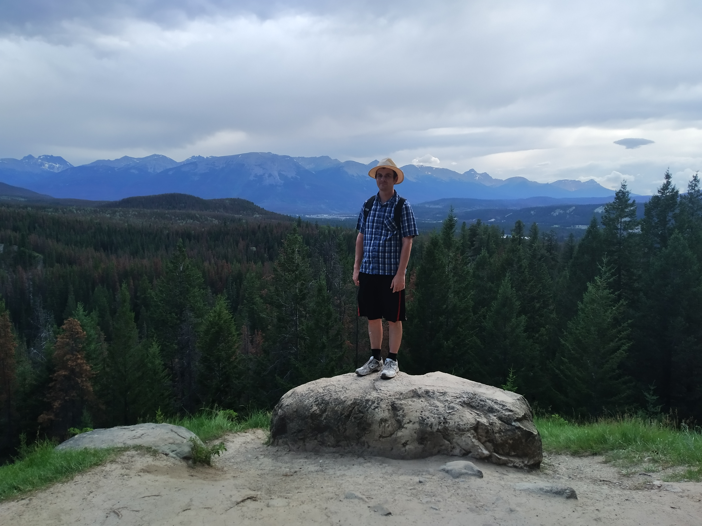

Who’s sick of nature yet?  I counted and this is the 11th blog post about Banff and Jasper.  Well, we certainly weren’t.

Betty had read nice things about a place called Maligne Canyon.  I hadn’t prioritised this walk because it was also known to be very busy as it was a popular spot for tour buses.  I expected it to be another Johnston Canyon so we’d done another walks on our one day in Jasper.

Well, at 6pm or so we were all rested up from our Valley of the Five Lakes walk.  Hopefully Maligne Canyon wouldn’t be too busy. Tour buses don’t visit this late at night, right?

It wasn’t!

The carpark was huge, with an additional overflow carpark further down the road.  Fortunately, it was only 20% or so full.  We even got our choice of parks relatively close to the start of the walk.

Maligne Canyon turned out to be a kind of slot canyon – where a stream has dug a thin canyon into the soft rock.  We’d walked through a similar slot canyon in Utah, but this one was a little different.  First, this is what the “stream” looked like once it emerged from the canyon:

You probably can’t get a good idea of the perspective but that it not a small stream.  That is a river!  I’d almost go so far as saying that it’s a swollen river.  It was rather fast flowing too.

Now, remember I said that Maligne Canyon was a slot canyon.  Slot canyons are typically often about a few metres wide.  Can you imagine what this much water would look like flowing through such a small space?  Well, it would probably look a lot like this:

> All that water is down there somewhere

The Maligne Canyon trail was a walk which ran along the canyon rim.  At various points in the walk there were six bridges crosses the canyon.  It was great to stand on these bridges and look down..

Except, the canyon at times was extremely deep.  The picture above was the first bridge we came to (actually the second bridge).  The canyon was so deep that we didn’t actually know or realise exactly how much water was flowing beneath us.

> There’s the water!

Fortunately we did get some views of the river throughout the walk.

Now, there is something that I want you to know before we go any further: This was an amazing walk.

Looking back at these pictures I am shocked at how poorly they convey exactly what it was like to be here. Take the picture below for example:

> Exhibit A

At this bridge, the whole stream* is cascading through a tiny gap and straight down a ten metre drop, right below us. The picture doesn’t convey the thunderous noise that all that water was making. Without being there in person you also can’t tell exactly how much water is passing through. And you probably have no idea how scary it was trying to take a photo (with my suncreened slippery hands) without dropping my camera down into the canyon.

(actually not true – see later on)

I did my best to try and take a picture straight down into the canyon but it really didn’t look right. It seems photos look best when they are taken parallel with the ground:

> Like so

We followed the canyon from bridge two (we missed the first bridge coming from the carpark) all the way down to bridge four. After this bridge, the slot canyon disappeared and the stream widened out – as you can see it kind of doing in the picture above.

The fifth bridge was a kilometre or so downstream and because we were having such a good time we figured, “Why not?”

> Here’s some water coming out from the ground. It turns out that not all of the stream comes through the canyon. Some water takes a shortcut.
> …Actually, it wasn’t a shortcut as according to the sign it took up to 18 hours to cover the distance. Scenic route then?
> …Okay, I guess its probably not scenic since it’s all underground. The slow route then? Are you happy?

The rocks and stream were still pretty interesting from bridge four. Although by the time we arrived at bridge five, the stream had widened a lot and was now flowing uninterestingly. (The first picture you saw at the top was from bridge five).

Rather than walk another 2.5 kilometres down to the sixth bridge (the equivalent of the distance we had walked so far), we turned around and took a more inland path back to the carpark. Betty wasn’t convinced about this path. It certainly didn’t help that for the first ten minutes the path climbed very steeply straight up.

But after those ten minutes, it leveled off completely and we were treated to views like this:

> This is definitely the scenic route!

> The town of Jasper is somewhere in those trees in the distance to the right.

Aside from the ten minute steep incline, this was a great walk.

> Here I am, holding in my enjoyment well. (Seriously. Not my most photogenic day)

Looking back, I was trying to pick a favourite walk or two that we did over all our holiday. And you know what, I really can’t. This is certainly in the running but we have had so many good walks. We’ve really spoiled ourselves by coming to all these places.

> Betty is a lot better at showing excitement.

Hopefully our experiences here won’t ruin New Zealand walks for us.