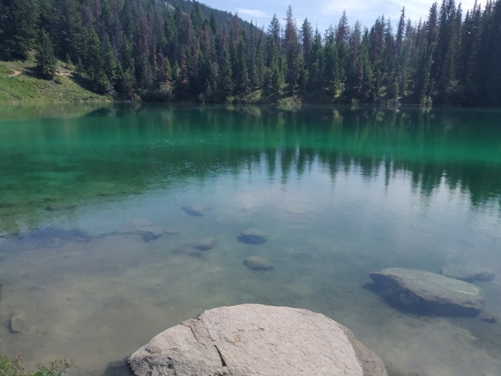
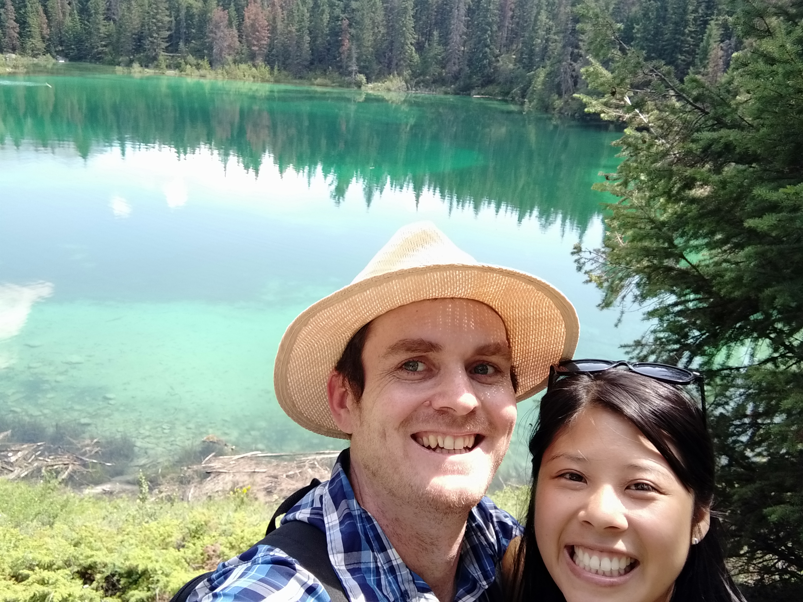

While were were spending two nights in Jasper National Park, in reality it felt like more like one day. We arrived late on the first day and we weren’t confident the weather was going to be any good on the day we had to leave.

So, what did we want to see? There were a number of highly rated all-day hikes. Well since we only had one day, perhaps smaller hikes would be better than one long hike. Also while researching the hikes we noticed that there was a common theme to many of them: Bring bug spray.

Uh-oh. We’d bought some before entered Yellowstone but we hadn’t really needed it. Fortunately the mosquitos weren’t too bad, though Betty did get bitten once before deciding to apply the insect repellant.

The first hike we did was the Glacier Trail at Mt Edith Cavell. This hike was picked because the starting elevation was already quite high, and because the hike length was variable. We could do a short hike, or a long one – our choice. And as a bonus, even though we didn’t arrive all that early, we were able to find a carpark (it would have been quite difficult to find them for the rest of the day).

The short hike was less than 1km one way, although it was uphill. There were two glaciers here. The Angel Glacier could basically be seen from the carpark.

The Cavell Glacier was much lower, by a pond both glaciers were feeding into

Sadly, the track down to this pond had been closed. The excuse was to allow for restoration although the actual reason was likely because of the danger of house-sized ice chunks falling from the Angel Glacier. That didn’t stop a lot of people though.

We’d come all this way so we did start walking the longer track for a while. When it didn’t look like it was going to get much interesting, we decided to turn back.

We then drove to the next hike we’d identified as being potentially worthwhile. This one was called the Valley of Five Lakes.

I don’t know about the “valley” part, it felt very flat. Also, the “five lakes” part wasn’t quite right either. Lakes Three and Four (yes, those were their actual names) had merged due to their high water levels.

Here they are in reverse order (we did the loop in reverse for some reason):

> Five

> Four

> Four again (different angle)

> Three. (And Four)

> Two.

> Squirrel.

> And finally, number one.

As you can see, they were very nice. I don’t really have anything more to say about them.

> Here’s some more smiling faces

Those of you with a keen-eye will notice that this blog post is entitled, “The day of three hikes” but I’ve only detailed two here. Well, after this hike we needed an afternoon break. As great as these two hikes were, the next one was even better – so it gets its own blog post.