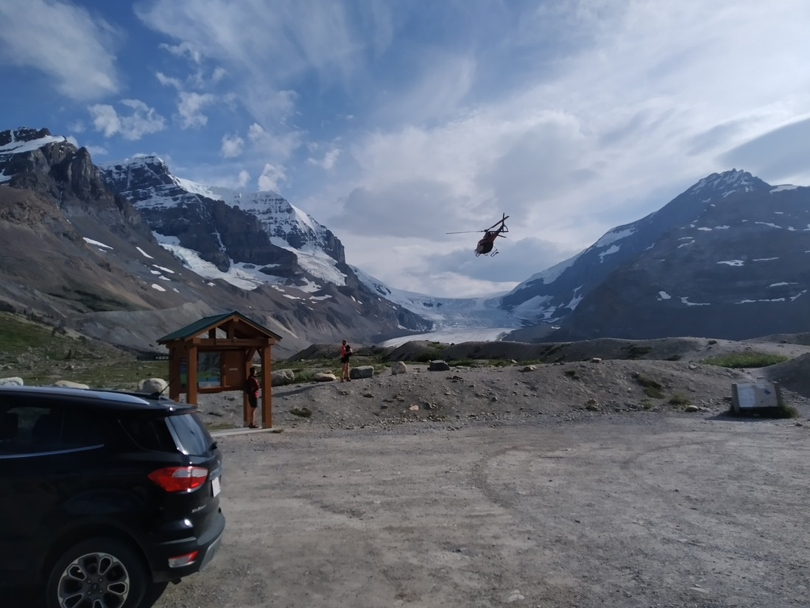

Before we came to Banff, we did some research regarding what attractions were in the area. One that came up was, “walk on a glacier for $100” (I think that amount is correct). Well, we don’t really do many of these touristy things. Partly because we’re cheap, and partly because we’re usually time poor.

Also, “walking on a glacier” just feels too symbolic of humanity’s contribution to climate change.

Anyway, two or three hours along the Icefields Parkway we came to the Athabasca Glacier – where the glacier walks were held. There was a huge carpark on the far side of the road – and it appeared to be mostly full. This looked to be the carpark for the tours – but there appeared to be a carpark on the other side of the road, closer to the glacier. Also, strangely it wasn’t that big. Or busy.

Anyway, enough about the carpark. Here’s what the glacier looked like:

Well, I can’t say I’d seen a glacier like this before. So flat! I see why people are able to walk on it.

Also, this is not what the glacier looked like from the carpark. Here’s what it looked like from the carpark:

So it was a bit further away. There was a sign nearby for a trail toward the glacier. Well, it looked like quite an impressive glacier so we figured, “Why not do another walk? Plus it was only 1km (one way).

So we walked and eventually came to…

> Lots of rocks!

…the actual carpark for the glacier.

I don’t know what the carpark we parked in was for. The walk looked like the above picture for the whole way so it wasn’t exactly amazing.

Anyway, from the other carpark there was a second trail so we followed that up to the glacier.

> Looking back. Our starting carpark can’t be seen – it’s to the top right.

We didn’t end up getting as close to it as we were hoping. It turns out, glaciers are prone to having house sized chunks break off so getting too close was dangerous.

> Yes, Betty – you were in a lot of pictures this day for some reason. No, I can’t use other pictures because they’re mostly bad.

But the excitement didn’t stop here. When we got back to the carpark there was an ambulance waiting. I figured that someone might have hurt themselves on the ice.

We were about to pull out when this happened:

Strangely, the helicopter hadn’t come from the glacier. It appeared to have come over the mountains to the east. “Maybe they’re airlifting someone out,” we figured. The helicopter was blocking the entrance to the carpark so we didn’t have much else to do other than to sit there and watch.

Then the ambulance people came out and rolled a stretcher out to the helicopter. A couple of minutes later a person from the helicopter was wheeled back to the ambulance. And five minutes later the helicopter took off.

This carpark was really central in Jasper National Park. There wasn’t a town within 100 kilometres. Why was an injured person dropped off here?

Our best guess as to what happened is that someone hurt themselves in a remote part of the park and they just needed some medical attention. Perhaps this ambulance was nearby and not doing anything.

Anyway, after this excitement we got in and our car and continued on to Jasper (the town) where we were spending two nights.

So, to sum up….

(Hmm, this is a hard blog post to sum up.)

…Well, we did some things…

…Oh, and we saw some things! I think that about covers it. Stay tuned for the next entry where we see some different things (but not too different).