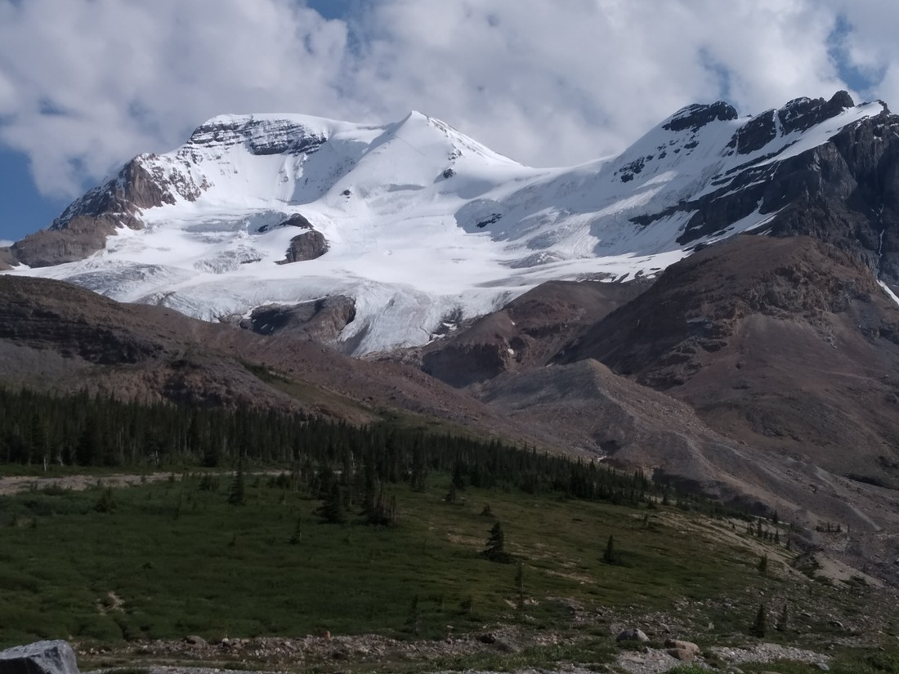

The Icefields Parkway is a 230 km stretch of road running from the North end of Banff National Park through to the town of Jasper in Jasper National Park.

And it is 230 kilometres of stunning scenery.

I’m actually afraid this blog post isn’t going to do it justice. Looking back at the photos, I’m a bit surprised and annoyed I didn’t take more of them. It was a four hour drive to Jasper so we didn’t want to be making too many stops.

The whole drive was through forests. There were always mountains visible on one side, if not both. There was regularly a river running alongside the road. Occasionally there’d be lakes. And credit where credit is due – the road itself was also quite nice to drive on.

…and Betty slept through some of it. In hindsight, we probably shouldn’t have done a 10 kilometre hike beforehand. However, she got woken up for this part:

> What’s going on?

A herd of mountain goats were on the side of the road and people were slowing down to look at them. However, it quickly stopped being a choice. The goats nonchalantly started walking on the road. Some of the adult goats stood, blocking the cars, while the younger goats crossed to a stream on the other side.

> That’s it, take your time…

There they all had a nice drink…

Before walking back onto the road again.

It was nice to see wildlife. Until now, we hadn’t really seen any in Banff. It wasn’t like Yellowstone where we’d be pulling over several times a day to see them.

Anyway, here’s some more photos of the drive:

Something I haven’t mentioned yet are the glaciers. We would have seen maybe five to ten glaciers from the roadside.

At least, I’m assuming they were glaciers. They’d look like huge snow drifts that you’d have expected to be melted by this time in the year. Occasionally, they’d look shiny.

Yesterday we’d spent four hours (probably more) hiking to and from the Stanley Glacier. Today we’d seen half a dozen and we hadn’t even left the roadside.

We did make one stop (which I will separate out into its own blog post) but otherwise we only made short stops where we felt the view was particularly scenic.

Given an opportunity, I’d love to make this drive again. Perhaps in the Spring, and there is still snow everywhere. And perhaps in the Autumn when (some of the) trees are changing colour.

Calgary residents should consider themselves very lucky.