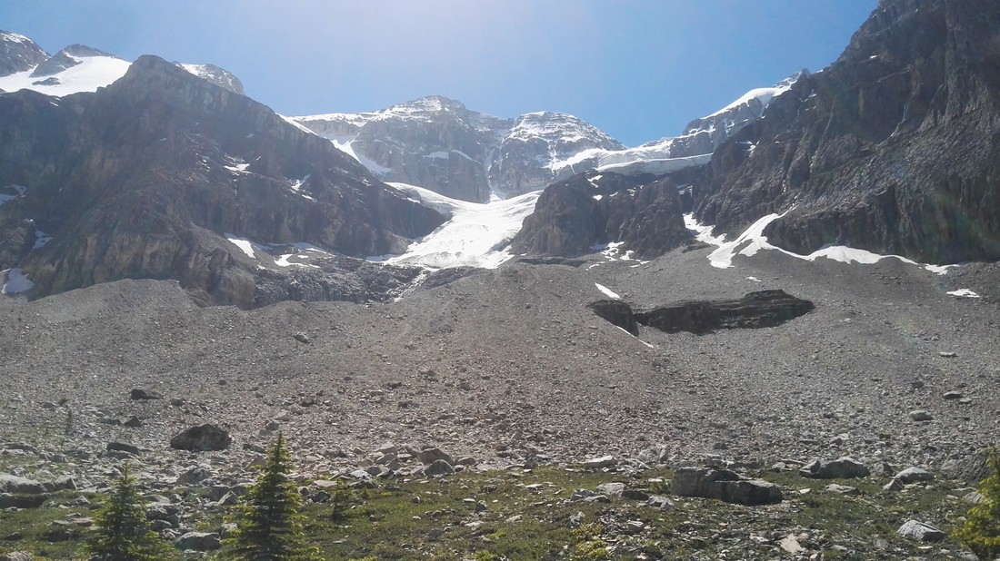

Okay, back to Stanley Glacier now.  I know, I’ve already spoiled the ending in my previous blog post -we survived the walk, but only just.

Something I haven’t talked about in Banff are the roads.  Running through the middle of the park is “Highway 1” – a 1,000 kilometre highway that runs all the way to Vancouver.  It was four lanes with a large strip of grass in the middle and to the sides.  On each side were high metal fences to keep animals from wandering onto the highway.  The top speed was only 90 kph, but this can be excused given that you’re driving through one of the most beautiful places on Earth.

Because of the grassy verges, the trees are far back from the road and therefore you get quite a good view of the mountains.  Contrast this with the roads in Yellowstone which were only ever two lanes and the trees lined the side of the road which meant you saw nothing.  This is what Yellowstone needed!  (Although, we did see a lot more wildlife in Yellowstone).

We had to turn off this road onto another, smaller road to get to the Stanley Glacier trailhead.  Shortly after leaving Highway 1 we encountered a sign stating that from this point on there would be no cellphone coverage.  This was another reason why Banff is so great that I haven’t mentioned yet.  You get cellphone coverage basically everywhere!

It was getting to be about 11am and until this point the day had been kind of sad.  The clouds must have been really low because we really couldn’t see much despite promises by the weather forecast that today would be a great day.  Well, the clouds finally lifted and we had blue skies and sunshine for the first time in Banff.

> No clouds!

We could finally see the mountains!

10 minutes of driving later we found the trailhead carpark.  We set off for what we were expecting to be a 2.5-3.5 hour, relatively straight forward hike.

Initially we were walking up a hill at an easy gradient.  This part was through a regenerating forest which had burned in 2003 (I think).  Well, unlike regenerating forests I had seen previously this one did resemble an actual forest.  The only difference was that the trees were all shorter than us.  It made for quite a scenic start to the walk.

> We’d driven past those mountains yesterday and never seen them.

(Spoiler, it also made for quite a hot finish to the walk as there was little shade.)

> But it is nice being taller than the trees.

Around an hour of walking later, we basically got to the end of the trail…

“Is this it?” we couldn’t help but think.

> Looking back on the valley we had just walked up.

We were now in a kind of valley.  We could see snow on some of the mountain tops around us.  Also, we could see a large white chunk on one particular mountain to our right.  It was quite far away and not all that impressive.

> Excuse the glare. I thought I had forgotten my camera phone so I was using my backup one.

The forest had given way to rocks.  The valley walls and floor were basically just rocks.  Just ordinary, alpine rocks.  Not pretty rocks.  Up ahead, quite far away was a large patch of trees at a higher elevation.  This patch of trees also looked like it was the perfect place to view the glacier.  Taking out my binoculars I could spot some groups of people working their way up there.

Betty and I shared the same thought.  We both wanted to go up there.

Well, there was no easy way to do so.

We could spot part of a path on both the left and right side of the valley. I decided to go right because it appeared like it might be shorter. The “path” was now nothing but scrambling up rocks. Not ideal, but it turned out that we were following a well used path because a lot of the time the rocks were pressed into a kind of path.

Eventually we made it to the trees.

> A bit of an oasis in the mountains, created by the melting glacier

We turned to look at the glacier and what did we find…

> Still far away…

It’s a bit hard to make out in this photo but the rocks in the foreground are of a ridgeline. That ridgeline appears to go all the way up, right near the glacier.

So, there wasn’t actually an end to this track. We could go as far as we wanted – possibly right up to the glacier. The question was, *could* we go all the way?

The answer was “no”. This extra part with the rocks was making the trail a lot longer than we were hoping for. Plus, it’s one thing to be able to get up the rocks – it’s another to get back down.

But we did go up a bit further. And behold:

> A slightly closer view of the glacier!

So, we started off back down the hill.

> So many rocks.

Easier said than done due to the amount of loose rocks. At least there was a cool mountain breeze blowing. It wasn’t cold but there were patches of snow about.

This happened:

> I made a friend!

By the time we got back to the car, we were pretty broken. We now knew why some people in the reviews of this walk stated, “It was easy” while others had the opposite opinion. Basically, this walk was as challenging as you wanted to make it. We just bit off perhaps a bit more than we were comfortable chewing.

Knowing we had several more days of walking ahead of us, we retired for the day.

…until Lake Louise and Lake Moraine brought us out again.