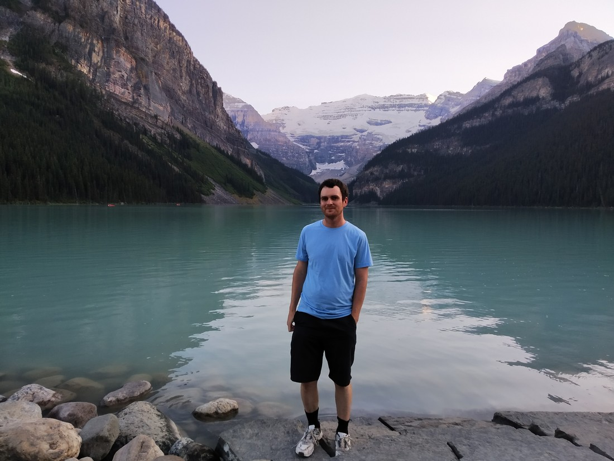

On our second morning in Canmore, we couldn’t decide what trail we wanted to do.  There was one called the Stanley Glacier trail which the hiking guide noted was quite popular.  However it was through a regenerating forest which often isn’t as pleasant as walking through an actual forest.

Also, this was really our last day in Banff as tomorrow we would be setting off for Jasper – an almost four hour drive along the Icefields Parkway.  Along the Icefields Parkway was lots of hikes (a whole guide’s worth in fact) that weren’t close to either Banff or Jasper so ideally we’d want to be doing these on the day we need to drive between the two.

Along the way was also Lake Louise, a location Betty identified with a specific interest in visiting.  It was described on a website as the “Jewel of the Banff National Park.”  It was about an hour’s drive from our accommodation so not too far.  I decided that today would be the day we would visit Lake Louise (so we didn’t have to squeeze it into our travel day).

I also identified a hike to do called the “Plain of Six Glaciers”.  Part of the appeal of this hike is that at the end turnaround point was a teahouse.  This teahouse was so remote in the park that it only opened for several months a year.  Supplies were helicoptered in twice a year.  I have no idea where the employees come from.

So we set off to Lake Louise.  10km out we saw signs saying, “Lake Louise Parking Full.”  Not surprising.  Many carparks get full.  It was also a weekend and the first fine day in a while so very not surprising.  7km out from Lake Louise we found the “Lake Louise Overflow Parking”.  So we turned in.

The overflow parking was a large carpark where you could catch a shuttle into Lake Louise.  The carpark was almost full, though we did find a park relatively easily.  However, before we even left the car we were having second thoughts.

Forming a full half circle around the carpark was a line of tourists, waiting to catch the shuttle.  Remember, this was not a small carpark.  We have never seen a line this big on our trips so far.  Staring at the line I saw our whole day disappearing.  It would take hours to get to Lake Louise.  We would have to fight the crowds there.  The trail we wanted to go on would likely be busy too.  Who knows where we’d find something to eat.  We’d have to queue to catch the shuttle back to our car.  Our whole day would be gone by the time we made it back to our accommodation.

So we didn’t go to Lake Louise.

Instead we backtracked and walked the Stanley Glacier hike.  This was a long hike (which I will explain in a separate blog post) and kind of killed us for the day.

After 6pm that night we were relaxing and I was reading about Lake Louise and its sister lake Lake Moraine.  Apparently the latter was very nice but the carpark would fill up before dawn, resulting in the park closing the road to the lake to anything other than shuttles.  If we wanted to visit these lakes, likely we would have to get up at 4am or earlier.  (Remember, we’re quite far north so dawn is quite early in summer).  As well as being tired, this would mean we would miss out on our breakfast provided by the hotel.  Are these lakes really worth missing breakfast? Probably not.

But remember, prior to coming on this trip we had identified these lakes as being worth seeing.  It would be a real shame to miss out on them.  So, if we can’t get up an hour before dawn and we’re leaving Banff to go to Jasper tomorrow, then we only have one option:

We’d go to Lake Louise tonight.  We set off at 7:45pm, planning to arrive at 8:45pm – a full hour before sunset.  We hoped that by this time the carparks would be free as most of the tourists would be long gone.

We were right-ish.  We arrived at Lake Louise on schedule.  The carpark by the lake was tiny but we found a free parking space.  Wanting to maximize the daylight we had remaining, we made a beeline for the lake.

It was both nice, but also disappointing.

The Lake is quite large, and quite still.  It is the same bright teal blue colour that we’d seen in some of the rivers in Banff.  Next to the lake was an old hotel called the Fairmont Chateau.  It too was very pretty.  Around the lake were mountains and on the far peaks were snow and a very large glacier.  Overall it would have been very nice to see except…

> It’s dark

We’d perhaps come a bit too late.  It was still a good 30 to 40 minutes before sunset but the mountains were shrouding the lake in shadow. The bright colours that had made the lake so famous were now muted.

> That doesn’t mean we can’t take our customary touristy photos.

It wasn’t awful but I felt a tad disappointed.

> Is this is Betty’s disappointed face?

Around the lake was a large walkway.  Apparently during the day this walkway is packed with tourists.  It was nice to be there when the walkway was quiet but there were still plenty of people about. We certainly didn’t have the place to ourselves.

Well, we’d driven all this way – we’d may as well make the most of it. And what better way to that than by jumping back in our car after only ten minutes in order to drive to another lake.

Lake Moraine was about 15 km further down the road and it too was often very hard to get to during the day. Figuring we weren’t going to get much more out of Lake Louise, we then headed to Lake Moraine.

We were about 1.5 km away from Lake Moraine and we hit a line of traffic. After about 7pm, the park stops policing the road to the lake so anyone and everyone can drive to it, regardless of whether there were enough spaces. Well, it seemed like there weren’t enough spaces.

We couldn’t do anything but wait and watch the minutes left in the day tick away. One car tried to give up and do a U-turn to head back the other way. It ended up getting stuck off the side of the road (the road was quite thin). We told ourselves, “We have nothing else to do tonight. Home is still an hour’s drive away so it’ll be late once we get back, regardless.” I did worry that we might run out of petrol though. Every minute spent idling in traffic was eating into the remaining quarter of a tank we had. Would we have enough to get home?

Eventually we made it to the Lake Moraine carpark and it turned out that there were still a lot of parks – there was just a bottleneck to get into the carpark.

It would have been about 9:40pm when we got to the lake. Surprisingly, there was still a lot of light left in the sky.

> Water is just as blue, but not quite as big as Lake Louise.

I certainly like this lake more than Lake Louise. I don’t know why but somehow, despite the time now being 25 minutes closer to nightfall, the lake was a lot clearer.

> Seriously, this photo was taken at sunset. It’s like my camera’s low-light setting finally kicked in,

We spent a lot longer here. We walked maybe 1-2km around the lake. It was nice.

> It always was nice to see the lakes without the throngs of canoeists on it.

But eventually, at around 9:58pm (now 10 minutes after the official sunset) we had to call it a day. Driving back to our hotel, we were certainly glad that we did fit Lake Louise and Lake Moraine into our trip. Like Angels Landing, it would have been disappointing to come all this way and not do them. It was just a shame that we couldn’t see them at their most colourful.

To anyone visiting the area, I wouldn’t say that these lakes are a “must do.” There are plenty of other good lakes in Banff and Jasper. Sure, you might need to walk to them and they won’t have a scenic glacier but at least you’ll be able to experience them on your terms.

And good news, we didn’t run out of petrol before getting home!