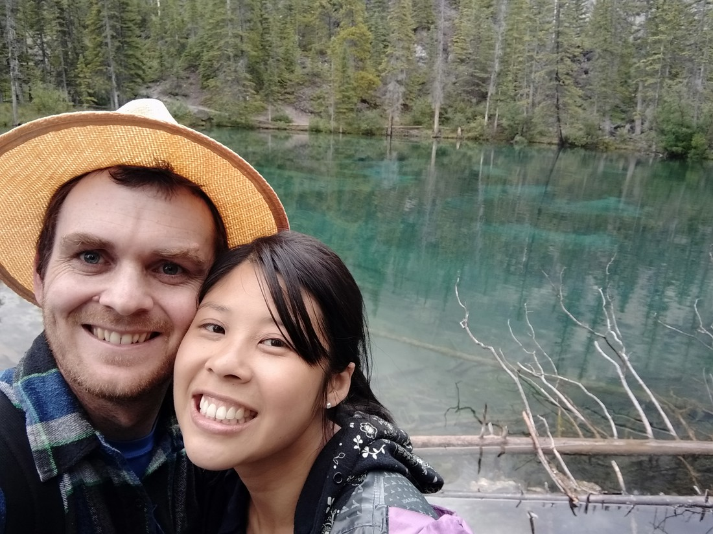

It wasn’t exactly early when we arrived at the Grassi Lakes trail – probably around 7 – 7:30pm.  Two days ago we had arrived in Canmore at 9:40pm (local time) only to find that it was still a bit of light in the sky.  It showed that we were now getting quite northerly.  Days were long in summer.  I can’t imagine what winter would be like.

So we arrived at the Grassi Lakes trailhead to find a sign warning, “Bear in the area”.  It was dated early July so we may have somewhat disregarded it.  The carpark had numerous cars so many other people were doing the walk at that time.  If this trail had been trafficked this much every day since early July without any incidents then we should be fine.

It was raining so lightly by this point in the evening that I didn’t wear my rain jacket (though I did pack it).  There were two trails to the lakes – one easy and one hard.  The easy one turned out to just be a service road so we decided to take the hard route which was a proper walking trail.  Also, both trails covered the same elevation so it’s not like the easy trail would have been less work.

The trail was flat to start with before climbing up.  We crossed several small streams (good thing I brought my hiking boots this time, although I may have oversold the difficulty by calling them “streams”).  We also were treated to some nice views that wouldn’t have been on the easy trail.

> So many clouds!

There was also a waterfall.  It was fine.  Better than no waterfall.

> It looked a bit better in person.

When we made it all the way up the steps we came to a junction.  The path ahead had a temporary sign stating, “Trail closed due to bear activity.”  This made me panic for a bit.  We’d climbed all this way and were almost at the lakes only to find out that we couldn’t walk the last few hundred metres.  Fortunately it was a different trail that was closed.

We hadn’t expected much for the lakes.  Remember, this walk was near Canmore – it wasn’t even part of the National Park.  We chose this walk because it was recommended in a brochure we had picked up but we couldn’t be sure.

The lakes turned out to be quite stunning.

> Good thing we’re night slightly higher. It looks like the cloud layer is right above us.

They were very still, giving off very nice reflections of the scenery.

It also helped that we were basically alone with the lakes.  I think there were a small number of other people but for once it was really nice to experience a peaceful place in peace – probably thanks to the late hour, the rain, and the location not being popular keeping people away.

> The water was so clear! Not the hazy teal blue we’d seen before.

Then we went to start making our way down and we noticed that the views had improved quite considerably.

> That’s Canmore in the distance. There appeared to be some sort of electricity being generated nearby, hence the power lines.

By this point in the day, the weather had truly fined up.  It was sunny for the first time in the day, despite the late hour. Even the falls looked better on the way down

And by the time we were at the bottom, it felt like a fine day. Sure, the sun was about to set but it was so nice to be able to see clearly for once. We also learned a trick – hiking later at night will result in fewer other tourists. With the Canadian sun setting well after 9pm each day, there’s several hours when most tourists will have retired for the day but the sun is still out. We’d use this trick again another couple of times.

> You wouldn’t think so but this is the latest photo in the day here.

But all in all, this was certainly our favourite walk in Canada (so far)

