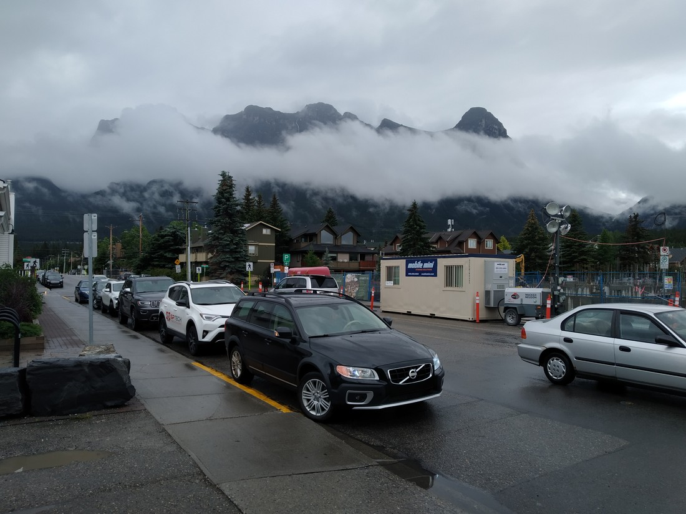

On our first morning in Banff we had to decide what we wanted to do that day. We had an entire menu of hikes – what to choose? The weather was still poor so figuring we might have limited visibility we picked a hike where the sights were all near to the track. We found a canyon walk that was noted to be very popular. We figured that it wasn’t likely to be popular today of all days.

We were kind of right. It was busy but hadn’t yet gotten busy enough that the carpark was full. That didn’t happen until about 10 minutes after we arrived – so good timing by us\! Good thing we set the alarm so we didn’t sleep in too late.

> This tight track got quite slow at points with lots of people. I kind of groan when we get to a carpark and there is space for multiple tour buses.

The canyon is popular because it is a flat-ish walk that is mostly paved. It follows a somewhat scenic stream up to two waterfalls named Lower Falls and Upper Falls…

I think this is the fourth time we’ve seen falls with those names.

The falls were okay. We’d seen bigger and better before. The canyon itself was more scenic than the falls.

> Not all of the walk was like this. Just the first two or so kilometres.

After reaching the Upper Falls we continued along the track. This part wasn’t paved, was hilly, and much longer so most people turned back at this point. And I can’t blame them. From here the track got very muddy.

> Not all of the walk was like this. But a lot of it was\!

Betty had been smart and foreseen that a frequently walked track might be in a poor condition given how much rain the park had endured recently. Luke had been stupid and worn his white everyday shoes. After cleaning them in the shower that night, they were now his off-white maybe-not-everyday shoes.

> Why would it be muddy? It’s not like it’s been raining all morning. And a lot of yesterday. And many more days in the weeks prior.

The attraction at the end of the path were called the “Ink Pots” (again, a name we had seen elsewhere). They were a series of pools in a variety of colours.

> But mostly just blue!

There appeared to also be some springs underneath as some of the pools bubbled. The sandy bottom of another pool rippled like a blanket underwater (is that a thing?).

Overall they were quite nice. But it wasn’t the nicest thing to see at the end of the walk. The ink pots were in a kind of valley. A very scenic valley.

> I’m assuming it was a valley. I think those are mountains in the distance.

The water, the trees, and the clouds were very peaceful. Poor valley. People come for the ink pots but its the valley that is the true star. At least when its misty.

Speaking of which! Luke was really enamoured with these clouds sitting below the mountains.

> So majestical.

He took a lot of photos of clouds like these. Then he complained in later days when the weather later fined up and the clouds disappeared.

> Who really needs to see all the mountains? This is in Canmore by the way.

With no real reason to stay in Banff, we returned to our accommodation in Canmore. By this time it was maybe 2pm to 3pm. But we hadn’t eaten lunch yet. And it had been 11km of walking so we needed a rest.

So we lazed around. We’d considered doing a couple of walks each day but the Johnston Canyon walk took a lot out of us. But by 7pm we were getting kind of restless. We had also noticed that the weather wasn’t getting worse. In fact, it seemed to be getting better…

> Clouds were still out though. Hurray!

Betty had read about some walks near Canmore so we picked one called the Grassi Lakes.

And you know what… I’m going to leave that walk for the next blog. This has already been a pretty image heavy post and Grassi lakes has many more great images that I want to show off.

Stay tuned for the next one!