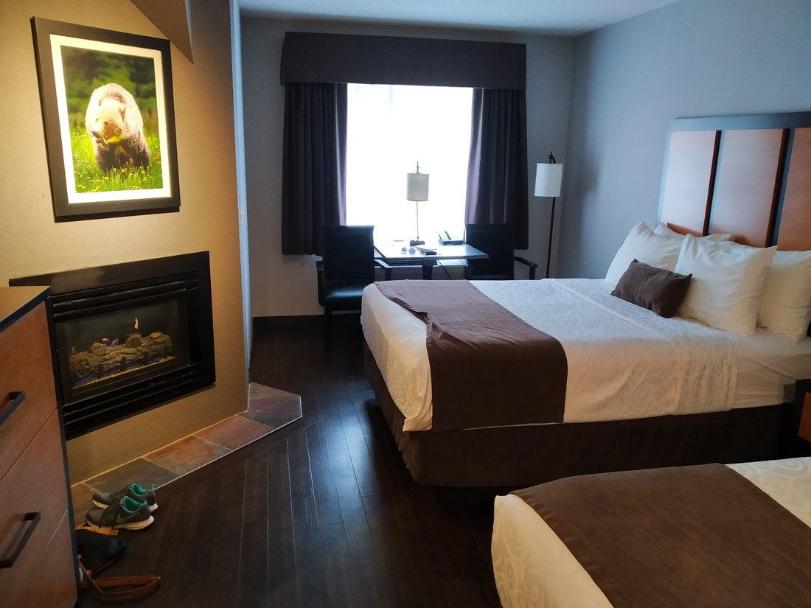
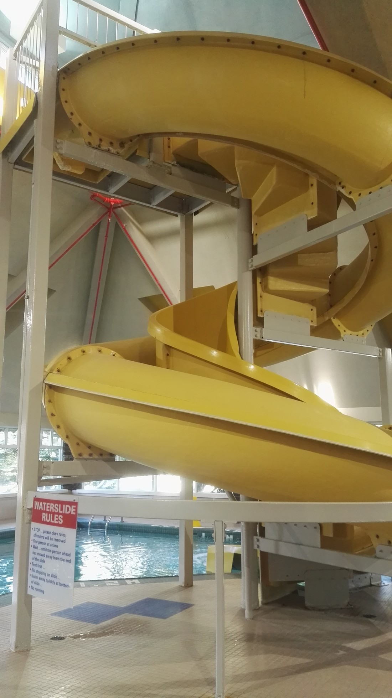
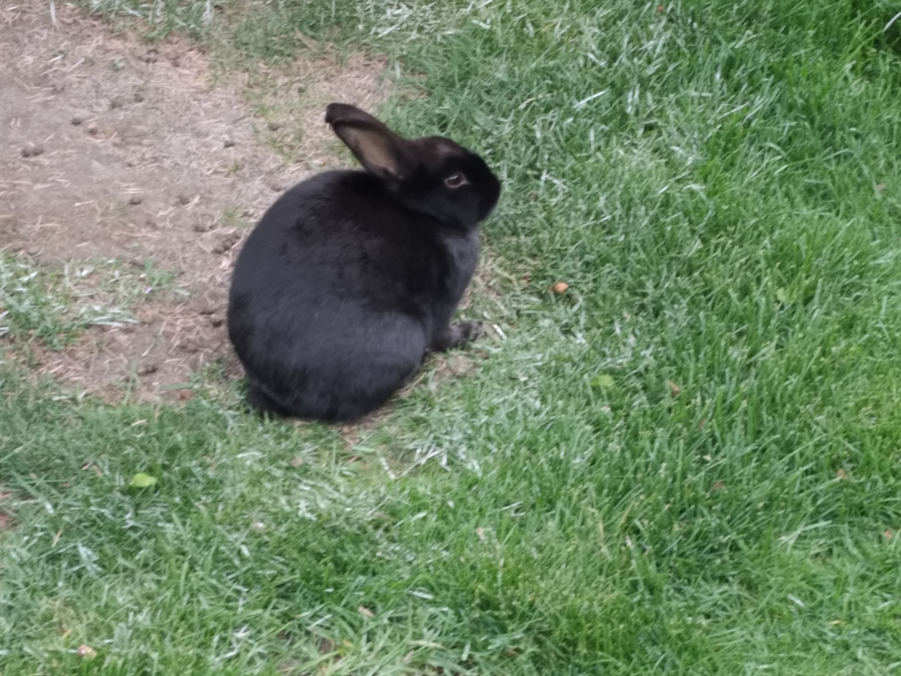

When booking accommodation, I hadn’t prioritised Banff as I was more focused on the more complicated start of the trip. When we came to book Banff, we found everything to be expensive. There was no cheap accommodation. Previously we were forced to book something expensive for San Francisco due to the ridiculous cost of living there. Banff was worse.

So for once we decided not to stay in the location we had chosen. Instead we stayed in Canmore, a township at the gate of Banff National Park and 20 minutes drive from where we would have otherwise been staying. This meant that for the same money we could stay in a really nice place rather than a cramped, not so nice place. Unfortunately, it was still the most expensive place we stayed at.

But it turned out to be worth it.

The rooms just felt nicer. The front-desk people just seemed nicer. The decor felt newer, cleaner. We had breakfast provided for us each day. Cookies, fruit, and lemon water were provided in the lobby free of charge. We had a microwave in our room – always nice to see one of those.

And there was a fireplace in our room! And not an ordinary fireplace either. Nor a leaky one like the one in Yellowstone. This was a magical fireplace that lit at the turn of a switch with logs that never burned!

And that’s not all. Over the fireplace was this random picture of a bear. Yeah, yeah – so what? It’s a bear. Not true! Clearly this must have been a special bear because one light switch out of the three in the room was solely devoted to lighting up the picture of the bear!

> There were actually other animal pictures too. Some sheep, wolves and a picture of a beaver in the bathroom. Not sure why the bear got special treatment.

And I haven’t even gotten to the best part! Instead of telling you, let me show you:

> Behold!

That’s right! It’s a waterslide. A short one, sure – but still a fun one. The first night we were there we warmed ourselves up in the pools, watching kids going up the stairs and down the slide, envious of the fun they were having. We carefully reviewed the wording on the rules and noticed something: There was no rules against adults using the slide. But do we dare? We’re adults after all. The only thing differentiating us from tall children is that we act like adults.

On the second night we returned to the pools again to heal our legs tired from a day of walking. That night there were different people in the pool. Europeans of some sort. Again, the kids were using the slide but this time occasionally one of their parents would join in too. Like so happens a lot with us, we were too shy to be the first to do it. Now we were not 🙂 I even got Betty to go down a second time!

So it was a nice place to stay! While it did add an extra 20 minutes of travelling to each day, to us Canmore was just so much more convenient. We had a much nicer place. We had a supermarket nearby and much more choices for eating out. There was a board game shop in town (although the prices were quite high – not that we could buy anything anyway). There was even wildlife. There were lots of these squirrels around:

> “Welcome to Canmore! This is my hole. You can come in but you might need to take off your shoes first.”

And some very pretty bunnies. I still don’t know if they were pet bunnies let run free but there were quite a few of them over quite a large area.

> Whose a cuddly bunny? (Full disclosure: I don’t know how cuddly it actually was because I couldn’t get close enough to it.)

And its not like there weren’t things to see nearby – which will be explained in my next blog post.