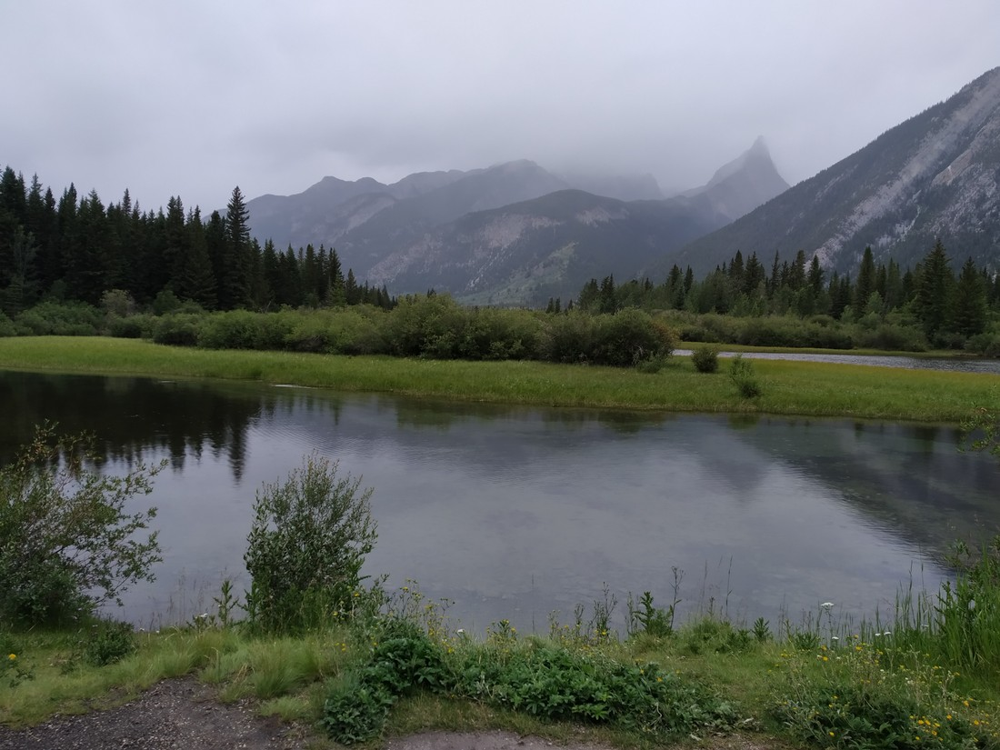

Well, Luke and Betty are roadtripping again!

(Well we were. At the time of posting this Luke and Betty are back in New Zealand as I have got quite behind in documenting our travels. But I’ve come this far, may as well finish it.)

There’s some differences compared to last time. For one, we’re in Canada. And two, we saved ourselves a small amount of money. When we landed in Calgary we caught the shuttle to our accommodation and then we walked to a nearby hotel to hire a car. The downside is that they didn’t have a range of cars on site so we were stuck with what we had requested – a “compact” car.

This turned out to be okay. The boot space was almost big enough. In order to fit everything we had to fold one of the seats down – no biggie. It also had cruise control which was nice. Highway roads are very straight so cruise control is always welcome. It had also only done 3,600km although it felt less new than our last vehicle. It felt like Avis hadn’t cleaned / refreshed the car after the last rental. Again, no biggie.

But there were some issues. For one, the rental only allowed one driver. Additional drivers were $10 per day. To be honest, I should have complained about this. Every other country appears to allow multiple drivers. USA allowed up to four. Canada even allowed spouses to be added as an additional driver for free. We decided it wasn’t worth the additional $110 so I ended up doing all the driving. Poor Betty, she must have been so bored on some days.

Another issue was that we no longer had GPS in the car. This meant that we were reliant on my phone to Google Maps the routes we wanted to travel. However, Google Maps can only find a route if there is cellphone coverage. We were planning to head into the National Parks. For comparison, we were without any cellphone coverage for two whole days while in Yellowstone National Park. Fortunately, Banff had relatively excellent cellphone coverage but some days I did have to use the hotel WIFI to find the route for the day.

The last issue was a strange one. Unlocking the car using the car remote inexplicably only unlocked the driver’s door. There was a separate button to unlock the boot but no buttons to unlock all the doors. This meant, every time we got in the car, I had to open my door and reach in to press a button in the middle of the car to unlock all the doors. I am hoping that there was a way to change this and that we were just to stupid to find it because it was really annoying.

But overall we were happy. We were on the road again. The most enjoyable and relaxing parts of our time in the States was when we were roadtripping. It was nice to be roadtripping again.

Banff National Park was a couple of hours’ drive from Calgary. We headed for the Banff township which was 20 minutes into the park. It was busy but we managed to find a park on the street. So we parked and then walked to the Visitor Centre to get some information on hikes. It turns out we hadn’t really learnt our lesson from Yellowstone and we were hoping that Banff would have hiking guides available.

Fortunately, Banff had the best hiking guides we had ever seen. They were huge A1 (ish) folding pamphlets with maps on the front and a list of the hikes (20ish) on the back. There were also separate guides for the Jasper National Park and another for the area between Banff and Jasper. While some of the other parks had decent guides, none of them came close to the sheer volume of information we had in these guides.

But there was another issue. When we were walking through the town, I couldn’t help but notice that everyone was wearing jackets and trousers. I was the only person walking around in shorts and a t-shirt. And for good reason – it was freezing! The high temperature for the day would have been only slightly higher than 10 degrees Celsius. And to make matters worse – it was raining slightly.

> That mountain on the right should be clearer… Well, at least it isn’t pouring.

So much for our summer holiday 😦

We knew the weather was also expected to be pretty bad the following day but should fine up for the few days after that. Fortunately we were staying in Banff for three nights otherwise we might have only experienced it at its worst.

With no better ideas, we had lunch and then picked a relatively straight forward hike along the river to a small canyon. We donned our jackets and I put on something a little warmer and headed off. We weren’t sure what it was going to be like but we figured we had nothing else better to do.

I must say, it wasn’t half bad. Like the basilica in Quebec, the rain and the cold kept most people away so we dawdled along – with basically the whole path to ourselves. At one point we rounded a corner and caught this view:

> If the colour of the river look unusually bright in this picture, know that this is 100% accurate to how it looked in person.

I feel like I’ve seen rivers of many colours but not like this.

> Interestingly not all rivers looked so bright. Here’s two different coloured rivers joining.

We continued walking along the path by the river. There were frequently nice views. Had the weather been better the views might have been nicer. I don’t know, the mountains just looked… peaceful. Maybe we were just in a good mood.

> Betty might disagree on the ‘peaceful part’. It was very cold.

(Note to self: A bit more about the walk needs to go here. Don’t forget! Make sure its actually interesting.)

> So I drafted this post while waiting at the airport. Was too tired to think of anything notable for this hike, hence the above comment I left myself.

> And to be honest, there wasn’t really anything that notable. It was a nice hike. Not the best, but not a waste of our time either.

Once we were done, we checked out some thermal pools above the Cave and Basin site. This site was reputed to be responsible for the creation of the Banff National Park. To be honest, it looked kinda boring. We got the gist of it from outside. It’s a cave with a thermal pool. Seen them before.

> Whoops – forgot to photograph the thermal sites. Oh well. Here’s another photograph of the surroundings.

At this point we decided to call it a day and we headed back to our hotel. No point in trying to do too much, especially in the cold weather. We essentially had five to six days of straight hiking planned. Best to save our legs for when the weather fined up.

> Hopefully soon!