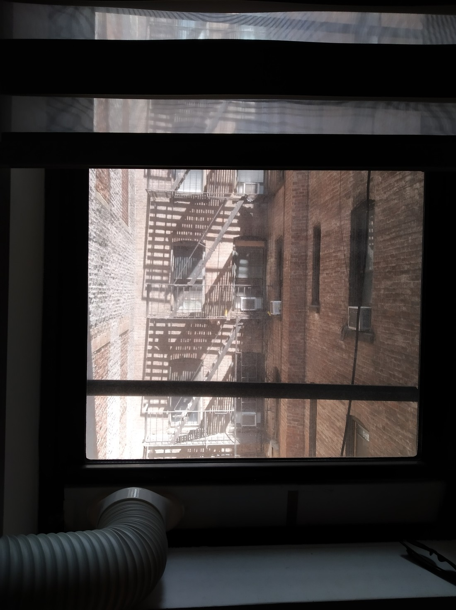
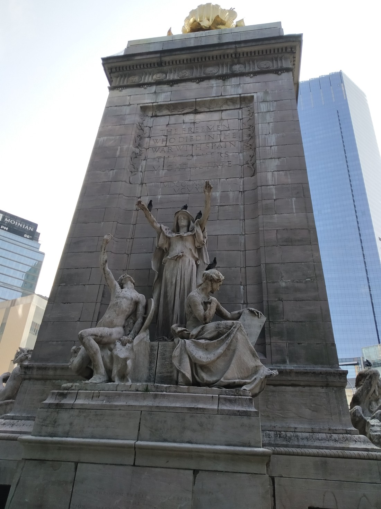

So while putting together the last blog post, I was reviewing the pictures I took of New York and I thought, “Man, there’s a whole lot of pretty stuff that I photographed but haven’t put online.”

New York was a very interesting place so I took a lot of photographs. I’m going to post them in the order they were taken, which might not be a logical order.

> Our view from our bedroom. Still, much better than having a noisy street view.

> I asked Betty to take a picture of both me and the Empire State Building. Turns out, it couldn’t be done.

> Where Law and Order is supposedly set. Fun fact – those types of crimes aren’t even tried in this building. They’re tried in the one next to it (that I cropped out slightly)

> City Hall (with our tour guide in the bottom right)

> Rockerfeller Centre (I think – I could be wrong)

> An art piece. Stairs leading to nowhere. Tickets to walk up it need to be bought seven days in advance (which we didn’t do) or you need to line up as 7:00am (no thanks!). Was this already posted? I’m sure Betty will tell me if it was.

> Have I posted a picture of the Chrysler building yet? Prettier than the Empire State Building but not as tall. Fun fact: it stole the title of world’s tallest building from the Bank of Manhattan Trust Building. That building held the title for less than a day.

> Statue at the south west corner of Central Park. Pigeons couldn’t care less though.

> The Washington Square Arch. I think I couldn’t figure out what to with my hands at the time.

> Here’s a better one if you don’t mind the belly peeking out.

> A lot of interesting buildings near Washington Square (as well as a University Campus so lots of students). This building made me dream of living inside the turret on top.

> FBI headquarters. Shhh, don’t tell anyone.

> 30 Rock is a great show.