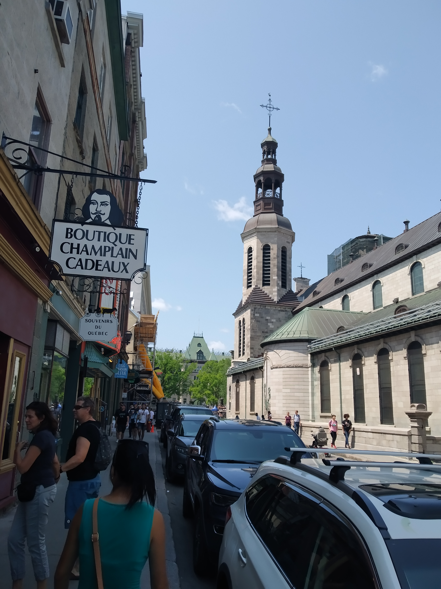
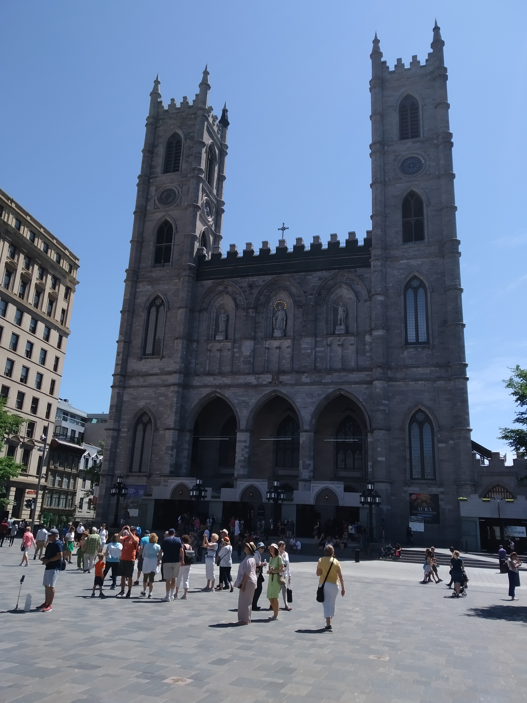
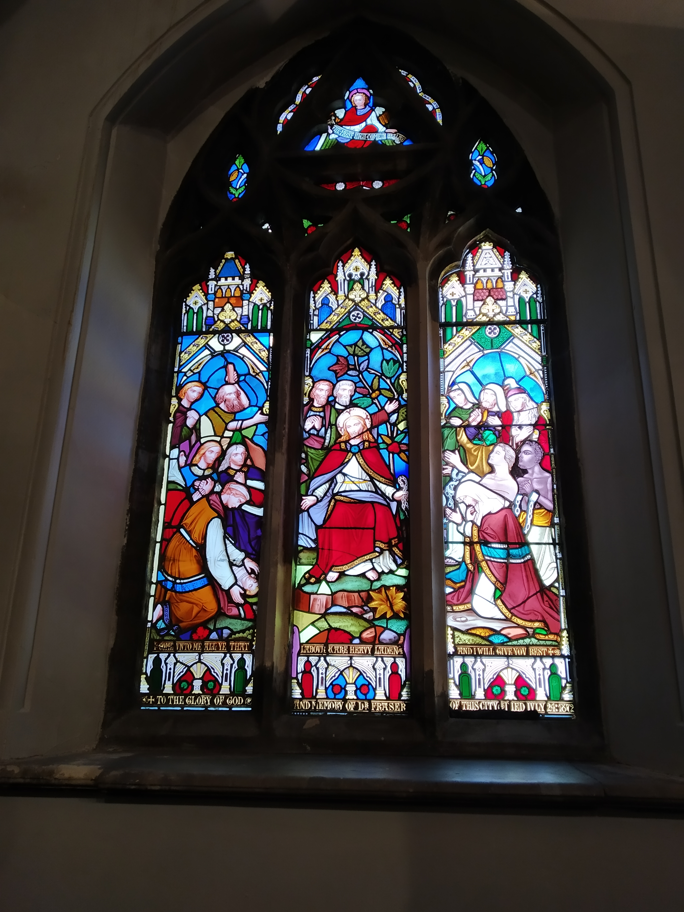
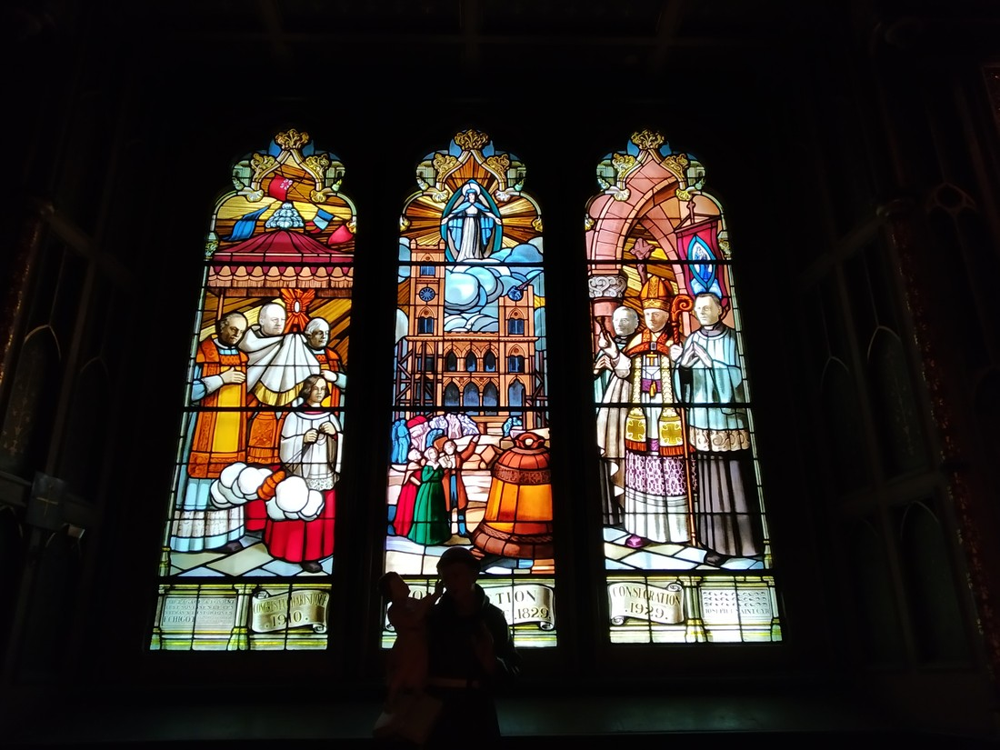

Okay, it’s about time to get controversial again! This time its churches – what’s the deal with them?

A couple of blog posts ago I said we’d been to the Basillica of Sainte-Anne-de-Beaupre in Quebec. Well, that wasn’t the only churchy thing we went to in Quebec.

In the city centre we poked our nose into the Notre-Dame de Quebec Basillica-Cathedral. It was a large but otherwise ordinary church on the outside.

> No Betty, it’s on the right.

Inside it was very nice.

> As always, the seats are plain…

> …and the altar (is that the right term) is OTT.

It paled in comparison to the Saint Anne one but we figured that one was on a level of its own. That is, until we visited the Notre-Dame Basilica of Montreal.

> Darn. It’s sunny – the tourists are out.

> More wooden seats. Can’t have people being too comfortable.

> Whoever this church employed to do their lighting clearly knows what they are doing.

While wandering around waiting until we needed to go catch our flight, we found another church with open doors – the St James United Church. This was perhaps the smallest we’d seen yet. It too was nice. Didn’t really take any photos of it. Probably because it didn’t really compare to the others we had seen.

Now, while we hadn’t been inside any churches in New York, we did see a lot there too.

> The Fifth Avenue Synagogue

> St Patrick’s Cathedral

While it only appears that I photographed two, there were quite a lot. So many in fact that our bus tour guides commented on a couple that had been converted into other things. One was now a roller-rink while another had been a disco until the police had to shut it down.

Which got me thinking: Do we really need all these churches? With the exception of the Saint Anne one, they’re all taking up valuable real estate. We clearly have a surplus of them if some are being repurposed.

But the thing about them is that they were all very historic, very large and very ornate. I struggle to fathom how many hours of labour was put into carving everything in the buildings, never mind building the buildings themselves. People clearly cared about their churches and wanted them looking nice.

Is that really what being religious is all about?

Spoiler: the answer is “no”. I don’t necessarily know why (not being religious myself) but I at least know the answer.

Anyway, something I do know is that stained glass windows are fantastic. They’re both pretty and functional. Here’s some we’ve seen in the churches we’ve visited:

I’m seriously thinking about getting some for my house.

Maybe not ones depicting bible scenes though.

