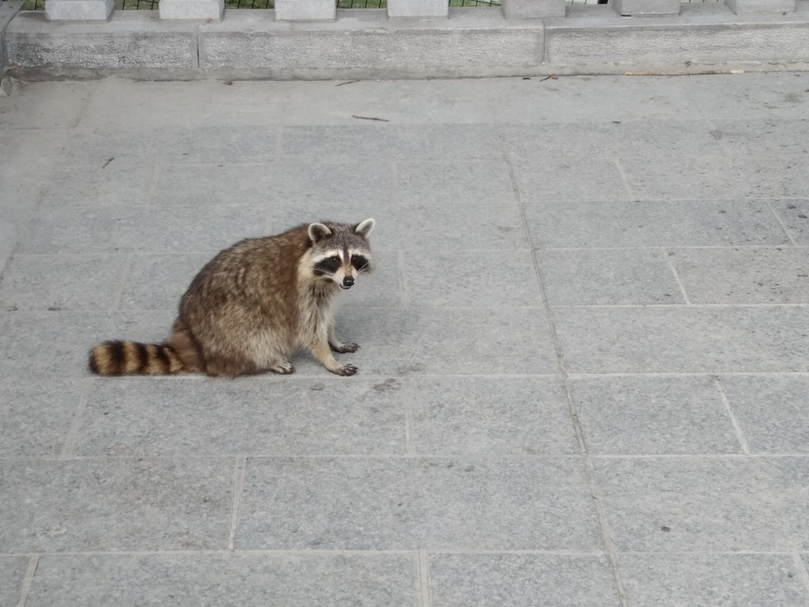

When we were planning this trip I was trying to figure out how best to get from Quebec to Calgary. Then Betty suggested, “Why not fly from Montreal instead?” It was a good idea.

We could take the train from Quebec City to Montreal. It would take several hours but it meant we’d get to see more on the Canadian countryside. We cut one night out of our plan for Quebec and added a night in Montreal.

Another advantage to taking the train is less obvious. Train stations are usually situated in the city centre while airports are usually located far away. Where possible (and reasonable), we like to stay in the city centre. This means that we have to drive (or be driven) to every or from every airport we visit.

> Here’s the Quebec train station – looking as Quebec-y as you’d expect.

Not only does taking the train save us some money on Uber rides, we also save some time by not having to deal with security and checked luggage. Mind you, what time we save taking the train we do lose because a train is much slower. But due to the other hassles that come along with flying, taking the train isn’t so slow.

So we arrived in Montreal around midday. We walked the 800m or so to our hotel. We were aware that it was far too early to check in but we figured we’d enquire. Fortunately they let us check in if we signed up to their loyalty program. By this point, I’ve signed up to so many things online that one more won’t make a difference.

The room wasn’t great. Despite being on the second floor we were almost underground, with one small window. But we didn’t really care. At least we were in the centre of the block and not street facing. A lack of view is certainly preferable to road noise. Anyway, after a rest we set out to see Montreal.

Now, something I haven’t talked about in a couple of days is the heat. Being more northerly, the heat isn’t as bad as New York. But there is still some humidity and we are having days of mid-summer sun. So it is still quite hot. What should we do then? Why not climb a hill?

Near the Montreal downtown area is a mountain called Mount Royal. It feels similar to Mount Eden in that it gives lovely views of the city.

The top of the mountain was quite flat. The stairs took us to an eatery with a great view out over the city. Looking on the map we also saw that there was a giant cross. So we walked to that, expecting some historic monument. It was just a steel frame, possibly with decorative lights. I was so disappointed I didn’t even stop to take a photo of it.

However what made the trip to the top worthwhile is that we finally found one of these:

> “So hungry… Need human food…”

They’re really quite cute. Kind of like a big, round cat with hands instead of paws.

> “This is not food! This is a stone.”

Anyway, we walked around the city some more, ate some things, checked out the board game store near to our hotel (you know, usual tourist things) and called it a night.

> My logic: “Not sure who that is. I’ll take a picture and maybe I’ll look it up before I blog about it.”

The next day we were set to fly out to Calgary in the late afternoon. So we checked out and the hotel was nice enough to hold onto our bags so we could walk around the city some more.

We headed to the Old Montreal section where Montreal’s version of Wall Street appeared to be.

> Whoever built old Montreal…

> …really like columns.

Then we wandered around the pier and wandered around trying to figure out what the Underground City was (supposedly it was a shopping centre) and where we could find it. We found a whole bunch of subway tunnels leading to various stations and stores but it never felt like we’d found one of the most recommended places to visit in Montreal.

> Another shop which looked interesting but didn’t go into because of all the scary French words.

Eventually we wandered back downtown and to our hotel where we picked up our luggage and called an Uber to take us to the airport.

We were glad to have visited Montreal. Aside from everyone still speaking mostly French, it was a nice place to visit. The traffic was pretty horrible though. In the city wasn’t quite as bad as New York but the motorways were much worse. I was a little annoyed at how aggressive our Uber driver drove – but what can you do? Plus, it technically was saving us money.

> Goodbye Montreal. We hardly knew you.

In many ways, Montreal felt a lot like Auckland. It’s a big city with a fair number of things to see, but without the novelty that the other cities we have visited have had. Just a city. We have been feeling for a while like we’d rather be back in the National Parks, surrounded by nature. It’s a lot nicer to be walking through nature than a city. Fortunately, we were only one day away from Banff National Park – highly recommended by everyone who has been there.