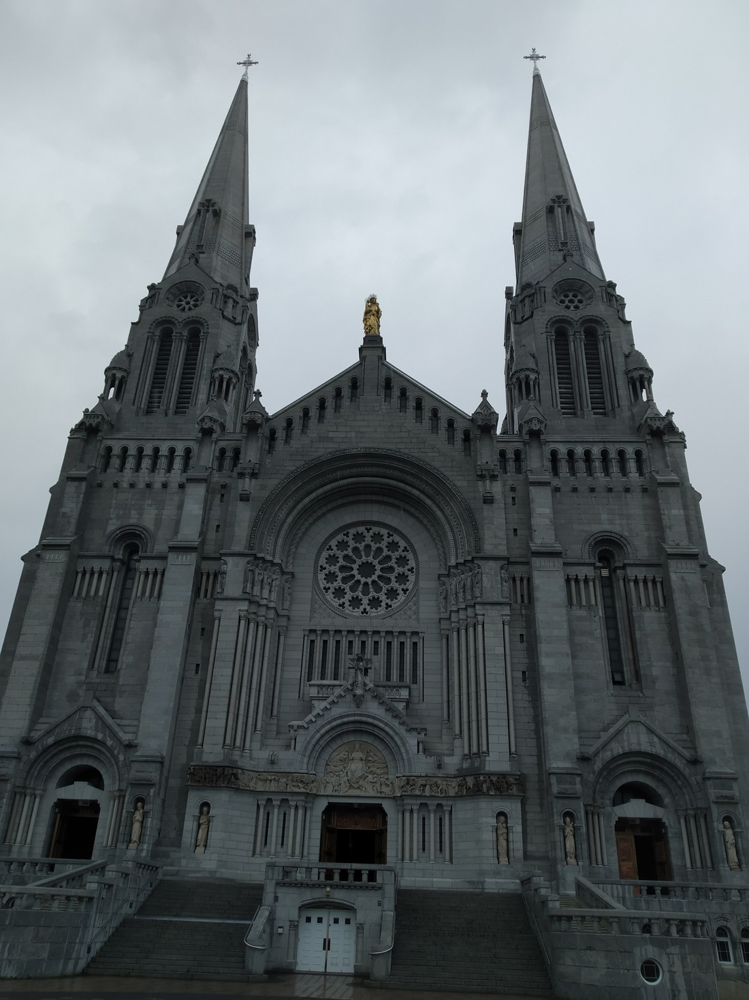

On our second full day in Quebec, we bought tickets for a “countryside” tour. Basically, this tour took us to the two attractions that we wanted to see but couldn’t get to by walking.

The first attraction that the tour took us to was the Montmorency Falls. It had some nice pictures in the brochure and was described as “1.5 times higher than Niagara Falls” – a phrase I found quite odd. It’s like saying, “he can run faster than Michael Phelps.” Sure Phelps probably isn’t all that slow, but that’s not really what he’s famous for.

When we arrived, the bus driver told us that we could take the gondola up to the top, or walk up – and to meet back in an hour. An hour seemed like a reasonable time (it means people won’t be waiting around for too long) but was that really enough time to climb to the top and get back? We figured he wouldn’t have mentioned it as an option otherwise.

Before we even started up the steps we went near the base of the falls to take some pictures. At this point we started getting wet but we couldn’t tell if it was due to spray from the falls or from rain. We knew it wasn’t going to be the best afternoon weather-wise. It turns out, it was both!

So we climbed the steps in a light drizzle. Wasn’t too bad – probably better than climbing it in the rain.

> We made it!

We then walked along the top to a bridge over the falls. This bridge was pretty impressive, crossing right over the point that the water falls away. Interestingly, this was in many ways the worst place to see the falls. Bridges like this also make me terrified that I’ll drop my camera over the edge. My sweaty, sunscreen covered hands don’t help ease these fears.

> But the bridge was a terrific place to get a good view of the steps

There wasn’t much else to see so we walked back down the steps. With nothing else to do or see we returned to the bus. We returned with five minutes to spare.

> Someone’s smug.

The thing is, we wasted basically no time. We powered up the 487 steps and barely spent any time looking around or taking photos. I’m almost certain that no-one else in our bus made it to the top via the steps. The people behind us tried, but told us that they ran out of time. And the rest of the bus were almost all older and wider than us so I’m willing to bet that we were the only ones that got up there without using the cable car. I would have thought that overly mean but the best views of the falls we found were from only part way up the stairs, so people aren’t really missing out by not making it to the top.

>The worst viewpoint was also the closest. See that part at the bottom that’s a darker brown. It’s that colour because it’s being soaked by spray from the falls.

The next attraction we were taken to was the Island of Orleans. It’s somewhat important in Quebec’s history but the thing is, there’s not a lot to see there. The attraction we were taken to was a chocolate shop / cafe.

The next attraction wasn’t better. It was a workshop where a family had been working with copper for generations. During the first part of the tour we found out that the speaker’s father had started the workshop. So, not exactly a huge part of Quebec’s history. We didn’t even bother with any more of the tour and just returned to the bus for a nap.

The last attraction was really the main event. This was the Basillica of Sainte-Anne-de-Beaupre. The front of it looked really impressive on the brochure so I made a mental note to try and replicate that picture. Only, it was raining quite heavily when we arrived. It didn’t stop so after 45 minutes I gave in and rushed out in the rain to photograph the outside. Here it is:

> The advantage of visiting when it was raining was that there wasn’t masses of other tourists ruining this shot. I did get pretty wet though to capture this. I’m not proud of how I smelled later on the ride back.

The inside of the basillica was quite impressive. It had your usual churchy things. Here’s some image of the main worship room:

> “Worship room?” There’s probably a proper name but if I know it, it’s escaping me right now.

Then we found a side room which was also quite nicely decorated.

> Why does a church need two worship rooms?

Then we found a stairwell which led us up here:

> Oh, there’s more

> “Kneel before the omnipotent floating MacOS settings menu!”

It turns out that we hadn’t entered the main part of the church when we first entered. I suspected as much but Betty was pretty surprised. I can’t blame her – the part we saw initially was so impressive that it could have been the basilica’s main worship room.

> They sure like board games here. (This joke isn’t funny unless you know a lot about board games, and even then it isn’t really that funny.)

We were also told by the bus driver that Saint Anne’s bones were supposed to be in the basilica. Well, an arm bone and part of a hip bone. It wasn’t publicised anywhere in the building so it made for a very strange treasure hunt. We didn’t find them. Or maybe we did – I can’t be sure what part of a hip bone looks like.

After an hour we ran back to the bus (because it was still raining) and returned to Old Quebec.

I’m not sure if the tour was worth the $50 CAD each we had paid. This sounds like a lot but the falls and the basilica did have entry fees so the tour cost was really less than $50. We walked away not regretting it – which is basically all we could ask for I guess. We’d been walking round Old Quebec for a day and a half and seen basically everything. Now we’d seen the best bits of the countryside. Tomorrow we were leaving for Montreal. It felt like we’d spent the right amount of time here.