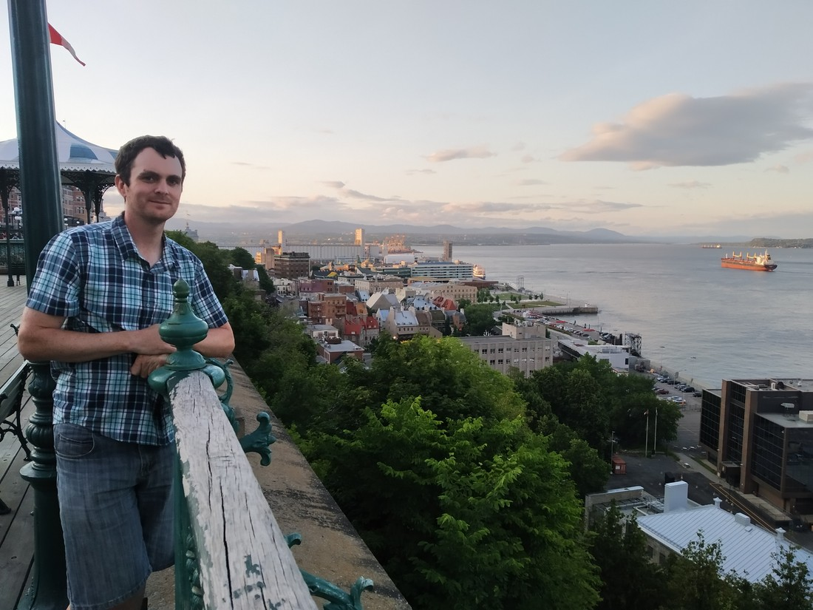

When deciding upon our route through North America, we wanted to experience as much varied places as we could in the timeframe we had allowed ourselves. Eastern Canada was the last piece of the puzzle. Originally we were going to visit Toronto (because its a major city) but for something different, we ended up choosing to visit Quebec City instead.

Quebec City is the heart of the french part of Canada. For this reason we decided to visit it under the assumption that it would be quite different to the rest of the places we were visiting.

And boy were we right.

> So different. Well, except for the cars. They’re about the same.

Quebec (or at least the oldest part of the city) is a little European town conveniently located outside of Europe. We deliberately booked accommodation in Old Quebec so that each morning we could get up and wander through the city. No hustle and bustle here. Instead it was mostly coffee shops and eateries.

> Looks nice in summer but Quebec is also the site of the famous Ice Hotel (a hotel made entirely out of ice).

Now, we’re just assuming this is what Europe is like. For those of you who have actually been to Europe, you might be able to answer these questions. Are the streets all cobbled with bricks? Do all the houses have window gardens filled with flowers? Are all the hotels called “Chateau …”? If so, Europe sounds like a lovely place to visit.

> So often we were like, “That’s an interesting house – take a picture of it!”

I’m running out of different ways to say, “It was nice” so I’m going to throw in some facts until I run out of pictures. Quebec is billed as the largest “walled” city north of Mexico. This is misleading because only the “Old Quebec” part of the city is walled – and there is pretty large gaps in the walls nowadays.

> So many nice shops we didn’t go into.

The city was founded by the nation of France. At some later point the English showed up and took over Canada. French is still the primary language spoken in Quebec and other parts of Eastern Canada so obviously England all the French people weren’t evicted. I guess England just had more guns and the people were like, “Okay, you win. Can we still live here if we pay you taxes?”

> This is the Chateau Frontenac. It claims to be the most photographed hotel in the world.

To be honest, that last paragraph is probably stretching the truth a fair bit. The reason we’re still a bit lacking in knowledge about Quebec is that we chose not to do the hop-on hop-off bus this time. We looked at the route and realised we could just walk it and save ourselves $40 each.

> This was our hotel – the Chateau Fleur de Lys. It’s no Frontenac but was still very nice. The concierge nicely offered to carry our suitcases up two flights of stairs – which I’m sure he regretted because he had to then explain a whole bunch of things about the room while extremely out of breath. Yeah, we’re not travelling light.

While in Quebec we also sampled the local delicacy. It’s called “Poutine” and it consists of french fries with large chunks of Mozzarella-like cheese and beef gravy. As you’d imagine it’s tasty but doesn’t feel very healthy.

> Fun fact: this blog will be valuable data for how fast my hair grows.

And that’s all for now. Hope you enjoyed the pictures and tolerated my ramblings.