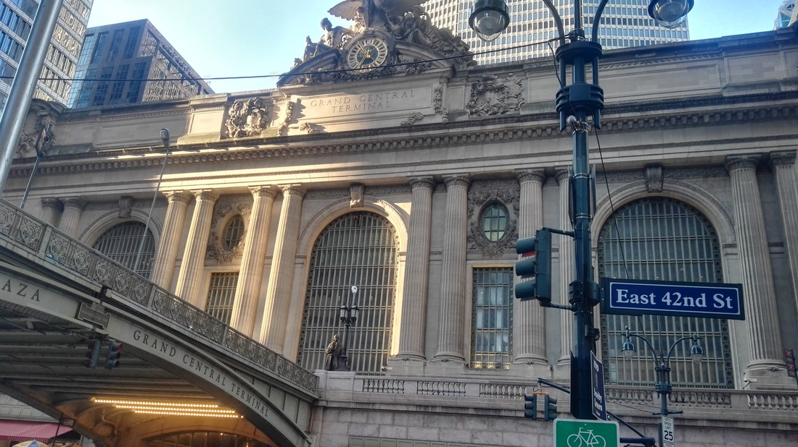

Manhattan is a very condensed borough. Its nice to be able to wake up in the morning and then discover what you want for breakfast by walking around. But that doesn’t mean everything is close.

The hop-on hop-off bus routes were centred at Times Square. With all the Broadway theatres nearby too, we often walked from our apartment to Times Square – a journey of 2.4km. We did this walk twice most days.

Betty and I had experienced a lot of success getting around Hong Kong via the subway so we figured this would be a good way to get around New York too. Only this time we could understand all of the signs, instead of just those in English.

Overall we were reasonably successful although to be honest, we had more success in Hong Kong than we did in New York. Some of our struggles were due to the express trains. New York subway lines have a lot of stops (I counted fifty on the line that went closest to our accommodation) so they have express trains that skip many of the stops allowing those people that are commuting long distances to get to their destinations quicker.

However we weren’t needing to go long distances. Yet we kept finding that most of the trains in the stations were express trains. We also never seemed to figure out how to identify them. At one point we only needed to go one stop (about 8 streets) but we accidentally got on the express train and went about 30 streets instead. Fortunately fares are the same for any distance so we just got off and got back on the next train going in the other direction.

We also had some problems with construction which closed some lines or stations. Coming out of the Metropolitan Museum of Art we had to walk several blocks to nearest subway station, only to find that we couldn’t catch the subway south. We caught the subway north (because we were so tired of walking) only to find that we couldn’t switch trains and had to exit and re-enter (and re-pay).

Eventually we made it to Grand Central Terminal which is one stop (nine blocks) away from our intended stop. We hadn’t seen the terminal building yet and we were tired of the subway’s shenanigans so we just walked the rest of the way.

> You win this time Subway.

To get to LaGuardia Airport to leave New York, we just hired an Uber to save ourselves the hassle.

…and with that we’re finally done with New York. Stay tuned for Season 2 of Luke and Betty’s Holiday Blog: Canada.