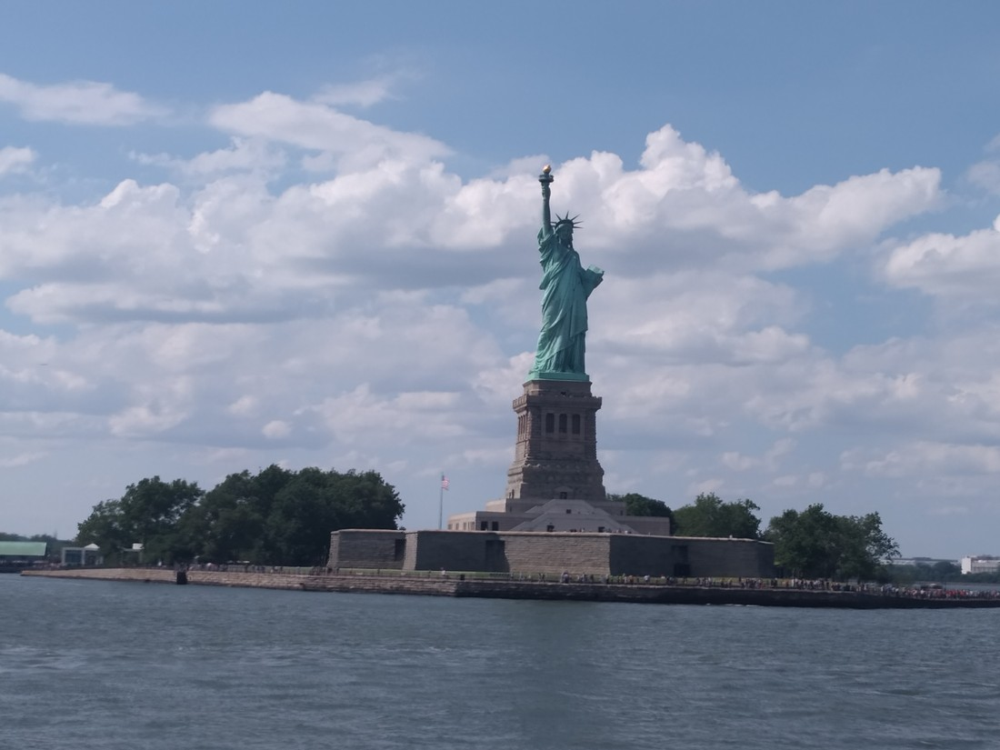

Yes.

> See. It’s an island. You can stop reading now. The question has been answered.

It seems like a reasonably straight-forward fact. But is it really? What body of water is it in? Well, none actually. It is an island surrounded by three rivers. That’s very suspicious Manhattan. It’s like you don’t want to admit to being connected to the Bronx. Anyway, today’s topic is cruising around New York harbour

“Harbour? So it is connected to the coastline?”

“Shush. We’re off topic enough already.”

Our trials first started when we received a free ticket for buying a multiday hop-on hop-off bus pass. We set out one morning to cash it in, only to realise that the cruise only departs twice a day at 10am and 3:30pm. We were on the subway when we noticed this. It was 10:10am.

No worries – we went and explored Central Park the Met instead. When we were ready, we set off for the cruise docks again. Only problem was, the subway didn’t go all the way there so we had to walk through some neighbourhoods to get there. They were very nice. Here’s a picture I took 10 seconds before I realised exactly how close to 3:30pm it was:

So we kind of semi-ran the rest of the way. We got to the docks with less than five minutes to spare only to find that there was no 3:30pm cruise. That was the off-season schedule. Elsewhere on the tickets it had different times. It also turned out that there were cruises every 1.5 hours or so and the ticket we had was essentially a $30 voucher (the shortest cruise was that amount).

So we paid a bit extra and booked to the next cruise at 4:30pm. This was nice as it gave us a chance to eat a proper late lunch / early dinner. Unfortunately in my foolishness, this was the time I bought that horrible pretzel from the street vendors.

The cruise was actually quite nice. It was essentially a new way to see New York.

It cruised down the Hudson river…

> Yes, this is a river

…through part of the Harbour, past Ellis Island…

> Forgot to photograph that. Whoops. Here’s a building that looks like the sky instead.

…to get to the Statue of Liberty.

> Made famous by the hit TV series Fringe.

Then up the East river…

> Is it just me, or does this look like New York is flooded?

…under some of the bridges…

> Empire State Building (right side, back) doesn’t look so big from this angle

…before turning around and returning to its dock.

It was nice. There was a tour guide explaining what we were seeing. And fortunately, we could almost hear what he was saying (the speaker could have been better).

It was a relatively inexpensive way (for us anyway) to see more of and learn more about Manhattan. I give it 4.5 stars out of 5.