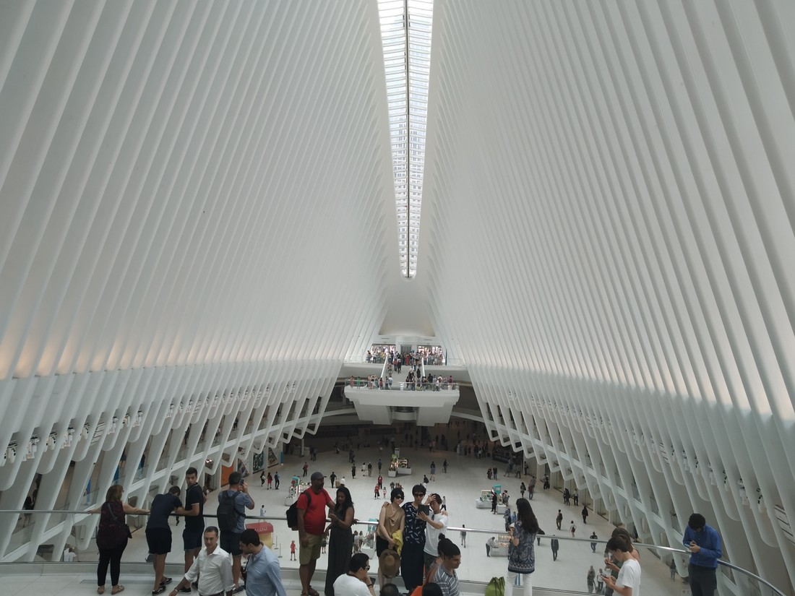
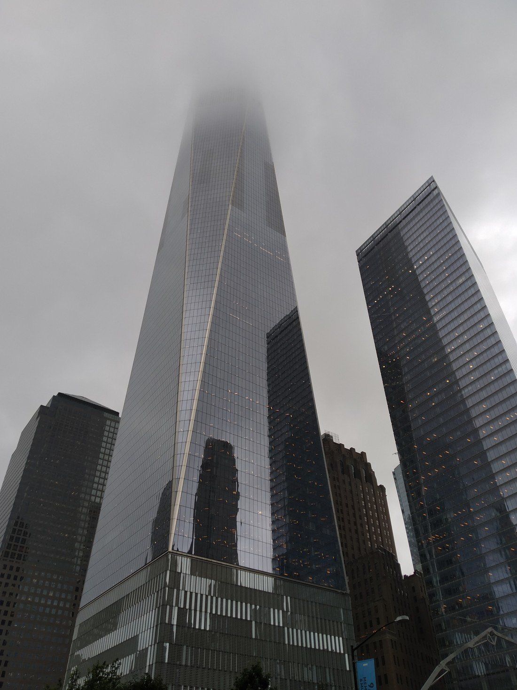

A lot of the museums, parks, and buildings I have talked about so far have decades, if not centuries of history. This blog post is about something new to New York’s history in comparison – the terrorist attack that occurred on September 11 2001.

In the plaza that once stood the World Trade Centre there is now a pair of memorials – two large holes in the ground where the buildings once stood along with the names of the victims. Water falls down the sides, into the centre and then down the centre well. Not quite sure what that all symbolises but it feels very fitting and tasteful.

> Here once stood the North Tower

At the plaza there is the 9/11 museum which we decided to check out. The museum itself goes down many floors below the plaza and below the memorials as well.

I’m just going to cut to the chase – this museum was a bit disappointing. They appear to have tried to make the museum itself a work of art / in the style of an art gallery. Most of the museum is large empty spaces – which is great because a lot of people flock through the museum except the information panels are all really tiny. It wasn’t nice having to crowd around them to read them.

So there are various exhibits. We saw some crushed girders and fire trucks. We saw a room filled with the faces of the victims. We watched an excerpt from a documentary about the rebuild. We even saw some themed motorcycles (like what you’d see in American Chopper) dedicated to the victims.

Once we had seen all these, we entered the Timeline exhibit – which was a walkthrough of the timeline of the events on the day. To be honest, 98% of the museum’s information and teachings are in this one exhibit. While we were queuing to watch the documentary excerpt, the employee in charge was trying to convince people to NOT see the the excerpt (which was an odd sight to see) and to go to this exhibit instead. Apparently many people feel they have seen enough and never make it to this exhibit.

Aside from being condensed into too small a space, the Timeline exhibit was excellent. It contained lots of different media: photos, videos, voicemails from the victims, news footage from the day, a full account of what happened at any particular minute. It was only 18 years ago so I still remembered a lot of what happened, but there was some content I hadn’t seen at the time, or had forgotten.

There was so much content in this one exhibit that Betty and I ran out of energy about halfway through. When we came out of the museum, it had started raining – which was kind of fitting.

So overall the museum was worth a visit. But the layout frustrated us which may have resulted in us leaving without experiencing all we could have. I did look up why this might have been done and the Wikipedia page implies that it is laid out this way so that survivors don’t have to see the most distressing parts if they can’t handle it. That’s fair – I guess it couldn’t work both ways.

However the Twin Towers weren’t the only buildings destroyed that day as the destruction brought down or destabilised many other nearby buildings. A couple of new buildings include this dumpling shaped piece of art acting as a skylight for a Westfield mall:

and the One World Trade Centre building:

1776 feet tall because American’s love that number (date of independence), it is currently the tallest building outside of Asia and the Middle East. It has an observation deck on the 100th floor. Some days might be better than others to visit though:

