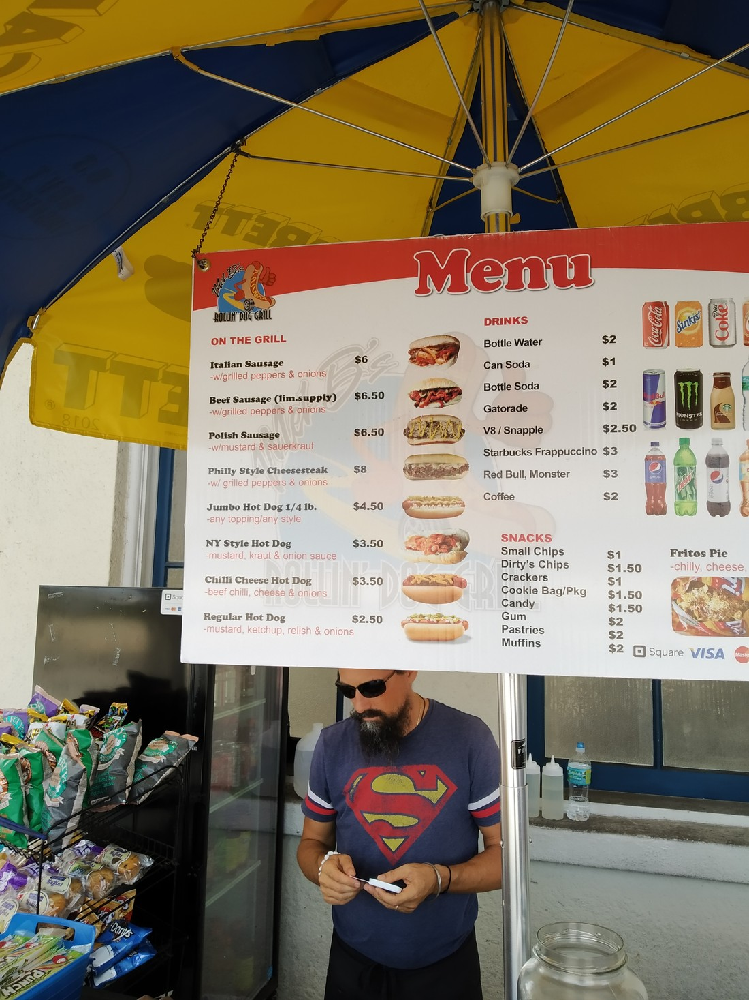

Prior to coming to America, we had discussed about all the food we’d seen on TV that we associated with New York. I always joked that we needed to make a list and try them all. We never wrote it down but as we went along, I mentally ticked them off in my head.

First was the New York hotdog. We kinda ticked this one off even before we got to New York. At the train station in Orlando there was a hotdog cart and since we weren’t sure whether we’d get fed lunch on the train, we bought a couple of dogs.

Overall they were okay. They served their purpose as food but if anything they were quite pricey for what they were. “Oh well,” we figured, “at least we tried them.” I mentally noted that I needed to try a Philly Cheesesteak. I didn’t know what it was, but it sounded American and therefore sounded like it needed to be tried. (Although I never did get round to it).

When we got to New York we found these hotdog carts everywhere. I literally mean everywhere. I was often surprised when the one time we wanted one, we had to walk a whole city block (like 150 metres) to find one. They looked like this and they were literally all the same:

Betty had heard (possibly incorrectly) that New York has cheap food. A lot of the eateries we had been to hadn’t been that cheap so we figured, “Oh, they must be talking about those hotdog carts.” Well the hotdog carts weren’t that cheap either. All but the budget hotdogs appeared to be $4 to $7 – which I suppose still isn’t much but that’s $6 to $10 New Zealand money. Where’s the $1.50 pies from the dairy?

Anyway, another item we’d associated with New York were pretzels. We saw some of them on these hotdog carts. $4 later and I was the proud owner of one.

It was terrible.

I think I took one more bite and then threw it in the garbage.

But that didn’t stop us. We figured, “Surely they must be good otherwise they’d not be a thing.” We’d seen signs for Auntie Anne’s Pretzels while we were on the bus so we hunted one of these down for breakfast one morning. Annoying, the closest one wasn’t close – it was near Times Square. Also, it turned out to be inside this building:

Macy’s is the world’s largest department store and we can confirm that it is large. To get our pretzels we had to go up to the 6th floor (which was the children’s clothing floor). The pretzel shop wasn’t even the only eatery in that section – there was a McDonald’s too.

Fortunately Auntie Anne’s had more flavours than just “salt”. We can report back that they were delicious. And that we were quite disappointed that while waiting at the airport, we found out that there was an Auntie Anne’s there – but in another terminal.

I also made sure I had a donut (Dunkin style) and pizza slice. Although neither were anything like the traditional American style you’d see on TV.

The last item I’ll talk about is bagels. Very near our accommodation was a bagel shop. And while their bagels were only decent, they did very good cream cheese. They probably had 20 different flavours. On separate occasions we tried the “cheese and bacon”, “sundried tomato” and “jalapeno cheese” flavours. The bagels were also reasonably priced which was nice – not much more than a basic hotdog.

Oh – something I forgot is that we did have hotdogs in New York. On our last night we had a late lunch but we got snacky late that night. So we walked down to the 7 Eleven store nearby. They have self serve hotdogs at much more reasonable prices ($2) and a reasonably wide range. I had myself a cheeseburger flavoured hotdog. They also had tomato, pickles, onions, sauces, and more which we could add on ourselves. It was great. Probably our best meal, value-for-money-wise.

Moral of the story: stay away from the hotdog carts.