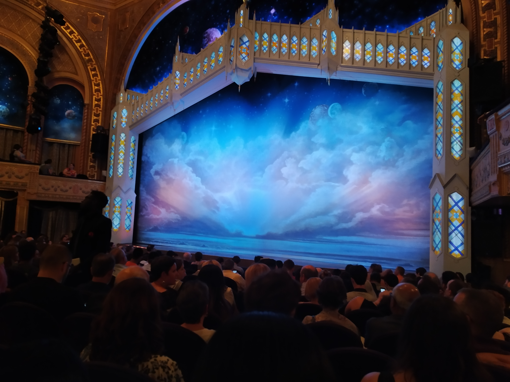
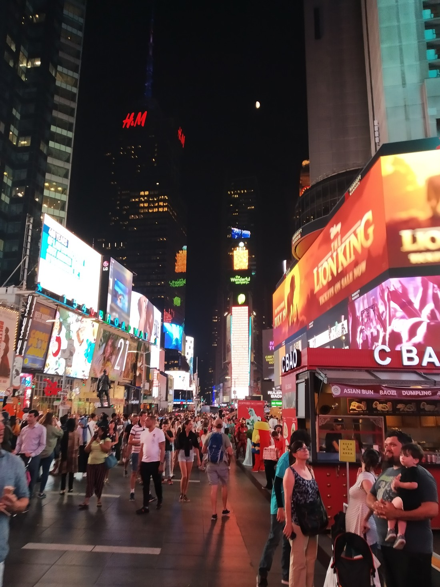

When brainstorming things New York is known for, Broadway musicals came up. We figured that we’d better try see one.

I had taken notice of The Book of Mormon musical when it first started. The “Hamilton” of its day, it swept the Tony awards winning in nine categories including Best Musical. It was created by the duo behind South Park as well as one of the creators of Avenue Q (who went on to write “Let It Go” from Frozen, becoming one of of 15 people to “EGOT”).

I must say, I was a bit nervous seeing it – mostly because we had been walking around Central Park that afternoon and I was quite sweaty but we didn’t have time to return to our accommodation to freshen up. Instead we bought iced Starbucks drinks and sat around in their air conditioning until our (my) perceived grossness had lessened.

The story is about a pair of 19 year old Mormon boys who are sent on a mission to Uganda. Various hilarities ensue as you’d expect. Overall it was a very funny show. The writing was well done and the songs were very clever, even if they weren’t necessarily catchy. It’s also the first show I’ve seen where the second act lives up to the standard set by the first act.

It wasn’t without its faults though. While it was constantly ribbing the Mormon faith by slyly pointing out oddities in its teachings, overall its portrayal of Mormons was quite faithful, if exaggerated. Unfortunately it let itself down with its portrayal of Ugandians, relying more on stereotypes to produce humour. But it was nice to have the cultural diversity as otherwise this would have just been a musical about singing white boys.

The main issue we had with the show is that at certain points in the show it became very R-rated. I’m actually not comfortable detailing here what these moments were, they were that bad (although I should note they weren’t graphic) To be honest, I shouldn’t have been surprised given the creators are best known for South Park.

We tossed around the idea about seeing another musical while we were here but whenever we felt we had made a decision, we had missed the opportunity.

> Underneath this mass of people there is Broadway Street somewhere

A couple facts to end the blog post. Most of the Broadway theatres aren’t on Broadway (which is a street). Instead they are located on streets off Broadway in the Theater district. Also, the Book of Mormon theatre was nowhere near as large as expected – less than half the number of seats as the Civic Theatre in Auckland. I guess when its being performed daily for months then the theatre size doesn’t need to be overly big.